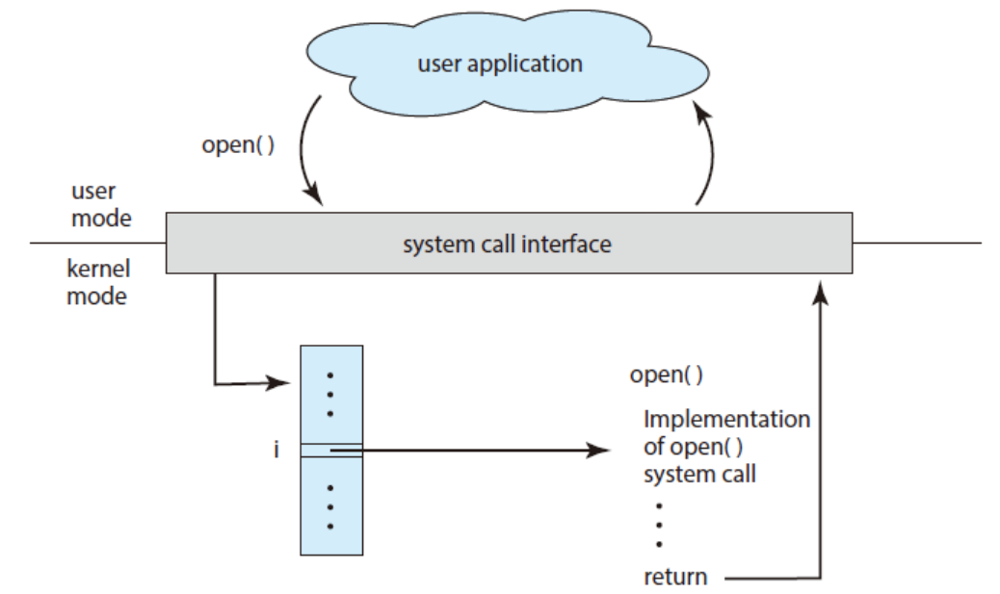

# 1.操作系统定义

操作系统（Operating System，OS）：
- **系统资源的管理者：** 操作系统控制和管理整个计算机系统的 **计算机资源** ，并合理地组织调度计算机的工作和资源分配。
- **向上层提供方便易用的服务：** 提供给用户和其他软件方便的接口和环境。
- **最接近硬件的一层软件：** 操作系统是计算机系统中最基本的系统软件。

---

# 2.操作系统功能和目标

---

## 2.1 系统资源的管理者

**计算机（系统）资源：**
- **硬件资源：** 计算机系统中用户看得见、摸得着的 **物理设备** 。
  - **CPU**（中央处理器）
  - **内存（RAM）**
  - **磁盘存储（HDD/SSD）**
  - **输入设备（键盘、鼠标）**
  - **输出设备（显示器、打印机）**
  - **网络设备（网卡、路由器）**

- **软件资源：** 存储在计算机上的 **数据** 和 **程序** 。
  - **文件**（文本文件、图片、音视频、文档等）
  - **进程**（运行中的程序）
  - **库（Libraries）**（供程序调用的代码）
  - **系统调用（System Calls）**
  - **数据库**

---

> **补充：** 执行一个程序前需要将该程序放到 **内存** 中，才能被 CPU 处理。

- **进程管理（Process Management）：** 安排每个程序啥时候运行，谁先谁后。
- **内存管理（Memory Management）：** 给程序合理分配空间，防止冲突。
- **文件系统（File System）：** 让你能读写文件，比如保存文档、打开图片。
- **设备管理（Device Management）：** 帮你管鼠标、键盘、显示器等硬件。

---

## 2.2 向上层提供方便易用的服务

对于硬件来说，只听得懂二进制指令，用户很难直接操作硬件，所以操作系统进行了一定的封装，仅仅暴露出简单易用的（用户）接口。

> **封装思想：** 操作系统把一些难以直接操作的硬件功能封装成简单易用的服务，使用户能更方便地使用计算机，用户无需关心底层硬件的原理，只需要对操作系统发出命令即可。

- **命令接口：**
  - **联机命令接口（交互式命令接口）：** 用户说一句，系统跟着做一句。比如在中断中敲命令。
  - **脱机命令接口（批处理命令接口）：** 用户说一堆，系统跟着做一堆。比如 `Shell(.sh)` 脚本

- **程序接口（系统调用）：**
  - **GUI (图形化界面)：** 用户可以使用形象化的图形化界面进行操作，不再需要记忆复杂的命令、参数。

> 程序接口（系统调用）属于 **内核态** （后文会详细说明），是操作系统为 **应用（用户程序）** 使用内核功能所提供的接口。因为操作系统不允许用户直接操作各种硬件资源，因此只能通过系统调用间接访问。

---

## 2.3 最接近硬件的层次

操作系统实现了**对硬件机器的拓展** 。没有任何软件支持的计算机称为裸机，在裸机上安装的操作系统，可以提供资源管理功能和方便用户的服务功能，将裸机改造成功能更强、使用更方便的机器。

> 通常把覆盖了软件的机器成为 **扩充机器** ，又称之为 **虚拟机** 。

操作系统对硬件机器的拓展：将CPU、内存、磁盘、显示器、键盘等硬件合理地组织起来，让各种硬件能够相互协调配合，实现更多更复杂的功能。普通用户无需关心这些硬件在底层是怎么组织起来工作的，只需直接使用操作系统提供的接口即可。

---

# 3.操作系统的四个特征

- **并发**
- **共享**
- **虚拟**
- **异步**

---

## 3.1 并发

- **并发：** 指两个或多个事件在 **同一时间间隔** 内发生。这些事件宏观上是同时发生的，但微观上是 **交替** 发生的。比如，A 程序执行了 `5ns` 后换 B 程序执行，B 程序执行了 `3ns` 后又换 A 执行，人是感知不到有程序在换着执行的。
- **并行：** 指两个或多个事件在 **同一时刻** 内发生。

操作系统中的并发性是指计算机系统中 **“同时”** 运行着多个程序，这些程序宏观上看是同时运行的，而 **微观上是交替运行** 的。操作系统和程序并发是一起诞生的，因此并发性是操作系统一个最基本的特性。

> 单核 CPU 同一时刻只能执行一个程序，各个程序只能并发地执行。
> 多核 CPU 同一时刻可以同时执行多个程序，多个程序可以并行地执行。

---

## 3.2 共享

共享是指资源共享，是指系统中的资源可供内存中多个并发执行的进程共同使用。

资源共享的两种方式：
- **互斥共享方式：** 系统中的某些资源，虽然可以提供给多个进程使用，但一个时间段内只允许一个进程访问该资源。
- **同时共享方式：** 系统中的某些资源，允许一个时间段内由多个进程 “同时” 对它们进行访问。

---

## 3.3 虚拟

虚拟是指把一个物理上的实体变为若干个 **逻辑上的对应物** 。物理实体（前者）是实际存在的，而逻辑上对应物（后者）是 **用户感受到的** 。

> 例一：一个 4 GB 内存的电脑，却可以运行远大于 4 GB 内存的程序（虚拟存储技术 —— 空分复用技术）。
> 例二：一个单核的计算机，却可以同时运行多个程序（虚拟处理器技术 —— 时分复用技术）。

---

## 3.4 异步

异步是指在多道程序环境下，允许多个程序并发执行，但由于资源有限，进程执行并不是一管到底的，而是走走停停，以 **不可预知的速度** 向前推进。

---

## 3.5 四者关系

1. 如果失去并发性，则系统中只有一个程序正在运行，则共享性失去了存在的意义。

2. 如果失去共享性，则多个程序不能同时访问硬件资源，就无法实现同时发送文件等功能，也就无法并发。

3. 如果失去了并发性，则一个时间段内系统只需要运行一道程序，那么就失去了实现虚拟性的意义。因此，没有并发性，就谈不上虚拟性。

4. 如果失去了并发性，即系统只能串行地运行各个程序，那么每个程序的执行会一贯到底。只有系统拥有并发性，才有可能导致异步性。

5. 没有并发性和共享性，就谈不上虚拟和异步，因此两者互为存在条件。

> **注意：** **“并发 + 共享”** 是操作系统 **最基本**且 **必须** 要实现的两个特征，属于设计目标。