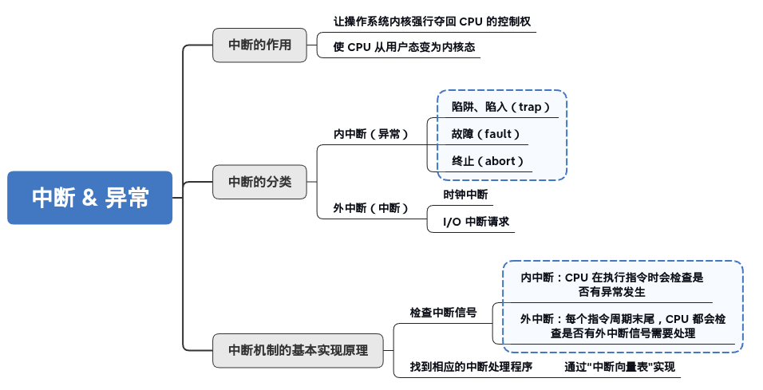
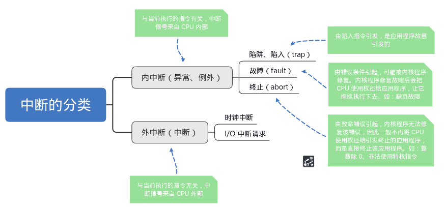
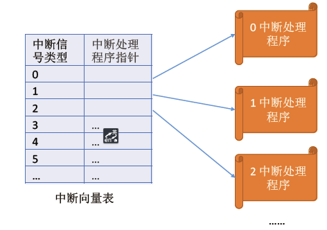
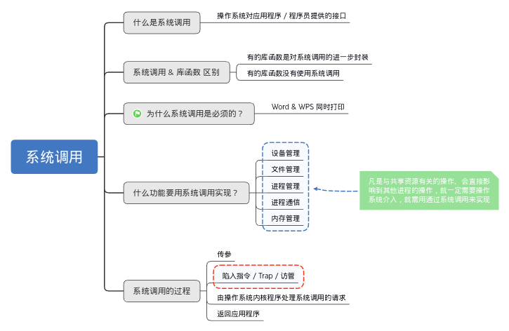
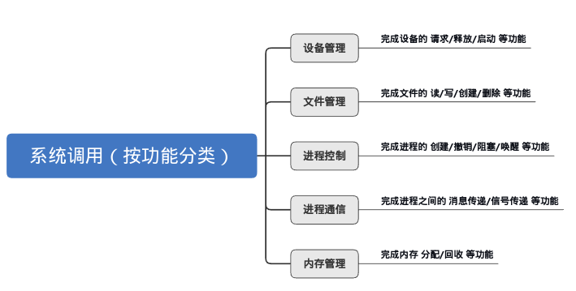
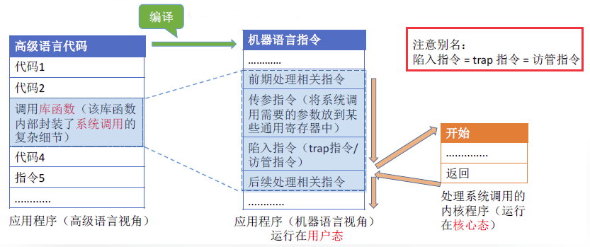

# 1.处理机运行模式

---

## 1.1 内核程序和应用程序

- **应用程序（User Program）：** 是用户运行的软件，比如微信、Word、VS Code；
- **内核程序（Kernel Code）：** 是操作系统里最核心的部分，比如负责进程调度、内存分配、系统调用等。

“操作系统内核”（或简称“内核（Kernel）”）是由很多 **内核程序** 组成的，这些“内核程序”通常以模块或组件的形式存在，比如：
- 进程调度器
- 内存管理器
- I/O 管理
- 系统调用处理器
- 驱动程序管理器（有些驱动也在内核层）

内核是操作系统最重要最核心的部分，也是 **最接近硬件** 的部分。某些软件（如 docker 容器）只需要内核即可运行，而不需要完整的操作系统“用户空间程序”。

操作系统的功能未必都在内核中，如 **图形化用户界面** （Linux 系统的内核不自带 GUI，桌面环境如 GNOME、KDE 是运行在“用户空间”的）。

---

## 1.2 特权指令和非特权指令

在 CPU 设计和生产时就划分了特权指令和非特权指令，因此 CPU 执行一条指令前就可以判断出其类型。

> 特权指令是只有操作系统内核（Kernel Mode）才能执行的指令，而非特权指令是用户程序（User Mode）可以自由执行的指令。普通用户程序如果尝试执行特权指令，会触发 **异常**（即**内中断**，Exception） ，被操作系统拦截。

可以这样给特权指令简单分个类（便于做选择题）：
- 能改变计算机状态。
- 可以访问计算机核心资源。

---

常见的特权指令：

| **类别**     | **指令**     | **作用**                                       |
| ------------ | ------------ | ---------------------------------------------- |
| **CPU 控制** | `HLT`        | 停止 CPU（Halting the CPU）                    |
|              | `CLI`        | 关闭中断（Clear Interrupt Flag）               |
|              | `STI`        | 开启中断（Set Interrupt Flag）                 |
|              | `IRET`       | 从中断返回（Interrupt Return）                 |
| **内存管理** | `LGDT`       | 加载全局描述符表（GDT）                        |
|              | `LLDT`       | 加载局部描述符表（LDT）                        |
|              | `LTR`        | 加载任务寄存器（Task Register）                |
| **I/O 操作** | `IN` / `OUT` | 访问 I/O 端口（输入/输出设备）                 |
| **模式切换** | `MOV CRx`    | 修改控制寄存器（如 `CR0`, `CR3` 用于内存分页） |

常见的非特权指令:

| **类别**       | **指令**                 | **作用**       |
| -------------- | ------------------------ | -------------- |
| **数据传输**   | `MOV`                    | 数据传输       |
|                | `PUSH` / `POP`           | 堆栈操作       |
| **算术运算**   | `ADD` / `SUB`            | 加法 / 减法    |
|                | `MUL` / `DIV`            | 乘法 / 除法    |
| **逻辑运算**   | `AND` / `OR` / `XOR`     | 逻辑运算       |
| **分支控制**   | `JMP`                    | 无条件跳转     |
|                | `CALL` / `RET`           | 调用函数和返回 |
| **字符串操作** | `MOVS` / `LODS` / `STOS` | 字符串操作     |
| **浮点运算**   | `FADD` / `FSUB`          | 浮点加减       |

---

## 1.3 内核态和用户态

> **别名：** 内核态 = 核心态 = 管态；用户态 = 目态

- 处于内核态时，说明此时正在运行的是内核程序，此时 **可以** 执行特权指令（特权指令都能执行了，非特权指令当然也能执行咯(●'◡'●)）；
- 处于用户态时，说明此时正在运行的是应用程序，此时 **只能执行非特权指令** 。

> **注意：** 当 CPU 处于内核态时，可以执行指令集中除 **访管指令** 之外的所有指令！这里不是指内核态下的 CPU 不能执行访管指令，而是不需要执行！因为访管指令的作用是**从用户态主动切换到内核态**。当CPU已经处于内核态时，执行这条指令是没有意义的，甚至可能导致未定义行为（例如，再次触发陷入，陷入到错误的处理程序）。
>> P.S. 操作系统内核的代码是由程序员精心编写的，他们绝不会在内核代码中插入一条用于从用户态进入内核态的指令。因此，在实践中内核不会执行它，但并非CPU在硬件层面禁止在内核态执行该指令。
> 
> 补充：**访管指令 = 陷入指令 = Trap指令**（不同叫法罢了），是用户程序自愿进管的指令（ 即发起系统调用，**进管** 也意味着程序放弃 CPU 的控制权）。该指令本身属于 **非特权指令** ，可在用户态执行，执行后进入核心态 。

---

> CPU 中有一个寄存器叫 **程序状态寄存器（PSW）** ，其中有个二进制位，1 表示内核态，0 表示用户态。PSW 的状态是由 **CPU** 来更改的！转变 CPU 状态的过程是有成本的，要消耗不少时间， **频繁地转变 CPU 状态会降低系统性能** 。

- **用户态 —> 内核态：** 由 **中断** （后面会详细说明）引发， **硬件自动完成** 变态过程，触发中断信号意味着操作系统将重新夺回 CPU 的使用权。
- **内核态 —> 用户态：** 操作系统通过执行“恢复上下文”的 **特权指令** ，让 **CPU 自己去改 PSW** ，完成状态的切换。这个过程通常在 **“中断处理结束”** 或 **“系统调用处理完”** 后发生。

| 切换方向        | 谁触发               | 谁执行                                | CPU 做了什么                   |
| --------------- | -------------------- | ------------------------------------- | ------------------------------ |
| 用户态 → 内核态 | 系统调用、中断、异常 | **CPU 硬件自动切换**                  | 保存上下文、修改 PSW、跳转入口 |
| 内核态 → 用户态 | 操作系统主动还权     | **操作系统调用特权指令（如 `iret`）** | 恢复上下文、切回用户态         |

---

# 2.外中断和异常（内中断）



本章节先有个大概印象即可，在计算机组成原理中，还会详细学习中断。

---

## 2.1 中断的作用

> 从上个章节，我们知道 **中断** 会使 CPU 由 **用户态 -> 内核态** 。

- 中断是 **硬件** 机制，它通过硬件信号来打断当前正在执行的指令，迫使 CPU 跳到 **中断处理程序** （通常在 **内核** 中），因此操作系统可以夺回 CPU 的控制权并进行必要的处理。
- 如果没有中断机制，CPU 会一直执行程序，操作系统无法干预，这样就没有“多任务”和“多用户”支持。

---

## 2.2 中断的类型

    

---

## 2.3 中断机制的基本原理

> 不同的中断信号，需要不同的中断处理程序来处理。

- **中断向量表：** 当 CPU 接收到中断信号时，会查看中断向量表，它包含了不同类型中断对应的 **中断处理程序的地址（或指针）** 。
- **中断处理程序：** 这些处理程序通常运行在 **内核态** ，因为它们需要有足够的权限来操作硬件和管理系统资源。



> 中断向量表的作用就像是一个查号簿，根据中断的编号快速找到相应的处理程序。中断向量表会在操作系统进行 **初始化** 时创建和设置。

---

# 3.系统调用（程序接口）



---

## 3.1 系统调用的概念

> 操作系统作为用户和计算机硬件之间的接口，需要向上提供一些简单易用的服务。主要包括 **[命令接口和程序接口](01操作系统的基本概念.md#22-向上层提供方便易用的服务)** 。其中，程序接口由一组系统调用组成。

**系统调用** 是操作系统提供给应用程序（程序员/编程人员）使用的接口，可以理解为一种可供应用程序调用的特殊函数，应用程序可以通过系统调用来请求获得操作系统 **内核** 的服务。

---

> 思考下 **库函数** 和 **系统调用** 的区别和联系？
> > - **库函数:** 是编程语言或应用程序的一部分，可以运行在用户空间中。
> > - **系统调用:** 是操作系统的一部分，是内核为用户提供的程序接口，运行在内核空间中，并且许多库函数都使用系统调用来实现功能。
> > - **未涉及系统调用的库函数，其执行效率通常要比涉及系统调用的高** 。因为使用系统调用时，需要上下文的切换及状态的转换（由用户态转向核心态）。

---

## 3.2 系统调用的必要性

系统调用是操作系统与用户程序之间的桥梁，提供了以下几项必要功能：
- **安全性和稳定性：** 通过提供用户与硬件隔离的接口，避免了不安全的直接硬件访问。
- **资源管理和控制：** 操作系统通过系统调用对内存、文件、设备等资源进行管理。
- **操作系统的抽象与兼容性：** 不同的操作系统提供统一的接口，便于程序员编写跨平台程序。
- **进程间通信与同步：** 操作系统利用系统调用提供进程间的通信和同步机制。



---

## 3.3 系统调用的过程



```
传递系统参数 -> 执行陷入指令（用户态）-> 执行相应的请求内核程序处理的系统调用（内核态）-> 返回应用程序（用户态）
```

> 发出系统调用 **请求** 是在 **用户态** ，而对系统调用的相应 **处理** 在 **核心态** 下进行。