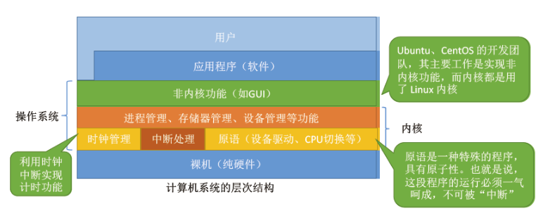
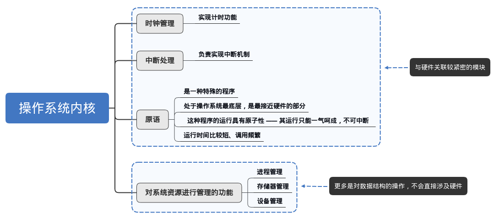

# 1.架构分类

---

## 1.分层式架构

将操作系统划分为若干层，层与层之间只能 **单向依赖** 或 **单向调用** 。

---

**优点：**
- **便于系统的调试和验证：** 每一层都有明确的职责，可以对单层进行调试和测试，而不必过多关心其他层的实现。这种结构有助于将复杂系统分解为易于处理的部分。
- **易于扩充和维护：** 新的功能或特性可以通过添加新的层或扩展现有的层来实现，减少对其他部分的影响。这种层次化的设计使得操作系统可以在不破坏已有功能的情况下进行修改和升级。

**缺点：**
- **合理定义各层较为困难：** 在设计操作系统时，很难清晰地划分出每一层的边界，某些功能可能涉及多个层，或者某一层可能依赖于其他层的功能，这样就会导致设计不清晰，增加开发难度。
- **效率较差：** 每个请求都需要通过多个层进行处理，这可能导致性能的下降。特别是当层数很多时，程序的执行可能需要通过层与层之间的多次调用。

---

## 2.模块化架构

将操作系统分为多个具有 **独立性** 的子模块，规定好模块之间的接口使得模块之间可以相互通信。

**独立性：** 模块的独立性越高，各模块之间的交互越少，系统结构越清晰。衡量独立性的指标如下：
  - **内聚性：** **模块内部**联系的紧密程度，内聚性越高，独立性越好。
  - **耦合度：** **模块间**相互联系与影响的程度，耦合度越低，独立性越好。

---

**优点：**
- **提高系统设计的正确性和可维护性：** 模块化设计使得每个模块功能明确，容易测试和调试。模块之间的独立性提高了系统的稳定性，也方便了单独更新或替换某个模块。
- **增强了可适应性：** 由于模块之间通过接口通信，操作系统可以较容易地进行扩展。例如，可以根据需要添加新模块，而不需要改动现有的模块。
- **加速开发过程：** 模块化设计使得多个开发人员可以并行开发不同的模块，从而加快操作系统的开发进程。

**缺点：**
- **模块间的接口规定很难满足实际需求：** 在实际开发中，不同模块之间的通信接口可能需要在开发过程中不断修改，特别是在不同模块的需求发生变化时，接口的设计可能变得不灵活。
- **模块间设计者的协调问题：** 由于模块化开发通常由多个团队或者开发者并行进行，如何保持各模块设计的一致性和协调性是一个挑战。如果模块之间的协调性不好，可能导致接口不兼容或功能重复，影响系统的整体性能和稳定性。

---

# 2.内核分类

---

## 2.1 宏内核（大内核）

**宏内核：** 传统操作系统内核的设计方式，将大部分操作系统功能（核心功能）和所有的服务都集成到内核中，包括进程管理、内存管理、文件系统、设备驱动等。

---

**优点：**
- **性能高：** 由于所有内核功能都在一个统一的地址空间中，进程切换和服务调用通常较为高效，因为不需要频繁的上下文切换或内核与用户之间的通信。

**缺点：**
- **代码庞大：** 因为所有的功能都集成在内核中，导致内核代码非常庞大，增加了内核的复杂性，调试和维护变得更困难。
- **结构复杂且难以扩展：** 如果需要增加新功能，往往需要对内核进行修改，可能会影响其他功能模块，难以保持系统的稳定性和可扩展性。

---

## 2.2 微内核

**微内核：** 只有底层保留在内核态下运行，运行时不断切换 CPU 状态。其他更高级的功能（如文件系统、网络协议、设备驱动等）则运行在用户空间，以服务或进程的形式存在。微内核设计通常采用 **客户/服务器** 模式，其中内核只提供通信机制和最基本的服务，其它模块通过消息传递与内核或其他服务进行交互。

**微内核的基本功能：** 与硬件处理有关的部分、基本功能、客户与服务器之间的通信。比如：
- 硬件抽象层：负责与硬件的直接交互。
- 进程和线程管理：管理进程调度、线程同步等。
- 低级内存管理：分配和管理内存资源。
- 中断和陷入处理：处理系统级的中断。

---

**优点：**
- **扩展性和灵活性：** 因为内核功能非常精简，系统能够方便地进行扩展，开发者可以根据需求增加或修改功能模块。
- **可靠性和安全性：** 内核只负责最基础的功能，而其他大部分功能都运行在用户空间中，内核的代码量小，减少了系统崩溃的可能性。用户态服务崩溃不会影响到内核的稳定性。
- **可移植性**：微内核设计使得操作系统的核心部分与硬件平台相对独立，从而更容易移植到不同的硬件架构上。
- **分布式计算：** 由于微内核通过消息传递进行进程间通信，它特别适合于分布式计算环境，可以通过网络连接不同的节点。

**缺点：**
- **性能问题：** 微内核需要频繁进行 **上下文切换** ，因为用户空间的服务和内核之间需要通过消息传递进行通信，每一次服务调用都需要切换到用户态和内核态，这会带来额外的性能开销。
- **复杂的消息传递：** 虽然微内核在设计上将复杂性分散到用户空间，但这也导致了进程之间的通信非常依赖消息传递，增加了开发和维护的难度。

---

## 2.3 外核

> 这部分简单了解即可。

外核是一种极简的操作系统内核，与宏内核、微内核不同，它的核心理念是将 **硬件资源直接暴露给应用程序** ，让应用程序自己进行资源管理和调度，而不是由内核去做。这种设计的优势在于，应用程序可以根据自己的需求定制资源管理策略，减少了操作系统本身的干预。

> 在拥有 **外核** 的操作系统中，外核只负责 **硬件资源的分配、回收、保护等** ，进程管理相关的工作仍然由内核负责。