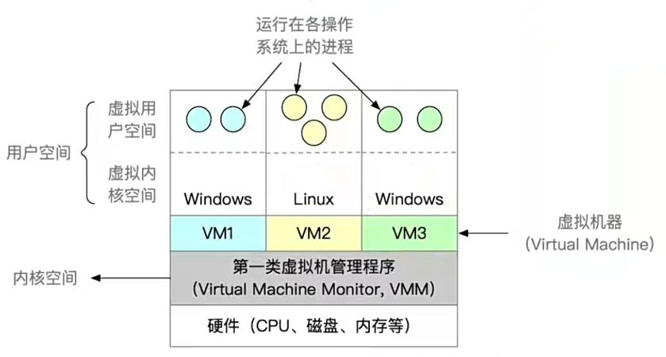
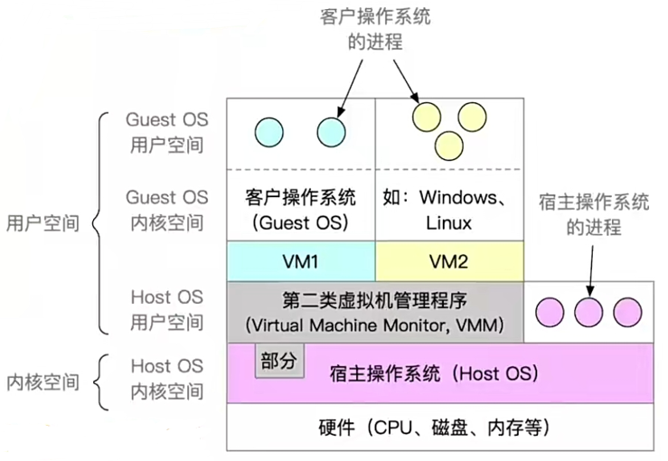

# 1.虚拟机概念

运用虚拟化技术，将一台物理机虚拟化为多台虚拟机。

---

## 1.1 第一类虚拟机

也叫 **裸金属虚拟化（Bare-metal Virtualization）** ，它的虚拟机管理程序（Hypervisor）直接运行在 **硬件** 上（比如：KVM, PVE）。

**特点：**
- 只有虚拟机管理程序运行在内核态。
- 虚拟机处于虚拟内核态，实际上是用户态。
- 直接运行在硬件上，由虚拟机来控制和分配硬件资源。

---

**优点：**
- **性能更高：** 由于直接运行在硬件上，不需要与宿主操作系统共享资源。
- **支持更多虚拟机：** 因为虚拟机管理程序拥有更直接的硬件访问权限，可以更高效地分配和管理资源。

**缺点：**
- **可迁移性差：** 由于虚拟机直接运行在硬件上，迁移到其他硬件平台可能会遇到兼容性问题。

---

## 1.2 第二类虚拟机

也叫 **托管虚拟化（Hosted Virtualization）**，这种虚拟化方式是虚拟机管理程序运行在宿主操作系统上（比如：VMWare, VirtualBox）。

**特点：**
- 虚拟机的内存、硬盘等资源都由宿主操作系统来虚拟化和分配。

---

**优点：**
- **迁移性更好:** 由于虚拟机是运行在宿主操作系统上，因此在不同的硬件平台间迁移比较容易，且不需要修改虚拟化管理程序本身。

**缺点：**
- **性能较差:** 虚拟机要通过宿主操作系统来访问硬件资源，会有额外的开销。
- **支持的虚拟机数量较少:** 宿主操作系统和虚拟化管理程序共享资源，因此虚拟机的数量和性能受到宿主操作系统的限制。
