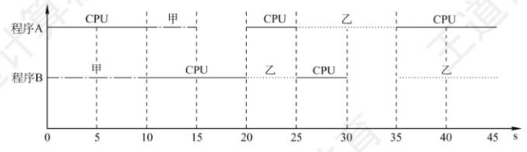

# 1.甘特图

画图时要注意，如处理器、打印设备等资源是 **不能让两个程序同时使用** 的，有一个程序正在使用时，其他程序的请求只能排队。

步骤：
- 横坐标上标出合适的时间间隔，纵坐标上的点是程序的名字。
- 过横坐标上每个标出的时间点，向上作垂直于横坐标的虚线。
- 用几种不同的线（推荐用“直线”“波浪线”“虚线”三种，较易区分）代表对不同资源的占用，按照题目给出的任务时间片，平行于横坐标把不同程序对应的线段分别画出来。

---

# 2.操作系统的运行环境

1. 操作系统执行程序时，必须从 **起始地址** 开始执行。

---

2. 系统调用需要触发 **陷入指令** 。

---

3. 外部中断是由 CPU 外部的事件引起的，如 I/O 设备的请求、时钟信号等；内部中断是由 CPU 内部的事件引起的，如访管指令、缺页异常等。

---

4. 外部中断处理过程，PC 值由中断隐指令（也就是由 **硬件**）自动保存，而通用寄存器内容由操作系统保存。

---

5. 有中断请求时，大部分 CPU 是在当前指令执行完毕后，才转去执行中断服务程序。

---

6. 中断处理和子程序调用都需要压栈以保护现场。子程序调用只需要保存 **程序断点** ，即该指令的下一条指令的地址；中断处理要保存 **程序断点** 和 **程序状态字寄存器的内容** 。