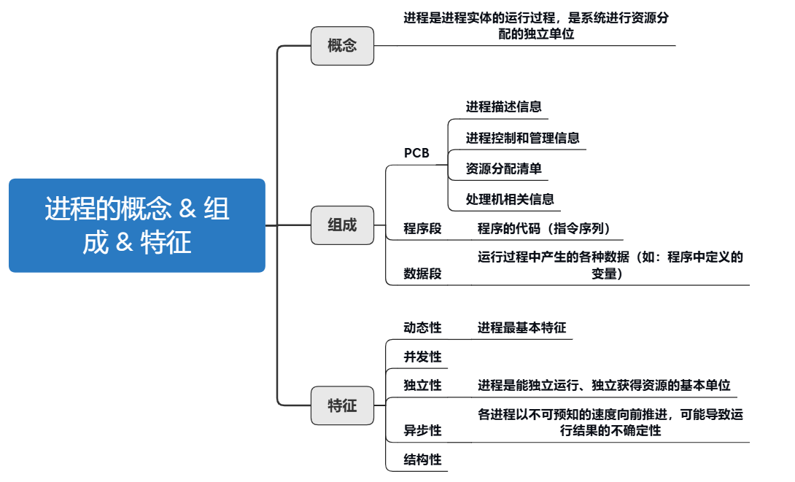

---

# 1.进程的概念

- **程序：** 静态的，是存放在 **磁盘里的可执行文件** ，是一系列的指令集合。
- **进程（Process）：** 动态的，是 **程序的一次执行过程** 。同一个程序可能有多个进程。

进程的基本描述信息全部存放在一个数据结构 **PCB（Process Control Block）** 中，即进程控制块。操作系统需要对各个并发运行的进程进行管理，但凡管理时所需要的信息，都会被放在 PCB 中。

---

# 2.进程的组成

---

## 2.1 PCB

操作系统对进程管理工作所需的信息都存放在 **PCB** 中。**PCB 是进程存在的唯一标志** ，当进程被创建时，操作系统为其创建 PCB，当进程结束时，会回收其 PCB 。

**PCB 包含的信息：**
1. **进程标识信息** ：用于唯一标识一个进程及其所属关系。
- 进程标识符（PID）
- 父进程标识符（PPID）
- 用户标识符（UID）/组标识符（GID）

2. **处理机（CPU）状态信息** ：保存进程在 CPU 中的执行上下文信息，用于进程切换时恢复运行状态。
- 程序计数器（PC）：记录 **下一条** 将要执行的指令地址  
- 程序状态字（PSW）：包含条件码、中断码等  
- 通用寄存器、堆栈指针等其他 CPU 寄存器值

3. **进程控制和调度信息** ：支持操作系统对进程进行调度和管理。
- 进程状态：就绪、运行、阻塞、终止等  
- 优先级信息  
- 所属调度队列信息  
- 进程间通信信息（如信号、管道、消息队列）  
- 资源使用统计信息（如 CPU 时间、I/O 次数）

4. **资源分配信息** ：记录进程已获得的系统资源。
- 打开的文件（文件描述符表）  
- 占用的内存区域（代码段、堆、栈等）  
- 使用的 I/O 设备（如设备句柄、缓冲区信息）

---

**注：** PCB 通常存储在 **内核空间** ，由操作系统维护，用户进程无法直接访问。操作系统的“进程切换”核心工作就是保存当前进程的 PCB → 读取下一个进程的 PCB → 恢复执行上下文。

---

## 2.2 代码段、数据段

- **代码段：** 程序的代码（指令序列），又称程序段。
- **数据段：** 存放程序运行过程中所使用的全局变量和静态变量等数据。

总之，PCB 是给操作系统用的；代码段、数据段是给进程自己用的。

这里简单了解下即可，后面的“内存管理——分段存储管理”中会详细说明。

---

## 2.3 程序运行过程

**进程** 和 **进程实体** 的区别：
- 进程（Process）是程序的一次执行，是 **动态** 的活动单位；
- 进程实体（Process Entity 或 Process Image）是构成进程的 **静态集合** ，包括程序代码、数据、PCB 等，是 **进程在某一时刻的完整状态描述** 。

> 在无线程模型中，进程是 **资源分配** 和调度的基本单位。
> 在引入线程模型之后：
>> 进程是资源分配的单位（内存空间、打开文件等）；
>> 线程是调度的单位（每个线程有独立的 PC、寄存器等执行上下文）。

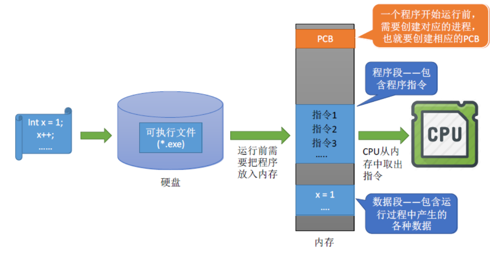

---

# 3.进程的特征

- **动态性：** 进程是程序一次执行过程，是动态产生、变化和消亡的。
- **并发性：** 内存中有多个进程实体，各个进程可并发执行。
- **独立性：** 进程是能独立运行、独立获取资源的基本单位。
- **异步性：** 各个进程按各自独立的、不可预知的速度向前推进，操作系统需引入进程 **同步** 与 **互斥** 机制来协调进程之间的运行关系（后面会学到）。
- **结构性：** 每个进程都会配置一个 PCB。结构上看，进程由代码段、数据段、PCB 组成。

---

# 4.进程的状态 & 转换

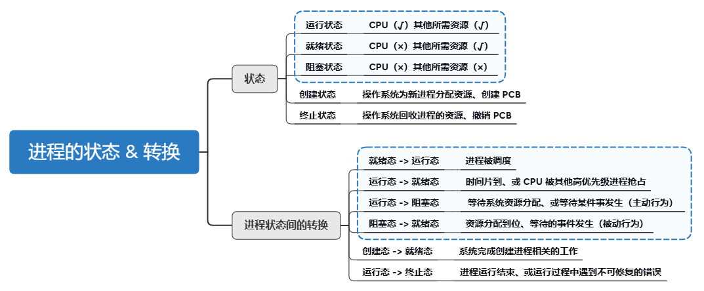

---

## 4.1 进程的状态

| 状态名称                        | 描述                                                                                    |
| ------------------------------- | --------------------------------------------------------------------------------------- |
| **创建态（New）**               | 正在被创建。操作系统正在为其 **分配资源** 、初始化 PCB 等准备工作。                     |
| **就绪态（Ready）**             | 已准备好运行， **等待被调度到 CPU** 。具备运行条件，但 CPU 正忙。                       |
| **运行态（Running）**           | 占用 CPU 正在执行，系统中 **同时最多只有一个进程处于运行态（在单核系统下）** 。         |
| **阻塞态（Blocked / Waiting）** | 正在等待某事件（如 I/O 完成、资源释放），暂时无法继续执行，**即使有 CPU 也不能运行** 。 |
| **终止态（Terminated / Exit）** | 进程执行完成或被操作系统强制终止， **资源回收中或已回收完毕** ，将被从系统中移除。      |

进程 PCB 中，会有一个变量 `state` （可能是枚举、整型变量）来表示进程当前状态。

---

为了对同一个状态下的各个进程进行统一的管理，操作系统会将各个进程的 PCB 组织起来，组织方法如下：

1. **链接方式：** 最常见、效率高的实现方式。
   - 按照进程状态将 PCB 分为多个队列（比如就绪队列、阻塞队列、终止队列……）；
   - 每个 PCB 中包含一个指向下一个 PCB 的指针；
   - 操作系统保留指向每个队列头节点的指针。

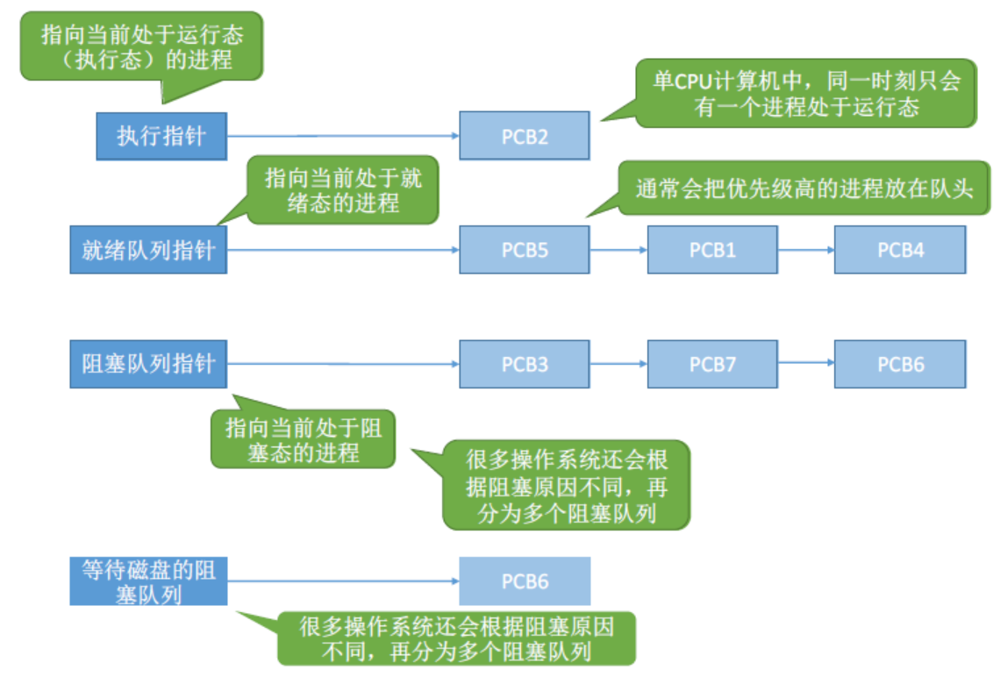

---

2. **索引方式：** 查找/访问较快，嵌入式或特殊场景中较常见。
   - 操作系统维护多个数组或哈希表（例如按状态分类），也就是索引表；
   - 每个表项记录对应状态下的 PCB 或 PCB 地址；
   - 操作系统持保留指向各个索引表的指针。

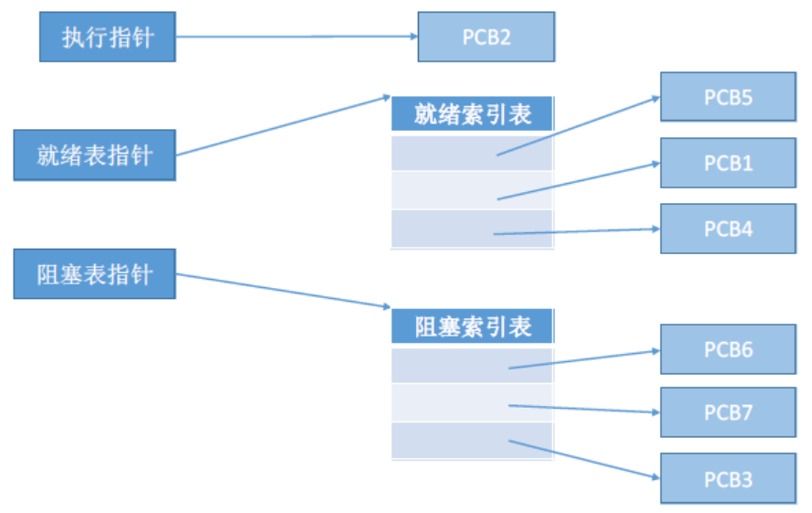

---

## 4.2 进程状态的转换

- **阻塞态 -> 就绪态** 不是进程自身能控制的，是一种 **被动** 行为；
- **运行态 -> 阻塞态** 是一种进程自身做出的 **主动** 行为。

不能由阻塞态直接转换为运行态，也不能由就绪态直接转换为阻塞态（因为进入阻塞态是进程主动请求的，必然需要进程在运行时才能发出这种请求）。

---

# 5.进程控制

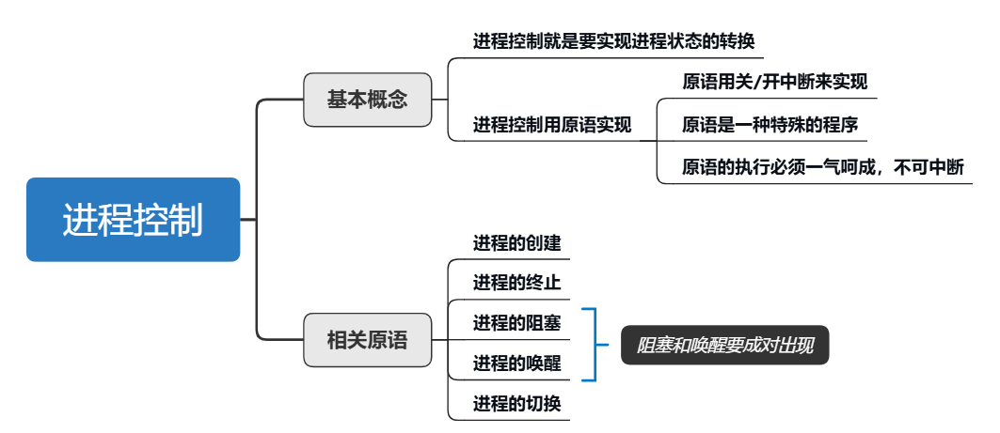

- **定义：** 进程控制是操作系统 **内核** 的重要功能模块，用于创建、撤销、切换、阻塞和唤醒进程，并维持进程运行状态的正确转换。

- **实现：** 通过 **原语（原子操作）** （一气呵成的特性，不允许被中断）。

> 为什么要使用原语？
> > 如果一个进程从阻塞态 -> 就绪态，需要两步:
> > > step1: 修改`state`变量；
> > > step2: 从阻塞队列中移除放到就绪队列中。
> >
> > 如果这两步骤不能一气呵成的执行，就会出现问题。比如：CPU 执行完一条指令后，就会检查一遍是否有 **中断信号** 需要处理，如果有，则转而去处理中断信号。这也是导致本来应该一起执行的两条指令，可能出现只执行一条指令的情形。

原语的实现原理：使用 **“关中断-执行关键指令-开中断”** 方式：
1. 执行“关中断”指令后，就不去处理中断信号，仅仅执行连续的指令；
2. 执行“开中断”指令后，就把之前没有处理的中断信号全部处理完。

这样，“关中断”指令和“开中断”指令之间的指令就可以一气呵成的执行完。

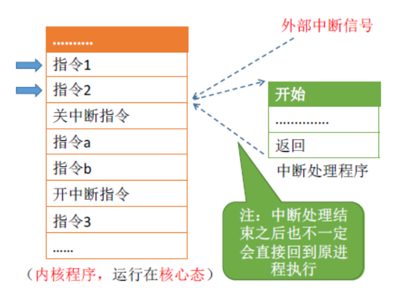

---

## 5.1 进程的创建原语

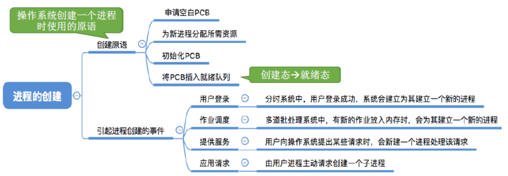

---

## 5.2 进程的终止原语

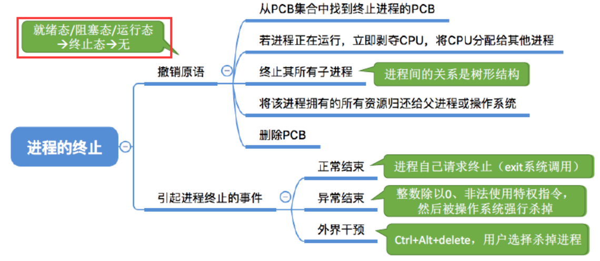

---

## 5.3 进程的阻塞 & 唤醒原语

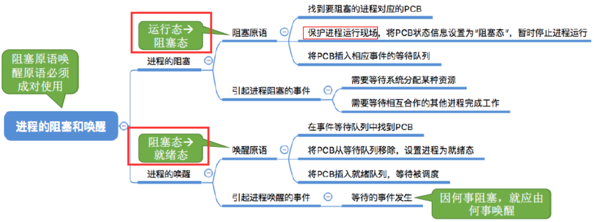

---

## 5.4 进程的切换原语

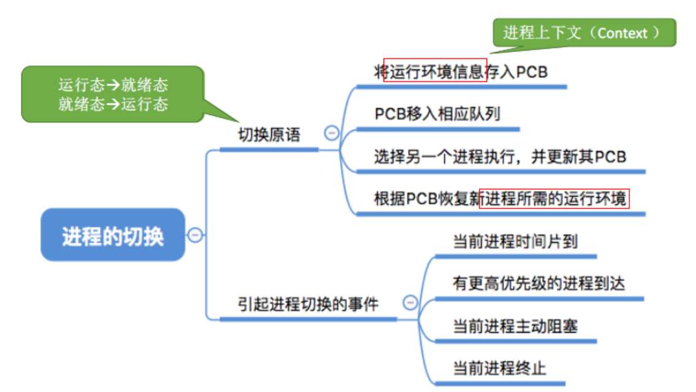

---

## 5.5 保存运行环境

进程在执行时，CPU 寄存器（如 **程序计数器 PC、程序状态字 PSW、通用寄存器** 等）中会保存进程的运行环境信息。然而这些寄存器是 CPU 的物理资源，是多个进程 **共享** 的，所以不属于某一个特定进程。当操作系统执行进程切换时，会将当前运行进程的上下文信息（即寄存器中的值）保存到它自己的 **PCB** 中；当该进程再次被调度执行时，操作系统会从其 PCB 中恢复寄存器状态，使进程能够 **从上次中断处** 继续执行。

---

# 6.进程通信

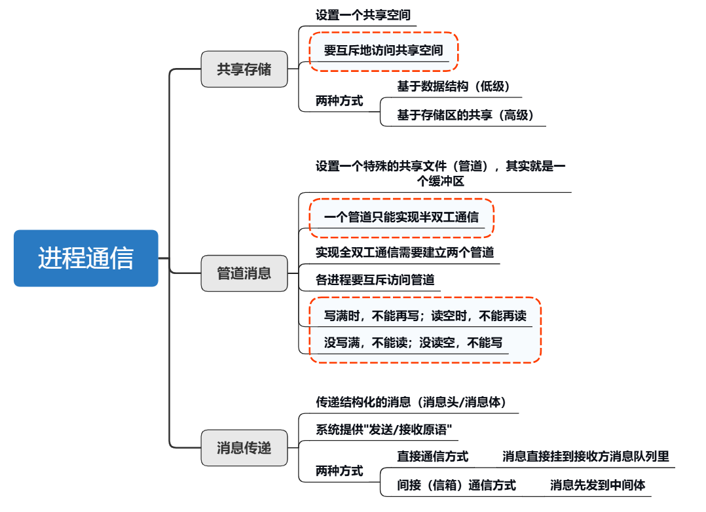

**定义：** 进程通信是指多个进程之间进行 **数据交换** 的机制，以实现 **协同工作** 或 **数据共享** 的目的。进程是分配系统资源的单位（包括内存地址空间），在采用进程隔离机制的现代操作系统中，每个进程运行在 **独立的虚拟地址** 空间中，不能直接访问其他进程的内存，以保障系统稳定与安全。但是进程之间的信息交换又是必须实现的，为了保证进程间的通信安全，操作系统提供了一些方法：共享存储、消息传递、管道通信。

---

这里 **虚拟地址** 的概念会在 **4.内存管理** 中详细说明，也可以提前了解 [1.虚拟地址和物理地址](../03内存管理/03补充.md) 。

---

## 6.1 共享存储

**定义：** 共享存储是指两个或多个进程通过访问同一块内存区域来实现通信的方式。进程之间对共享空间的访问必须是 **互斥** （不能同时访问）的。

---

- **基于数据结构的共享：** 比如共享空间里只能放一个长度为`10`的数组。这种共享方式速度慢、限制多，是一种 **低级通信** 方式。
- **基于存储区的共享：** 在 **内存** 中画出一块共享存储区，数据的形式、存放位置都是 **由进程控制** ，而不是操作系统。相比之下，这种共享方式速度更快，是一种 **高级通信** 方式。

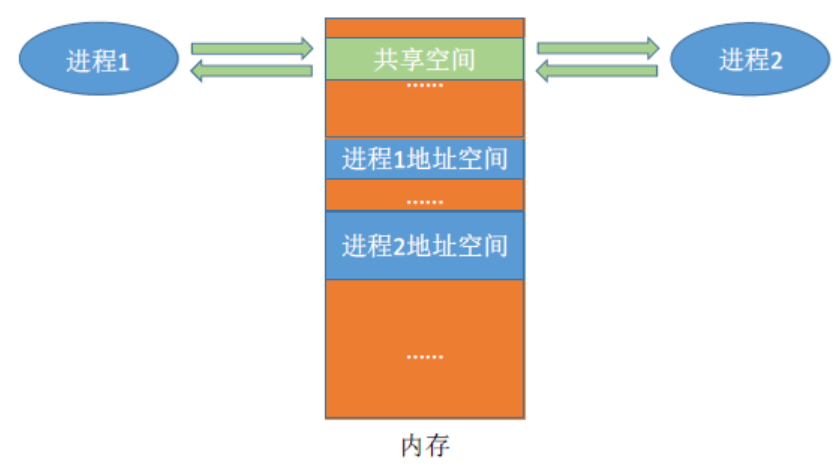

---

## 6.2 消息传递

**定义：** 进程间的数据交换以 **格式化的消息** （Message）为单位。进程通过操作系统提供的 **“发送消息/接收消息”** 两个 **原语** 进行数据交换。
> 消息结构通常包括：
> - 消息头（Header）：
>>  - 发送者 ID（PID）
>>  - 接收者 ID（PID）
>>  - 消息类型 / 优先级
>>  - 消息长度
>- 消息体（Body）：
>>  - 实际传递的数据内容

---

消息传递的两种方式：
- **直接通信方式：** 消息直接挂到接收进程的消息 **缓冲队列** 上。
- **间接通信方式：** 消息先发送到 **中间实体（信箱）** 中，因此也称“信箱通信方式”。

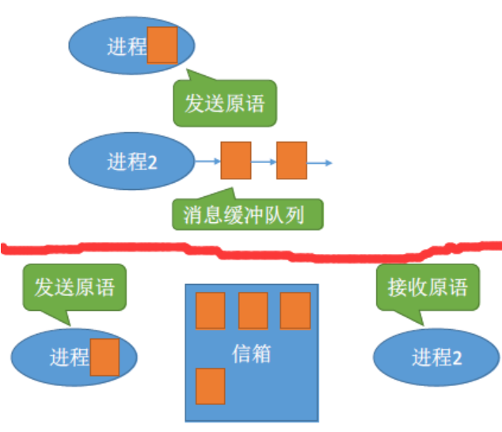

---

## 6.3 管道通信

1. 管道只能采用 **半双工通信** ，某一时刻内只能实现 **单向** 的传输。如果要实现双向同时通信，则需要设置两个管道。

2. 管道是一种 **临界资源** ，因此对其访问必须遵循 **互斥** 访问原则。

3. 管道是基于内核缓冲区的，里面的数据以 **字符流** 的形式写入管道。如果管道中没有数据，读（`read()`）操作将会阻塞；如果管道满了，写（`write()`）操作将会阻塞。

4. 管道是流式通信，随时都可以读，不要求写满才读！只要有数据，`read()`就能读取，哪怕只写了`1`个字节。

5. 数据一旦被读出，就从管道中被抛弃，这就意味着读进程最多只能有一个，否则可能会有读错数据的情况。

6. 可以 **多个写进程 -> 一个读进程** 、 **多个写进程 -> 多个读进程** 。后者实现需操作系统 **同步** 处理。

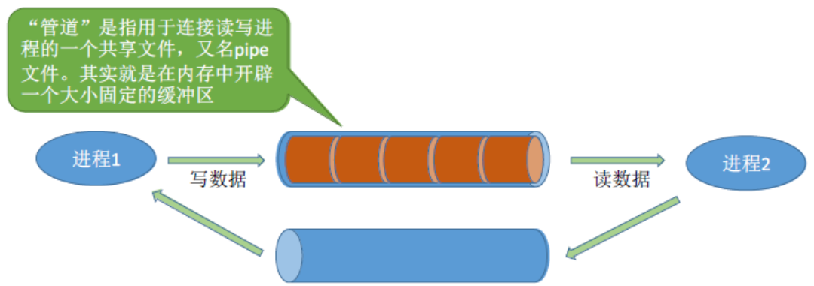

