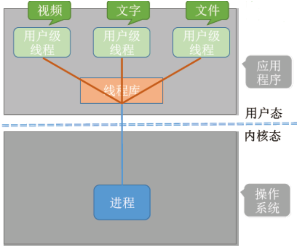
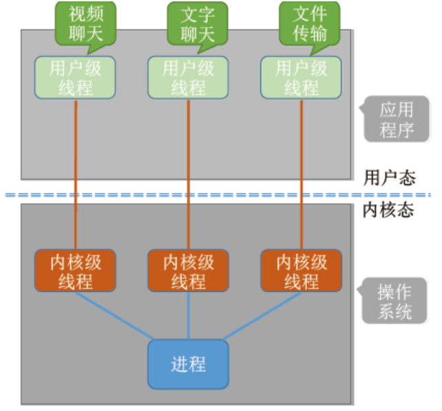
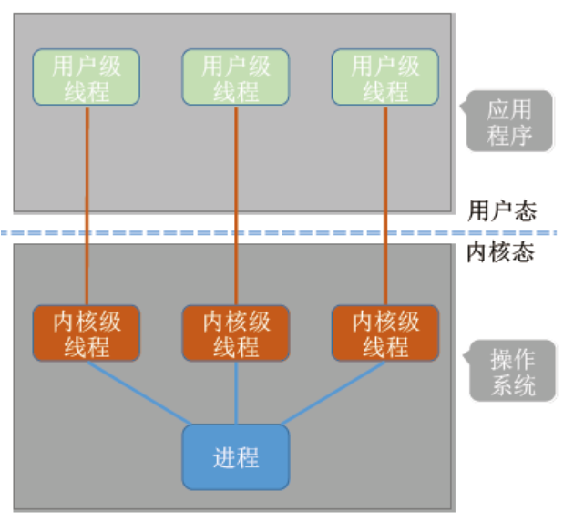
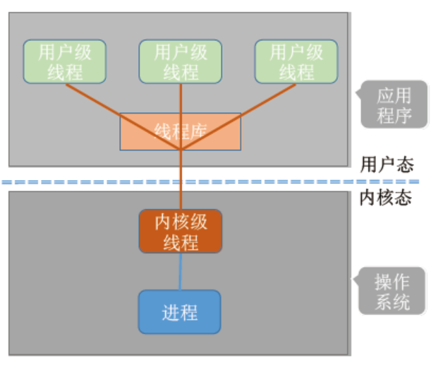
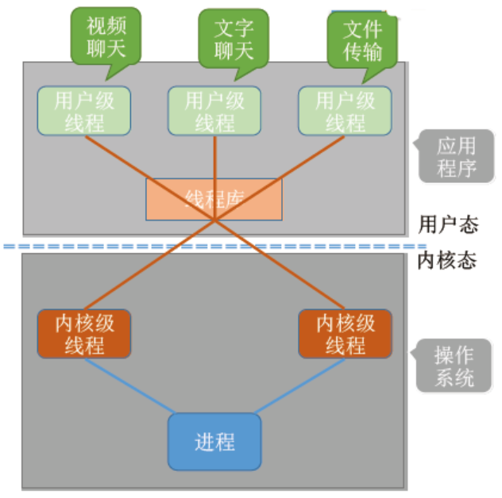

---

# 1.线程的概念

**定义：** 线程是一个基本的 CPU 执行单元，也是 **程序执行流的最小单位** 。

> 引入线程后，进程只作为 **除 CPU 之外的系统资源** 的分配单元（如打印机、内存地址空间等都是分配给进程的）；线程作为 **处理机（CPU）** 的分配单元。

**引入线程后的变化：**
1. 资源分配、调度：
   - 传统进程机制中，进程是资源分配、调度的基本单位；
   - 引入线程后，进程是资源分配的基本单位，线程是调度的基本单位。

2. 并发性：
   - 传统进程机制中，只能进程间并发；
   - 引入线程后，各线程之间也能并发，提升了并发度。

3. 系统开销：
   - 传统的进程间并发，需要切换进程的运行环境，系统开销很大；
   - 线程间并发，如果是同一个进程内的线程切换，则不需要切换进程环境，系统开销小（不涉及切换页表等）。

后续学了 **内存管理** 再来看这里时会理解得会更深刻。

---

# 2.线程的属性

| 属性点           | 描述                                                                         |
| ---------------- | ---------------------------------------------------------------------------- |
| **调度单位**     | 线程是 **CPU调度的基本单位**，进程只负责资源管理。                           |
| **多核支持**     | 多核/多CPU系统中，不同线程可以分布在多个CPU上并行执行。                      |
| **线程ID & TCB** | 每个线程有唯一 ID，系统维护 **线程控制块（TCB）** 来保存其状态信息。         |
| **线程状态**     | 就绪、运行、阻塞 —— 和进程一样的三种基本状态。                               |
| **资源拥有**     | 线程本身几乎 **不拥有资源** ，只拥有自己的寄存器、栈等少量上下文。           |
| **资源共享**     | 同一进程内的线程共享： **地址空间、打开文件、全局变量等资源** 。             |
| **通信效率**     | 同一进程中的线程之间通信不需要操作系统干预， **直接读写共享内存即可** 。     |
| **线程切换**     | **同进程内线程切换** 开销极小；不同进程间线程切换需上下文+内存切换，开销大。 |

---

# 3.线程实现方式

---

## 3.1 用户级线程（User-Level Thread，ULT）

通过程序员实现的 **线程库** 来实现多线程。
```C
int main() {
    int i = 0;
    while (true) {
        if (i == 0) { 处理视频聊天的代码; }
        if (i == 1) { 处理文字聊天的代码; }
        if (i == 2) { 处理文件传输的代码; }
        i = (i + 1) % 3;   // i 的值为 0、1、2、0、1、2...
    }
}
```



| 问题                      | 描述                                                                                                               |
| ------------------------- | ------------------------------------------------------------------------------------------------------------------ |
| **1. 谁负责管理？**       | **应用程序/线程库** 负责所有线程的创建、调度、切换。操作系统“看不到”这些线程。                                     |
| **2. 切换是否涉及内核？** | **不涉及** ，线程切换完全在用户态进行，效率高，不需要上下文切换到内核态。                                          |
| **3. 操作系统能否感知？** | 操作系统 **无法感知** ，它只知道是一个进程在跑。内部有几个线程，操作系统是不知道的。                               |
| **4. 优点**               | 切换开销小、无需系统调用、效率高、可在没有线程支持的OS上实现。                                                     |
| **5. 缺点**               | 一个线程阻塞会 **导致整个进程阻塞** ，且 **无法利用多核并行** （因为线程在用户空间， OS 只调度进程，不调度线程）。 |

---

## 3.2 内核级线程（Kernel-Level Thread，KLT）



| 问题                     | 描述                                                                                                              |
| ------------------------ | ----------------------------------------------------------------------------------------------------------------- |
| **线程管理者是谁？**     | **操作系统内核** 负责线程的所有创建、调度、切换、销毁等管理工作。                                                 |
| **是否需要进入核心态？** | 是的。线程的创建、销毁、切换等都由操作系统内核完成，因此必须切入 **核心态** 。                                    |
| **操作系统能否感知？**   | 可以。内核会为每个线程建立 **TCB（线程控制块）** ，感知并调度每个线程。                                           |
| **优点**                 | 一个线程阻塞不会影响其他线程（不会阻塞整个进程）<br> 支持多核并行执行，**并发度高**                               |
| **缺点**                 | 每次线程调度/切换都需系统调用，涉及用户态 <-> 核心态转换，**开销较大**<br> 每个线程资源都由内核管理，系统开销更重 |

---

# 4.多线程模型

---

## 4.1 一对一模型

一个用户级线程映射到一个内核级线程，每个用户进程有与用户级线程同数量的内核级线程。




- **优点：** 当一个用户级线程被阻塞后，其他线程还可以继续执行，并发度高；多个线程可在多核处理机上并行运行。
- **缺点：** 每个线程都需要内核资源（如TCB、栈空间），内存占用大；线程的创建、销毁、切换都要陷入内核，系统开销大。

---

## 4.2 多对一模型

多个用户级线程映射到一个内核级线程，且一个进程只被分配一个内核级线程。



- **优点：** 用户级线程的切换在用户空间即可完成，不需要切换到核心态，线程管理的系统开销小，效率高。
- **缺点：** 当一个用户级线程被阻塞后，整个进程都会被阻塞，并发度不高；所有用户线程共享一个内核线程，因此无法利用多核 CPU 并行。

> **重点：** 操作系统只“看得见”内核级线程，因此只有内核级线程才是处理机分配的单位。

---

## 4.3 多对多模型

`n` 用户级线程映射到 `m` 个内核级线程（n >= m）。每个用户进程对应 `m` 个内核级线程。

内核级线程中可以运行任意一个有映射关系的用户级线程，只有两个内核级线程中正在运行的代码逻辑都阻塞时，这个进程才会阻塞。如下图所示：


既克服了多对一模型并发度不高的缺点（一个阻塞全体阻塞）；又克服了一对一模型中一个用户进程占用太多内核级线程，开销太大的缺点。但是，由于实现复杂，目前很多系统更偏向使用“一对一模型 + 线程池”等手段来达到类似效果。

> 用户级线程是“代码逻辑”的载体（描述做什么任务）；
> 内核级线程是“运行机会”的载体（代表是否能在 CPU 上运行）。

一段“逻辑代码”只有获得了“运行机会”才能被 CPU 执行。