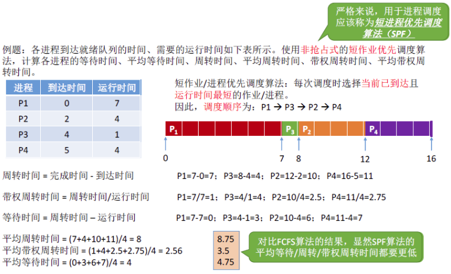

# 1.进程的调度

---

## 1.1 调度的概念

- **调度的概念：** 当有一堆任务需要处理的时候，但由于资源有限，这些事情没法同时处理，这就需要确定某种规则来决定处理这些任务的顺序，这就是“调度”研究的问题。

- **作业的概念：** 一个具体的任务。用户向系统提交一个作业 ≈ 用户让操作系统启动一个程序（来处理一个具体的任务）。

---

## 1.2 调度的三个层次

---

### 1.2.1 高级调度

**高级调度（作业调度）：** 按一定的原则 **从外存的作业后备队列中选择一个作业调入内存** ，并创建进程。每个作业只调入一次，调出一次。作业调入时会建立 PCB，调出时才撤销 PCB 。

> 简而言之：好几个程序需要启动，到底先启动哪个。

---

### 1.2.2 中级调度

当内存不够时，可能会把某些进程的数据调出到外存，等内存空闲时或者进程需要运行时再重新调入内存中。暂时调到外存等待的进程状态为 **挂起状态** ，被挂起的进程 PCB 会被组织成挂起队列。

**中级调度（内存调度）：** 按照某种策略 **决定将哪个处于挂起的进程重新调入内存** 。一个进程可能多次调出、调入内存，因此中级调度发生的频率要比高级调度高。

---

**补充知识：进程的挂起态 & 七状态模型**

暂时调到外存等待的进程状态为挂起状态（挂起态，suspend），挂起态可以分为 **就绪挂起、阻塞挂起** 两种。

**挂起 & 阻塞的区别：** 两种都是不能获得 CPU 的服务，但是挂起态是将进程从内存调出到外存中，而阻塞态的进程依然在内存中；有的操作系统会把就绪挂起和阻塞挂起分为两个队列，甚至可以根据阻塞的原因将阻塞队列细分为更多的队列。

更详细的描述可以参考： **[进程状态的补充](06补充.md#3进程状态的补充)** 。

---

### 1.2.3 低级调度

**低级调度（进程调度 / 处理机调度）：** 按照某种策略从就绪队列中选取一个进程，将处理机分配给它（内存 -> CPU）。进程调度是操作系统中 **最基本** 的一种调度，在一般的操作系统中都必须配置进程调度。进程调度的频率很高，一般几十毫秒一次。

---

### 1.2.4 调度层次对比

| 特征                 | **高级调度**（High-Level） 作业调度                     | **中级调度**（Medium-Level） 内存调度 / 进程挂起                      | **低级调度**（Low-Level） 进程调度                  |
| -------------------- | ---------------------------------------------------------- | ------------------------------------------------------------------------ | ------------------------------------------------------ |
| **主要任务**         | 从外存选择作业进入内存，创建进程                           | 挂起/恢复进程，调控内存负载                                              | 从就绪队列中挑选一个进程给 CPU 执行                    |
| **发生位置**         | 外存 → 内存                                                | 内存 ↔ 外存                                                              | 内存中，就绪队列 → CPU                                 |
| **调度对象**         | **作业** （尚未成为进程）                                  | **进程** （就绪/阻塞状态）                                               | **进程** （就绪状态）                                  |
| **发生频率**         | 低（用户提交作业后）                                       | 中等（系统内存压力较大时）                                               | 高（进程调度频繁，时间片到、I/O 等）                   |
| **对进程状态的影响** | 无进程状态（尚未创建 PCB） 创建后： **创建态 → 就绪态** | 内存中的进程被挂起，变为： **就绪 → 就绪挂起** 或 **阻塞 → 阻塞挂起** | **就绪态 → 运行态** 或 **运行态 → 就绪态 / 阻塞态** |
| **由谁触发**         | 用户提交作业、系统空闲                                     | 操作系统检测内存不足、长时间等待                                         | 时间片到、I/O 完成、中断、系统调用等                   |
| **目的**             | 控制进入系统的作业数量                                     | 控制内存负载，换出暂时不活跃进程                                         | 保证 CPU 利用率，实现并发执行                          |
| **是否涉及 PCB**     | ❌（作业还不是进程）                                        | ✅（进程存在，需保存/恢复 PCB）                                           | ✅（上下文切换涉及 PCB）                                |

---

## 1.3 进程调度的时机

**需要进行进程调度与切换的情况：**

1. **主动放弃处理机：**
   - **进程正常终止**（运行完毕，调用 `exit()`）
   - **运行中异常终止**（如非法访问内存）
   - **主动请求阻塞**（如等待 I/O、信号量、资源）

2. **被动放弃处理机：**
   - **时间片用完**（抢占式调度策略）
   - **有更高优先级进程进入就绪队列**
   - **外设发起中断信号**（I/O 完成等）

---

**不能进行进程调度与切换的情况：**

1. **处理中断时：**
   - 中断处理是内核与硬件交互的关键阶段，必须快速、完整执行，不能被进程切换打断。

2. **进程正在执行内核临界区代码：**
   - 为避免共享内核数据出错，进程在内核关键区域运行期间不会被切换。

3. **原语执行过程中：**
   - 原语具有原子性，不能被打断，只能一次性完成；例如对进程状态修改、PCB 链接操作。

> **补充：** 上面提到的“不允许调度切换”其实不是说完全 **不能发生上下文切换** ，而是 **调度器此时不会主动进行调度** ，为了确保系统数据结构一致性与硬件稳定性。等这些关键操作完成后，操作系统再决定是否需要调度其他进程。

---

| **概念**           | **定义**                                         | **发生位置**           | **保护机制**                                 |
| ------------------ | ------------------------------------------------ | ---------------------- | -------------------------------------------- |
| **临界资源**       | 资源被多个进程共享，且同一时刻只能有一个进程访问 | 可在用户空间或内核空间 | 同步机制（锁、信号量等）                     |
| **内核程序临界区** | 内核代码中对内核数据结构的访问部分               | 操作系统内核部分       | 中断关闭、禁用调度等                         |
| **（普通）临界区** | 进程在用户空间内访问共享资源的代码段             | 用户空间               | 互斥锁、信号量等（ **可以进行进程调度！** ） |

---

## 1.4 进程调度的方式

**非剥夺调度方式（Non-preemptive Scheduling）**

- **定义：** 一旦一个进程获得了处理机，除非它自己放弃（终止或进入阻塞态），否则系统不会中断它。
- **调度时机：** 只在进程 **主动释放处理机** 时进行调度。
- **优点：**
  - 实现简单
  - 系统开销小
- **缺点：**
  - 无法及时响应高优先级任务
- **适用场景：**
  - 早期的 **批处理系统**

---

**剥夺调度方式（Preemptive Scheduling）**

- **定义：** 当前运行的进程可被强制中断，处理机可以被 **更紧急或更高优先级的进程** 抢占。依赖于 **中断机制**，例如：时钟中断、I/O 中断。
- **调度时机：**
  - 时间片用完
  - 有更高优先级进程到达
  - I/O 中断等事件发生
- **优点：**
  - 能更好响应紧急任务
  - 可实现时间片轮转
- **缺点：**
  - 实现复杂
  - 系统开销较大
- **适用场景：**
  - **分时系统**
  - **实时系统**

---

## 1.5 进程的切换 & 过程

- **狭义的进程调度：**  
  - 指 **从就绪队列中选择一个进程** 来使用处理机的过程。这个选择动作本身并不一定引起进程切换。
  
- **广义的进程调度（包括两个步骤）：**  
  - **选择要运行的进程** （调度器从就绪队列中挑选）；
  - **上下文切换** （如果选中的进程不是当前正在运行的那个，就需要执行进程切换）。

---

**进程切换（上下文切换）**

- **定义：** 当前运行的进程让出 CPU，另一个进程获得 CPU 的过程。
- **涉及内容：**
  - 保存当前进程的运行现场（如 PC、寄存器等）到 PCB；
  - 恢复新调度进程的运行现场；

> 切换内容保存在 **进程控制块（PCB）中** 。

**注意：** 进程切换是 **有代价** 的，因此如果过于频繁的进行进程调度、切换，必然会使整个系统的效率降低，使系统大部分时间都花在了进程切换上，而真正用于执行进程的时间减少。

---

> **调度是“选谁来跑”，切换是“换人上场”。调度未必切换，但切换一定包含调度。**

---

# 2.调度算法的评价指标

---

## 2.1 CPU 利用率

**CPU 利用率：** 指 CPU “忙碌” 的时间占总时间的比例。

---

\[
利用率 = \frac{忙碌时间}{总时间}   
\]

---

## 2.2 系统吞吐量

**系统吞吐量：** 单位时间内完成作业的数量。

---

\[
系统吞吐量 = \frac{总共完成作业的数量}{总花费时间}   
\]

---

## 2.3 周转时间

**周转时间：** 从用户 **提交作业开始** ，到作业的所有处理（包括计算 + I/O） **全部完成** ，所经历的全部时间。

周转时间包含的四个阶段：

| 阶段               | 描述                                                                      | 属于哪种调度 |
| ------------------ | ------------------------------------------------------------------------- | ------------ |
| ① 后备队列等待时间 | 作业还没被调入内存，暂时在 **外存（磁盘）上排队** 等待分配内存            | **高级调度** |
| ② 就绪队列等待时间 | 作业已经变成了进程，进程被加载到内存中，但 **还没拿到 CPU，排队等待执行** | **低级调度** |
| ③ CPU 执行时间     | 进程 **获得 CPU 正在运行** 的时间                                         | ——           |
| ④ I/O 等待时间     | 如果进程在执行中需要 I/O，它会 **阻塞**，等待 I/O 设备完成操作            | ——           |

> ⚠️ **后三项（②~④）可能交替发生多次。**
> 比如：先运行一点（③）→ 然后等 I/O（④）→ 回到就绪队列（②）→ 再次运行（③）→ 再等 I/O（④）... 直到结束。

---

\[
作业周转时间 = 作业完成时刻 - 作业提交时刻
\]

---

\[
平均周转时间 = \frac{各作业周转时间之和}{作业数}   
\]

---

\[
带权周转时间 = \frac{作业周转时间}{作业在 CPU 上的运行时间}
\]

---

\[
平均带权周转时间 = \frac{各作业带权周转时间之和}{作业数}
\]

---

## 2.4 等待时间

**等待时间：** 指 **进程或作业** 处于等待处理机状态时间之和，等待时间越长，用户满意度越低。

- 对于进程来说，等待时间就是指进程建立后 **等待被服务的时间之和** ，等待 I/O 的时候虽然进程阻塞了，但它在被 I/O 设备服务，这个时间不算等待时间。
- 对于作业来说，不仅要考虑建立进程后的等待时间，还要加上作业 **在外存后备队列中等待的时间** 。

> 一个 **进程/作业** 总共需要被 CPU 服务多久，被 I/O 设备服务多久一般是确定不变的，因此调度算法其实只会影响作业/进程的等待时间。当然，与前面指标类似，也有“平均等待时间”来评价整体性能。

---

## 2.5 响应时间

> 对于计算机用户来说，会希望自己的提交的请求（比如通过键盘输入了一个调试命令）尽早地开始被系统服务、回应。

**响应时间：** 指从用户提交请求到首次产生响应所用的时间。

---

# 3.调度算法

各种调度算法研究思路：
- 算法思想
- 算法规则
- 这种调度算法是用于 **作业调度** 还是 **进程调度** 
- 抢占式？非抢占式？
- 优点 & 缺点
- 是否会导致饥饿（某 进程/作业 长期得不到服务）？

---

## 3.1 先来先服务（FCFS）

- 算法思想：主要从 **“公平”** 的角度考虑（排队买奶茶，先到先买）。
- 算法规则：按照作业/进程达到的 **先后顺序** 进行调度，等待时间越久的就越优先得到服务。
- 用于作业/进程调度：既可用于作业调度，也可用于进程调度。用于作业调度时，考虑的是哪个作业先到达后备队列；用于进程调度时，考虑的是哪个进程先到达就绪队列。
- 是否可抢占： **非抢占** 式的算法。
- 优缺点：
  - 优点：公平、算法实现简单。
  - 缺点：排在长作业（进程）后面的短作业需要等待很长时间，带权周转时间很大，对短作业来说用户体验不好。即 FCFS 算法 **对长作业有利，对短作业不利** 。
- 是否会导致饥饿： **不会** 。

---

例子：

---

## 3.2 短作业优先（SJF）

- 算法思想：追求最少的平均等待时间，最少的平均周转时间、最少的平均平均带权周转时间。
- 算法规则：被服务时间最短的作业/进程优先得到服务。
- 用于作业/进程调度：既可用于作业调度，也可用于进程调度。当用于进程调度时，称为“ **短进程优先** （SPF, Shortest Process First）算法”。
- 是否可抢占：SJF 和 SPF 默认是非抢占式的算法，但是也有抢占式的版本 —— **最短剩余时间优先** 算法（SRTN, Shortest Remaining Time Next）。
- 优缺点：
  - 优点：“最短的” **平均等待** 时间、 **平均周转** 时间（不考虑抢占式的）。
  - 缺点：不公平。对短作业有利，对长作业不利。可能产生 **饥饿** 现象。另外，作业/进程 的运行时间是由用户提供的，并不一定真实，不一定能做到真正的短作业优先。
- 是否会导致饥饿： **会** 。如果源源不断地有短作业/进程到来，可能使长作业/进程长时间得不到服务，产生“饥饿”现象。如果一直得不到服务，则称为“饿死”。

> **注意点：**
> 1. 如果未特别说明，所提到的“短作业/进程优先算法”默认是非抢占式的。
> 2. 很多书上都会说“SJF 调度算法的平均等待时间、平均周转时间最少”。严格来说，这个表述是错误的，不严谨的。实际上， **最短剩余时间优先** 算法得到的平均等待时间、平均周转时间还要更少。因此应该加上一个条件 **“在所有进程同时可运行时，采用 SJF 调度算法的平均等待时间、平均周转时间最少”** ，或者说 **“在所有进程都几乎同时到达时，采用SJF调度算法的平均等待时间、平均周转时间最少”** 。如果不加上述前提条件，则应该说 **“抢占式的短作业/进程优先调度算法（最短剩余时间优先, SRNT算法）的平均等待时间、平均周转时间最少”** 。
> > 虽然严格来说，SJF 的平均等待时间、平均周转时间并不一定最少，但相比于其他算法（如 FCFS）， SJF 依然可以获得较少的平均等待时间、平均周转时间。如果选择题中遇到“SJF 算法的平均等待时间、平均周转时间最少”的选项，那最好判断其他选项是不是有很明显的错误，如果没有更合适的选项，那也应该选择该选项。

---

例子（SJF）：
短作业/进程优先调度算法：每次调度时选择当前 **已到达且运行时间最短** 的 作业/进程。

---

例子（SRTF）：
最短剩余时间优先算法： **每当有进程加入就绪队列改变时就需要调度** ，如果新到达的进程剩余时间比当前运行的进程剩余时间更短，则由新进程抢占处理机，当前运行进程重新回到就绪队列。另外， **当一个进程完成时也需要调度** 。

---

## 3.3 高响应比优先（HHRN）

- 算法思想：要 **综合考虑**作业/进程的 **等待时间** 和 **要求服务的时间** 。
- 算法规则：在每次调度时先计算各个作业/进程的 **响应比** ，选择响应比 **最大** 的作业/进程为其服务。
\[
平均周转时间 = \frac{等待时间 + 要求服务时间}{要求服务时间}
\]

- 用于作业/进程调度：既可用于作业调度，也可用于进程调度。
- 是否可抢占： **非抢占式** 的算法。因此只有当前运行的作业/进程主动放弃处理机时，才需要调度，才需要计算响应比。
- 优点：
  - 综合考虑了等待时间和运行时间（要求服务时间）；
  - 等待时间相同时，要求服务时间短的优先（SJF 的优点）；
  - 要求服务时间相同时，等待时间长的优先（FCFS 的优点）；
  - 对于长作业来说，随着等待时间越来越久，其响应比也会越来越大，从而避免了长作业饥饿的问题。
- 是否会导致饥饿： **不会** 。

---

例子：
只有当前运行的进程 **主动放弃** CPU 时（正常/异常完成，或主动阻塞），才需要进行调度，调度时计算所有就绪进程的响应比，选 **响应比最高** 的进程上处理机。

---

## 3.4 时间片轮转（RR）

- 算法思想：公平地、轮流地为各个进程服务，让每个进程在一定时间间隔内都可以得到响应。
- 算法规则：按照各进程到达就绪队列的顺序，轮流让各个进程执行 **一个时间片** （如 `100` ms）。若进程未在一个时间片内执行完，则剥夺处理机，将进程重新放到就绪队列 **队尾** 重新排队。
- 用于作业/进程调度： **只用于进程调度** （只有作业放入内存建立了相应的进程后，才能被分配处理机时间片）。
- 是否可抢占：若进程未能在时间片内运行完，将被强行剥夺处理机使用权，因此时间片轮转调度算法属于 **抢占式** 的算法。由时钟装置发出 **时钟中断** 来通知 CPU 时间片已到。
- 优缺点：
  - 优点：公平；响应快，适用于 **分时操作系统** 。
  - 缺点：由于高频率的进程切换，因此有一定开销；不区分任务的紧急程度。
- 是否会导致饥饿： **不会** 。

> **时间片太大或太小分别有什么影响？**
> - **时间片太大：** 使得每个进程都可以在一个时间片内就完成，则时间片轮转调度算法退化为先来先服务调度算法，并且会增大进程响应时间。
> - **时间片太小：** 进程调度、切换是有时间代价的（保存、恢复运行环境），太小会导致进程切换过于频繁，系统会花大量的时间来处理进程切换，从而导致实际用于进程执行的时间比例减少。

---

例子：

---

## 3.5 优先级

- 算法思想：需要根据任务的紧急程度来决定处理顺序（实时操作系统的出现）。
- 算法规则：每个作业/进程有各自的优先级，调度时选择优先级最高的作业/进程。
- 用于作业/进程调度：既可用于作业调度，也可用于进程调度。甚至，还会用于在之后会学习的 I/O 调度中。
- 是否可抢占：抢占式、非抢占式都有。区别在于：非抢占式只需在进程主动放弃处理机时进行调度即可，而抢占式还需在就绪队列变化时，检查是否会发生抢占。
- 优缺点：
  - 优点：用优先级区分紧急程度、重要程度，适用于实时操作系统；可灵活地调整对各种作业/进程的偏好程度。
  - 缺点：若源源不断地有高优先级进程到来，则可能导致饥饿。
- 是否会导致饥饿： **会** 。

> **补充：**
> 1. 根据优先级是否可以动态改变，可将分为 **静态优先级** 和 **动态优先级** ：
> > - **静态优先级：** 创建进程时确定，之后一直不变。
> > - **动态优先级：** 创建进程时有一个初始值，之后会根据情况动态地调整优先级。
>
> 2. **如何合理设置各类进程的优先级？**
> > - 系统进程优先级高于用户进程；
> > - 前台进程优先级高于后台进程；
> > - 操作系统更偏好 **I/O 繁忙型** 进程。（原因：I/O 设备和 CPU 可以并行工作。如果让 I/O 繁忙型进程优先运行的话，则越有可能让 I/O 设备尽早地投入工作，那么资源利用率、系统吞吐量都会得到提升。）
>
> 3. **如果采用的是动态优先级，什么时候应该调整？**
> > - 可以从追求公平、提升资源利用率等角度考虑；
> > - 如果某进程在就绪队列中等待了很长时间，则可以适当提升其优先级；
> > - 如果某进程占用处理机运行了很长时间，则可适当降低其优先级；
> > - 如果发现一个进程频繁地进行 I/O 操作，则可适当提升其优先级。

---

例子（非抢占式）：

---

例子（抢占式）：

---

## 3.6 多级反馈队列

- 算法思想：对其他调度算法的折中权衡。
- 算法规则：
  - **step1：** 设置 **多级就绪队列** ，各级队列 **优先级从高到低** ， **时间片从小到大** ;
  - **step2：** 新进程到达时先进入第 `1` 级队列，按 FCFS 原则排队等待被分配时间片，若用完时间片进程还未结束，则进程进入下一级队列队尾。如果此时 **已经是在最下级的队列，则重新放回该队列队尾** ；
  - **step3：** 只有第 `k` 级队列为空时，才会为 `k + 1` 级队头的进程分配时间片。
- 用于作业 / 进程调度：**只用于进程调度** 。
- 是否可抢占： **抢占式** 的算法。在 `k` 级队列的进程运行过程中，若更上级的队列（1 ~ k-1 级）中进入了一个新进程，则由于新进程处于优先级更高的队列中，因此新进程会抢占处理机，原来运行的进程放回 `k` 级队列队尾。
- 优点：
  - 对各类型进程相对公平（FCFS 的优点）；
  - 每个新到达的进程都可以很快就得到响应（RR 的优点）；
  - 短进程只用较少的时间就可完成（SPF 的优点）；
  - 不必实现估计进程的运行时间（避免用户作假）；
  - 可灵活地调整对各类进程的偏好程度，比如 CPU 密集型进程、I/0 密集型进程（拓展：可以将因 I/O 而阻塞的进程重新放回原队列，这样 I/O 型进程就可以保持较高优先级）。
- 是否会导致饥饿： **会** 。

---

例子：

---

## 3.7 调度算法对比

**无交互：**

| 算法 | 可抢占？          | 优点                               | 缺点                             | 考虑等待时间？ | 考虑运行时间？ | 饥饿？ |
| ---- | ----------------- | ---------------------------------- | -------------------------------- | -------------- | -------------- | ------ |
| FCFS | 非抢占            | 公平、简单                         | 对短作业和 I/O 作业不利          | √              | ×              | 不会   |
| SJF  | 默认非抢占        | 最短平均周转时间（不考虑抢占式的） | 长作业可能饥饿；需预知运行时间   | ×              | √              | 会     |
| SRTN | 抢占（SJF抢占版） | 比SJF更优的响应                    | 长作业饥饿；实现复杂度高         | ×              | √              | 会     |
| HRRN | 非抢占            | 平衡等待与运行时间；避免饥饿       | 计算开销；非抢占导致紧急任务延迟 | √              | √              | 不会   |

---

**有交互：**

| 算法             | 可抢占？    | 优点                         | 缺点                     | 饥饿？ | 关键补充说明                                                                                  |
| ---------------- | ----------- | ---------------------------- | ------------------------ | ------ | --------------------------------------------------------------------------------------------- |
| **时间片轮转**   | 抢占式      | 公平；适合分时系统           | 切换开销大；无优先级区分 | 不会   | 时间片过大→响应差；过小→吞吐量低。                                                            |
| **优先级调度**   | 抢占/非抢占 | 灵活优先级控制；适合实时系统 | 需防止低优先级饥饿       | 会     | 动态优先级需 **老化（Aging）** 机制（逐步提高长等待任务的优先级）；实时系统中高优先级可抢占。 |
| **多级反馈队列** | 抢占式      | 平衡响应与吞吐量；自适应     | 配置复杂；长作业可能饥饿 | 会     | 通常设多个队列（如高优先级队列时间片短，低优先级队列时间片长）。                              |
