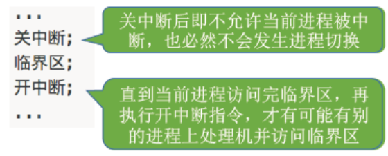
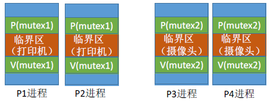
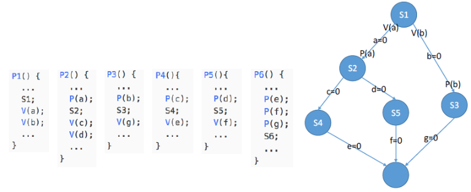
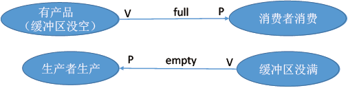

# 1.同步与互斥的概念

---

## 1.1 基本概念

- **异步性：** 即各并发执行的进程以不可预知的速度向前推进。
- **同步性：** ***多个进程以一定的顺序来执行*** 。同步亦称 **直接制约关系** ，它是指完成某种任务而建立的两个或多个进程因为需要在某些位置上 **协调** 它们的 **工作次序** 而产生的制约关系。

- **互斥（资源共享方式）：** 互斥亦称 **间接制约关系** 。
    - 互斥共享方式：系统中的某些资源，虽然可以提供给多个进程使用，但是一个时间段内 **只允许一个** 进程访问该资源。
    - 同时共享方式：系统中的某些资源，运行一个时间段内由 **多个进程“同时”** 对它们进行访问。

- **临界资源：** 一个时间段内只允许一个进程使用的资源。如：物理设备（摄像头、打印机）都属于临界资源，此外还有许多变量、数据、内存缓冲区都属于临界资源。因此对临界资源的访问，必须 **互斥** 地进行。

对临界资源的互斥访问，可以逻辑上分为四个部分：
```C
do {
    /**
     * 进入区
     * 负责检查是否可以进入临界区
     * 若可以进入，则应设置正在访问临界资源的标志(上锁)
     * 以阻止其它进程同时访问临界区
     */
    entry section;
    /**
     * 临界区
     * 访问临界资源的代码
     */
    critical section;
    /**
     * 退出区
     * 负责解除正在访问临界资源的标志(解锁)
     */
    exit section;
    /**
     * 剩余区
     * 做其它处理
     */   
    remainder section;
} while (true)
```

实现对临界资源的互斥访问，同时保证系统整体性能，需要遵循 **四** 个原则：
1. **空闲让进：** 临界区空闲时，可以允许一个请求进入临界区的进程进入临界区
2. **忙则等待：** 当已有进程进入临界区时，其他试图进入临界区的进程必须等待
3. **有限等待：** 当请求访问的进程，应保证能在有限的时间内进入临界区（保存不会饥饿）
4. **让权等待：** 当进程不能进入临界区，应立即释放处理机，防止进程忙等

---

# 2.互斥的实现方式

---

## 2.1 互斥的软件实现方式

---

### 2.1.1 单标志法

算法思想：
> 两个进程在访问临界区后会把使用临界区的权限转交给另一个进程。也就是说 **每个进程进入临界区的权限只能被另一个进程赋予** 。
```C
int turn = 0; // turn 表示当前允许进入临界区的进程号(表示谦让)

// P0 进程
while (trun != 0);
critical section;
turn = 1;
remainder section;

// P1 进程
while (trun != 1);
critical section;
turn = 0;
remainder section;
```

主要问题： 违背了 **空闲让进** 原则：
> 当`turn = 0`，`P0`进程不需要访问临界区，`P1`进程需要访问临界区，这样就会导致`P1`不能访问，但此时临界区时空闲的。

---

### 2.1.2 双标志先检查法

算法思想：
> 设置一个布尔类型数组`flag[]`，数组中各个元素用来标记 **各进程想进入临界区的意愿**，比如`flag[0] = true`意味着`0`号进程`P0`现在想进入临界区。每个进程在进入临界区之前先检查当前有没有别的进程想进入临界区，如果没有，则把自身对应的标志`flag[i]`设为`true`，之后开始访问临界区。
```C
bool flag[2]; // 表示进入临界区意愿的数组(表达意愿)
flag[0] = false; // P0 进程不想进入临界区
flag[1] = false; // P1 进程不想进入临界区

// P0 进程
while (flag[1]);   // 如果此时 P1 想进入临界区，P0 就一直循环等待 (检查)
flag[0] = true;    // 标记为 P0 进程想进入临界区 (上锁)
critical section;  // 访问临界区
flag[0] = false;   // 访问完临界区，修改标记为 P0 不想使用临界区
remainder section; //

// P1 进程
while (flag[0]);
flag[1] = true;
critical section;
flag[1] = false;
remainder section;
```

主要问题：违背了 **忙则等待** 原则
> 最开始，两个进程数组对应的值都为`false`，两个进程同时访问临界区，由于都为`false`，所以可以直接运行到`while`循环后。
>> 原因： **检查（从`while`的判断开始）** 和 **上锁（到`flag[i] = false`结束）** 不能一气呵成。

---

### 2.1.3 双标志后检查法

算法思想：
> 在双标志先检查法的基础上进行了改进， **先上锁，后检查** 。
```C
bool flag[2]; // 表示进入临界区意愿的数组(表达意愿)
flag[0] = false; // P0 进程不想进入临界区
flag[1] = false; // P1 进程不想进入临界区

// P0 进程
flag[0] = true;    // 标记为 P0 进程想进入临界区 (上锁)
while (flag[1]);   // 如果此时 P1 想进入临界区，P0 就一直循环等待 (检查)
critical section;  // 访问临界区
flag[0] = false;   // 访问完临界区，修改标记为 P0 不想使用临界区
remainder section; //

// P1 进程
flag[1] = true;
while (flag[0]);
critical section;
flag[1] = false;
remainder section;
```
主要问题：违背了 **空闲让进** & **有限等待** 原则
> 可能两个进程同时上锁，导致谁都不能访问临界区，产生 **死等**。注意和死锁的区别！

---

### 2.1.4 Peterson 算法

算法思想：
> 结合双标志法，单标志法的思想。如果双方都争着进入临界区，那可以让进程尝试 **互相谦让**，即表达自己想进入临界区的意愿，但是先让别人访问。

```C
bool flag[2]; // 表示进入临界区意愿的数组(表达意愿)
int turn = 0; // 表示当前允许进入临界区的进程号(表示谦让)
// P0 进程
flag[0] = true; // 表示 P0 想要进入
turn = 1;   // 对 P1 谦让
while (flag[1] && turn == 1);   // 如果 P1 真的想进，且自己已经“谦让”了，那就在这儿等着（被循环卡住）
critical section;
flag[0] = false;
remainder section;

// P1 进程
flag[1] = true;
turn = 0;
while (flag[0] && turn == 0);
critical section;
flag[1] = false;
remainder section;
```
主要问题：违背了 **让权等待** 原则

---

## 2.2 互斥的硬件实现方法

**执行的过程不允许被中断，都是一气呵成！**

---

### 2.2.1 中断屏蔽法

利用 **开/关中断指令** 实现（与原语实现的思想一样，即一个进程访问临界区前先关中断，访问完成后开中断，这样就不可能发生两个同时访问临界区的情况）。



- 优点：简单，高效
- 缺点：**不适用于多处理机**；只适用于操作系统内核程序，**不适用于用户进程**（因为开/关中断指令只能运行在内核态，这组指令如果能让用户随意适用就很危险）

---

### 2.2.2 TestAndSet（TS 指令/TSL 指令）

TSL 指令是 **用硬件实现** 的，执行过程中不允许被中断，只能 **一气呵成** 。

```C
// 布尔型共享变量 lock 表示当前临界区是否被加锁
// true 表示加锁，false 表示未加锁
bool TestAndSet(bool *lock) {
    bool old;
    old = *lock;
    *lock = true;   // 不管加没加锁，最后都会设置成加锁的状态（避免其它进程进入）
    return old;
}

// 以下是使用 TSL 指令实现互斥的算法逻辑
while (TestAndSet(&lock));   // 上锁 并 检查
// 临界区代码段...
lock = false;                // 解锁
// 剩余区代码段...
```

过程：
> 若刚开始`lock`是`false`，则`TSL`返回的`old`值为`false`，`while`循环条件不满足，直接跳过循环，进入临界区。若刚开始`lock`是`true`，则执行`TSL`后`old`返回的值为`true`，`while`循环满足条件，会一直循环，直到当前访问临界区的进程在退出区进行解锁。

- 对比：相比于软件实现方法，`TSL`指令把 **上锁** 和 **检查** 操作用硬件的方式变成了一气呵成的原子操作
- 优点：实现简单，无需像软件实现那样严格检查是否会有逻辑漏洞； **适用于多处理机环境**
- 缺点：不满足 **让权等待** 原则，暂时无法进入临界区的进程会占用`CPU`并循环执行`TSL`指令，从而导致忙等

---

### 2.2.3 Swap 指令（Exchange/XCHG 指令）

Swap 指令是 **用硬件实现** 的，执行的过程不允许被中断，只能 **一气呵成** 。

```C
// Swap 指令的作用是交换两个变量的值
Swap (bool *a, bool *b) {
    bool temp;
    temp = *a;
    *a = *b;
    *b = temp;
}

// 以下是使用 TSL 指令实现互斥的算法逻辑
// lock 表示当前临界区是否被加锁
bool old = true；
while (old == true)
    Swap(&lock, &old);
// 临界区代码段...
lock = false;                // 解锁
// 剩余区代码段...
```

过程：
> 逻辑上与`TSL`并无太大的区别，都是先记录下此时临界区是否已经被上锁（记录在`old`变量上），再将上锁标记`lock`设置为`true`，最后检查`old`，如果`old`为`false`则说明之前没有别的进程对临界区上锁，则可跳出循环，进入临界区。

- 优点：与`TSL`一样。
- 缺点：与`TSL`一样。

---

# 3.信号量机制

用户进程可以通过使用操作系统提供的 **一对原语** 来对信号量进程操作，从而很方便的实现了进程互斥、进程同步。

信号量其实就是一个变量（可以是一个整数，也可以是更复杂的记录型变量），可以用一个信号量来表示系统中某种资源的数量，比如：系统中只有一台打印机，就可以设置一个初值为 1 的信号量

**一对原语：** `wait(S)`、`signal(S)`，简称为`P`、`V`操作。

---

## 3.1 整型信号量

```C
int S = 1; // 初始化整型信号量 S，表示当前系统中可用的打印机资源数

void wait(int S) {   // wait 原语，相当于 进入区
    while (S <= 0);  // 如果资源数不够，就一直循环等待
    S = S - 1;       // 如果资源数够，则占用一个资源
}

void signal(int S) { // signal 原语，相当于 退出区
    S = S + 1;       // 使用完资源后，在退出区释放资源
}

// 进程 P0
wait(S);              // 进入区，申请资源
// 使用打印机资源...
signal(S);            // 退出区，释放资源

// 进程 P1
wait(S);
// 使用打印机资源...
signal(S);

// .......

// 进程 Pn
wait(S);
// 使用打印机资源...
signal(S);
```

缺点：不满足 **让权等待** 原则，会发生 **忙等** 。

---

## 3.2 记录型信号量

用 **记录型数据结构** 表示信号量。

```C
/* 记录型信号量的定义 */
typedef struct {
    int value;          // 剩余资源数
    struct process *L;  // 等待队列
} semaphore;

/**
 * 某进程需要使用资源时，通过 wait 原语申请
 *
 * 对信号量 S 的一次 P 操作意味着进程请求一个单位的该类资源
 * 因此需要执行 S.value--，表示资源数减 1
 * 当 S.value < 0 时表示该类资源已经分配完毕
 * 因此进程应调用 block 原语进行自我阻塞（当前运行的进程从 运行态 -> 阻塞态）
 * 主动放弃处理机，并插入到该类资源的等待队列 S.L 中
 * 可见，该机制遵循了 让权等待 原则，不会出现 忙等 现象
 *
 */
void wait (semaphore S) {
    S.value--;
    while(S.value < 0) {
        // 如果剩余资源数不够，使用 block 原语使进程从运行态进入阻塞态
        // 并把挂到信号量 S 的等待队列(即阻塞队列)中
        // 用 while 而不用 if 的原因：可能多个进程被唤醒，必须重新检查 S.value，确保资源可用才进入临界区
        block(S.L);
    }
}

/**
 * 进程使用完资源后，通过 signal 原语释放
 *
 * 对信号量 S 的一次 V 操作意味着进程释放一个单位的该类资源
 * 因此需要执行 S.value++，表示资源数加 1
 * 若加 1 后仍是 S.value <= 0，表示依然有进程在等待该类资源
 * 因此调用 wakeup 原语唤醒等待队列中的第一个进程
 * （被唤醒进程从 阻塞态 -> 就绪态）
 *
 */
void signal(semaphore S) {
    s.value++;
    if (S.value <= 0) {
        // 释放资源后，若还有别的进程在等待这种资源
        // 则使用 wakeup 原语唤醒等待队列中的一个进程，该进程从阻塞态变为就绪态
        // 用 if 而不用 while 的原因：只唤醒一个等待进程，不需要重复检查
        wakeup(S.L);
    }
}
```

- `wait`操作是用来 **申请资源** 的，当信号量的值大于`0`，进程可以直接获得资源，信号量的值会减`1`；当信号量的值小于`0`时，表示资源不足，进程必须进入等待队列，直到资源可用。所以判断条件用`<`。
- `signal`操作的目的是唤醒 **最多一个进程**，并且只在信号量的值小于或等于`0`时才会有进程在等待，唤醒的是等待队列中的一个进程。所以判断条件用`<=`。

---

## 3.3 总结

对于两种信号量，只需要记住 **P-减，V-增** 即可。 

---

# 4.P、V 操作的应用

用信号量机制实现进程同步、互斥、前驱关系。

---

## 4.1 同步关系（一前一后）

进程同步：要让各并发进程按要求有序地推进

- 分析什么地方需要实现 同步关系，即必须保证 **一前一后** 执行的两个操作
- 设置同步信号量`S`，初始值为`0`
- 在 **前操作** 之后执行`V(S)`
- 在 **后操作** 之前执行`P(S)`

```C
/**
 * 要求：后操作（代码4）需要在前操作（代码1和代码2）执行后才可以执行
 */
P1() {
    // 代码1
    // 代码2
    V(S);
    // 代码3
}
P2() {
    P(S);  //如果代码1和代码2没有执行完，就会主动请求阻塞
    // 代码4
    // 代码5
    // 代码6
}
```

---

## 4.2 互斥关系（错开访问）

- 分析并发进程的关键活动，划定临界区（如：对临界资源打印机的访问就应该放在临界区）
- 设置互斥信号量`mutex`，初值为`1`
- 在进入区`P(mutex)` —— 申请资源
- 在退出区`V(mutex)` —— 释放资源

注意：对于 **不同的临界资源** 需要设置 **不同的互斥信号量**



```C
/* 信号量机制实现互斥 */
semaphore mutex = 1;  // 初始化信号量

P1() {
    // ...
    P(mutex);  // 使用临界资源前需要加锁
    // 临界区代码段...
    V(mutex);  // 使用临界资源后需要解锁
    // ...
}

P2() {
    // ...
    P(mutex);  // 使用临界资源前需要加锁
    // 临界区代码段...
    V(mutex);  // 使用临界资源后需要解锁
    // ...
}
```

---

## 4.3 前驱关系

- 要为每一对前驱关系各设置一个同步信号量
- 在 **前操作** 之后对相应的同步信号量执行`V`操作
- 在 **后操作** 之前对相应的同步信号量执行`P`操作



---

# 5.经典同步问题

---

## 5.1 生产者消费者问题

**问题描述：**
> 系统中有 **一组生产者（多个）** 进程和一组消费者进程，生产者进程每次生产一个产品放入缓冲区，消费者进程每次从缓冲区中取出一个产品并使用。（注：这里的“产品”理解为某种数据） 

**分析：**
- 生产者、消费者共享一个初始为空、大小为`n`的缓冲区
- 只有缓冲区没满时，生产者才能把产品放入缓冲区，否则必须等待（缓冲区没满 -> 生产者生产）
- 只有缓冲区不空时，消费者才能从中取出产品，否则必须等待（缓冲区不空 -> 消费者消费）
- 缓冲区是临界资源，各进程必须互斥地访问（**互斥关系**）



```C
semaphore mutex = 1;  // 互斥信号量，实现对缓冲区的互斥访问
semaphore empty = n;  // 同步信号量，表示空闲缓冲区的数量
semaphore full = 0;  // 同步信号量，表示产品的数量，也即非空缓冲区的数量

producer() {
    // 生产一个产品...
    P(empty);
    P(mutex);
    // 把产品放入缓冲区...
    V(mutex);
    V(full);
}

consumer() {
    P(full);
    P(mutex);
    // 从缓冲区取出一个产品...
    V(mutex);
    V(empty);
    // 使用产品...
}
```

思考：能否改变互斥和同步的`P、V`操作的顺序？
> - 不可以，会产生死锁
> - 实现互斥的`P`操作一定要在实现同步的`P`操作之后

错误的顺序一：
```C
producer() {
    P(mutex);  // ❌ 互斥锁先执行
    P(empty);  // ❌ 可能导致死锁
    // 放入产品...
    V(full);
    V(mutex);
}
```
先`P(mutex)`，如果缓冲区已 **满** ，`P(empty)`会阻塞，但此时锁不会释放，导致消费者无法`P(mutex)`，形成死锁！

错误的顺序二：
```C
consumer() {
    P(mutex);  // ❌ 互斥锁先执行
    P(full);   // ❌ 可能导致死锁
    // 取出产品...
    V(empty);
    V(mutex);
}
```
先`P(mutex)`，如果缓冲区为 **空** ，`P(full)`会阻塞，但锁不会释放，导致生产者无法`P(mutex)`，形成死锁！

错误顺序三：
```C
producer() {
    P(empty);
    // ❌ 忘记 P(mutex)，多个生产者可能同时修改缓冲区
    // 放入产品...
    V(full);
}
```
忘记`P(mutex)`，多个生产者可能同时修改缓冲区，导致数据竞争和破坏。

---

## 5.2 多生产者多消费者问题

**问题描述：**
> 桌子上有一只盘子，每次只能向其中放入一个水果。爸爸专向盘子中放苹果，妈妈专向盘子中放橘子，儿子专等着吃盘子中的橘子，女儿专等着吃盘子中的苹果。只有盘子空时，爸爸或妈妈才可向盘子中放一个水果。仅当盘子中有自己需要的水果时，儿子或女儿可以从盘子中取出水果。 用`PV`操作实现上述过程。


**分析：**
- 互斥关系：（`mutex = 1`）
    - 对缓冲区（盘子）的访问要互斥地进行

- 同步关系（一前一后）：
    - 父亲将苹果放入盘子后，女儿才可以取走苹果
    - 母亲将橘子放入盘子后，儿子才可以取走橘子
    - 只有盘子为空是，父亲或母亲才可以放入水果

```C
semaphore mutex = 1;   // 实现互斥访问盘子(缓冲区)
semaphore plate = 1;   // 盘子中还可以放多少个水果
semaphore apple = 0;   // 盘子中有几个苹果
semaphore orange = 0;  // 盘子中有几个橘子

father() {
    while (1) {
        // 准备一个苹果
        P(plate);
        P(mutex);
        // 放苹果
        V(mutex);
        V(apple);
    }
}

mother() {
    while (1) {
        // 准备一个橘子
        P(plate);
        P(mutex);
        // 放橘子
        V(mutex);
        V(orange);
    }
}

daughter() {
    while (1) {
        P(apple);
        P(mutex);
        // 取苹果
        V(mutex);
        V(plate);
        // 吃掉苹果
    }
}

son() {
    while (1) {
        P(orange);
        P(mutex);
        // 取橘子
        V(mutex);
        V(plate);
        // 吃到橘子
    }
}
```

思考：可不可以不用互斥信号量（mutex）？
> 对于缓冲区大小 **为`1`** 的情况，**可以不设置** 互斥信号量，因为任何时候只能有一个进程访问缓冲区。但是对于缓冲区 **大于`1`** 的情况，**必须设置** 互斥信号量，否则多个生产者可能同时修改缓冲区，导致数据竞争和破坏。

---

## 5.3 吸烟者问题

**问题描述：**
> 假设一个系统有三个抽烟者进程和一个供应者进程。每个抽烟者不停地卷烟并抽掉它，但是要卷起并抽掉一支烟，抽烟者需要有三种材料:烟草、纸和胶水。三个抽烟者中，第一个拥有烟草、第二个拥有纸、第三个拥有胶水。供应者进程无限地提供三种材料，供应者每次将两种材料放桌子上，拥有剩下那种材料的抽烟者卷一根烟并抽掉它，并给供应者进程一个信号告诉完成了，供应者就会放另外两种材料在桌上，这个过程一直重复(让三个抽烟者轮流地抽烟)。


```C
semaphore finish = 0;  // 抽烟是否完成
semaphore offer1 = 0;  // 桌上组合一的数量
semaphore offer2 = 0;  // 桌上组合二的数量
semaphore offer3 = 0;  // 桌上组合三的数量
int i = 0;             // 用于实现轮流抽烟

provider() {
    // 这个 1 相当于 true，可以让这个循环一直持续下去（表示供应者一直供应材料）
    while (1) {
        if (i == 0) {
            // 将组合一放在桌上
            V(offer1);
        } else if (i == 1) {
            // 将组合二放在桌上
            V(offer2);
        } else if (i == 2) {
            // 将组合三放在桌上
            V(offer3);
        }
        i = (i + 1) % 3;
        P(finish);
    }
}

smoker1() {
    while (1) {
        P(offer1);
        // 拿走组合一
        V(finish);
    }
}

smoker2() {
    while (1) {
        P(offer2);
        // 拿走组合二
        V(finish);
    }
}

smoker3() {
    while (1) {
        P(offer3);
        // 拿走组合三
        V(finish);
    }
}
```

---

## 5.4 读者写着问题

**问题描述：**
> 有读者和写者两组并发进程，共享一个文件，当两个或两个以上的读进程同时访问共享数据时不会产生副作用，但若某个写进程和其他进程（读进程或写进程）同时访问共享数据时则可能导致数据不一致的错误。

因此要求：
- 允许多个读者可以同时对文件执行读操作
- 只允许一个写者往文件中写信息
- 任一写者在完成写操作之前不允许其他读者或写者工作（互斥）
- 写者执行写操作前，应让已有的读者和写者全部退出

方式一： **读优先**
```C
semaphore rw = 1;     // 用于实现对共享文件的互斥访问
int count = 0;        // 记录当前有几个读进程在访问文件
semaphore mutex = 1;  // 用于保证对 count 变量的互斥访问

writer() {
    while (1) {
        P(rw);  // 写之前 加锁
        // 写文件
        V(rw);  // 写完后 解锁
    }
}

reader() {
    while (1) {
        P(mutex);          // 各进程互斥的访问 count
        if (count == 0) {  // 由第一个读进程负责加锁
            P(rw);
        }
        count++;  // 访问文件的读进程数 +1
        V(mutex);
        // 读文件...
        P(mutex);          // 各进程互斥的访问 count
        count--;           // 访问文件的读进程数 -1
        if (count == 0) {  // 由最后一个读进程负责解锁
            V(rw);
        }
        V(mutex);
    }
}
```

方式二： **读写公平**
```C
semaphore rw = 1;     // 用于实现对共享文件的互斥访问
int count = 0;        // 记录当前有几个读进程在访问文件
semaphore mutex = 1;  // 用于保证对 count 变量的互斥访问
semaphore w = 1;      // 用于实现 写优先

writer() {
    while (1) {
        P(w);
        P(rw);  // 写之前 加锁
        // 写文件
        V(rw);  // 写完后 解锁
        V(w);
    }
}

reader() {
    while (1) {
        P(w);
        P(mutex);          // 各进程互斥的访问 count
        if (count == 0) {  // 由第一个读进程负责加锁
            P(rw);
        }
        count++;  // 访问文件的读进程数 +1
        V(mutex);
        V(w);
        // 读文件...
        P(mutex);          // 各进程互斥的访问 count
        count--;           // 访问文件的读进程数 -1
        if (count == 0) {  // 由最后一个读进程负责解锁
            V(rw);
        }
        V(mutex);
    }
}
```

---

## 5.5 哲学家问题

> 一张圆桌上坐着`5`名哲学家，每两个哲学家之间的桌上摆一根筷子，桌子的中间是一碗米饭。哲学家们倾注毕生的精力用于思考和进餐，哲学家在思考时，并不影响他人。只有当哲学家饥饿时，才试图拿起左、右两根筷子（一根一根地拿起）。如果筷子已在他人手上，则需等待。饥饿的哲学家只有同时拿起两根筷子才可以开始进餐，当进餐完毕后，放下筷子继续思考。

**分析：**
如果规定所有的哲学家都先拿左手边的筷子，再拿右手边的筷子，这样会导致死锁

**解决方法：**
- 可以对哲学家进程施加一些限制条件，比如最多运行四个哲学家同时进餐。这样可以保证至少有一个哲学家是可以拿到左右两只筷子的
- 要求奇数号哲学家先拿左边的筷子，然后再拿右边的筷子，而偶数号哲学家刚好相反。用这种方法可以保证如果相邻的两个奇偶号哲学家都想吃饭，那么只会有其中一个可以拿起第一只筷子，另一个会直接阻塞。这就 **避免了占有一支后再等待另一只的情况** 。
- 仅当一个哲学家左右两支筷子都可用时才允许他抓起筷子

```C
semaphore chopstick[5] = {1, 1, 1, 1, 1};
semaphore mutex = 1;  // 互斥地取筷子
Pi() {                // i 号哲学家的进程
    while (1) {
        P(mutex);
        P(chopstick[i]);
        P(chopstick[(i + 1) % 5]);
        V(mutex);
        // 吃饭...
        V(chopstick[i]);
        V(chopstick[(i + 1) % 5]);
        // 思考
    }
}
```

---

## 5.6 总结

`P(mutex)`是用来实现 **互斥访问** 的。 

---

# 6.管程

引入管程的原因：信号量机制存在的问题：编写程序困难、易出错。因此设计一种机制，让程序员写程序的时候不需要再关心复杂的`PV`操作。

将`PV`操作 **封装到具体问题的类中** ，使用的时候就直接调用方法即可。

**特征（和类的特征相似）：**
- 管程内的数据只能被管程内的方法访问（类中的私有变量只能由类中的方法访问）
- 一个进程只能通过管程所提供的方法才能访问共享数据（类中的私有变量只能通过类中方法获取）
- 每次仅允许一个进程在管程内执行某个过程（方法）

---

## 6.1 用管程解决生产者消费者问题

```C
#include <iostream>
#include <queue>
#include <thread>
#include <mutex>
#include <condition_variable>

const int N = 5;  // 缓冲区大小

class Monitor {
private:
    std::queue<int> buffer;  // 缓冲区
    int count = 0;           // 计数器
    std::mutex mtx;          // 互斥锁
    std::condition_variable full, empty;  // 条件变量

public:
    // 生产者插入产品
    void insert(int item) {
        std::unique_lock<std::mutex> lock(mtx);
        while (count == N) {
            full.wait(lock);  // 缓冲区满，等待
        }
        buffer.push(item);
        count++;
        std::cout << "Produced: " << item << "\n";

        if (count == 1) {
            empty.notify_one();  // 唤醒消费者
        }
    }

    // 消费者取走产品
    int remove() {
        std::unique_lock<std::mutex> lock(mtx);
        while (count == 0) {
            empty.wait(lock);  // 缓冲区空，等待
        }
        int item = buffer.front();
        buffer.pop();
        count--;
        std::cout << "Consumed: " << item << "\n";

        if (count == N - 1) {
            full.notify_one();  // 唤醒生产者
        }
        return item;
    }
};

// 创建全局管程
Monitor producerConsumer;

// 生产者线程
void producer() {
    for (int i = 0; i < 10; ++i) {
        producerConsumer.insert(i);
        std::this_thread::sleep_for(std::chrono::milliseconds(100));  // 模拟生产时间
    }
}

// 消费者线程
void consumer() {
    for (int i = 0; i < 10; ++i) {
        producerConsumer.remove();
        std::this_thread::sleep_for(std::chrono::milliseconds(150));  // 模拟消费时间
    }
}

// 主函数
int main() {
    std::thread p1(producer);
    std::thread c1(consumer);

    p1.join();
    c1.join();

    return 0;
}
```