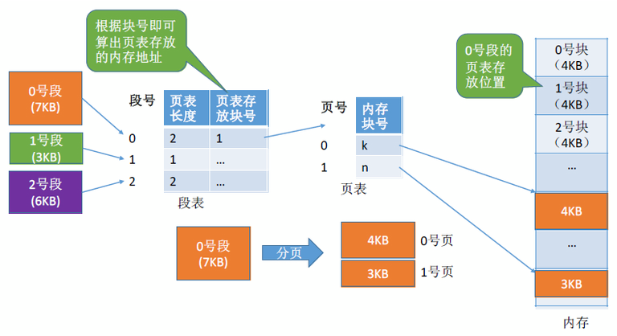

# 1.装入方式

---

## 1.1 绝对装入

在编译时，如果知道程序将放在内存的位置，编译程序就直接 **产生绝对地址的目标代码** 。适用于 **早期单道程序阶段** 的时候（无 OS）。

**缺点：** 如果分配的内存地址发生改变，需要重新编译链接生成新的目标代码，灵活性不高。

---

## 1.2 可重定位装入（静态重定位）

编译链接生成目标代码的时候，依然生成相对地址，当装入内存的时候， **把所有地址都加上起始物理地址** 。适用于 **早期多道批处理阶段** 。

**缺点：** 在装入一个作业时，必须分配其要求的全部内存空间，如果没有足够的内存，就不能够装入该作业。作业一旦装入内存，在运行期间也不可以移动，也不可以申请新的内存空间。

---

## 1.3 动态运行时装入（动态重定位）

装入内存的时候，依然采用相对地址，把地址转换工作推迟到程序真正要执行时才进行。需要借用一个 **重定位寄存器** 的支持，重定位寄存器中 **保存装入模块存放的起始位置** 。适用于 **现代操作系统** 。

**特点：**
- 可将程序分配到不连续的内存空间中
- 运行某一部分代码时，装入相应的代码即可
- 便于用户共享程序段

---

# 2.链接方式

---

## 2.1 静态链接

在程序运行之前，先将各目标模块及它们所需的库函数连接成 **一个完整的** 可执行文件（转入模块），之后不再拆开。


---

## 2.2 装入时动态链接

将各目标模块装入内存时，**边装入边链接** 的方式。依赖的动态库在 **程序启动时就已经被加载** （注意与运行时动态链接的区别）。


---

## 2.3 运行时动态链接

在执行程序中 **需要用到的目标模块才对它进行链接** 。可以方便 **修改** 和 **更新** ，便于对目标模块的 **共享** 。


---

# 2.内存管理


---

## 2.1 存储保护（简述）

> **定义：** 操作系统需要提供内存保护功能，保证各进程在各自存储空间内运行，互不干扰。

- **方法一：** 在 CPU 中设置一对 **上、下限寄存器** ，存放进程的上、下限地址。进程的指令要访问某个地址时， CPU 检查是否越界。


---

- **方法二：** 采用 **重定位寄存器** （基质寄存器）和 **界地址寄存器** （限长寄存器）进行越界检查。
  - 重定位寄存器：存放进程的 **起始物理位置** ；
  - 界地址寄存器：存放进程的 **最大逻辑地址（进程的大小）** 。


---

# 3.内存空间的分配与回收

---

## 3.1 单一连续分配

在单一连续分配方式中，内存被分为 **系统区** 和 **用户区** 。系统区常常位于内存的低地址部分，用于存放操作系统相关数据；用户区用于存放用户进程相关数据。

内存中 **只能有一道用户程序** ，用户程序独占整个用户区空间（早期的单道程序阶段）。

- **优点：** 实现简单；无外部碎片；可以采用覆盖技能扩充内存；不一定需要采取内存保护（因为只有一道用户程序）。
- **缺点：** 只能用于单用户、单任务的操作系统中； **有内部碎片** ，存储器利用率极低。

---

## 3.2 固定分区分配

为了可以装入多道程序，且这些程序之间又不会互相干扰，于是将整个用户空间划分为 **若干个固定大小** 的分区，在每个分区中只装入一道作业，这样就形成了最早的、最简单的一种可运行多道程序的内存管理方式。


1. 分区大小相等：缺乏灵活性，但是很适合用于用一台计算机控制多个相同对象的场合。
2. 分区大小不等：增加了灵活性，可以满足大小不同的进程需求，根据常在系统中运行的作业情况进行划分（划分多个小分区、适量中等分区、少量大分区）。

操作系统需要建立一个数据结构—— **分区说明表** ，来实现各个分区的分配与回收。每个表项对应一个分区，通常按分区的大小排列。每个表项包括： **分区的大小、起始状态、状态（是否分配）** 。


- **优点：** 实现简单、无外部碎片
- **缺点：** 
  - 当用户程序太大，可能没有一个分区满足要求，不得不采用覆盖技术，会降低性能。
  - 会 **产生内部碎片** ，内存利用率低。

---

## 3.3 动态分区分配（可变分区分配）

定义：不会预先分配分区，而是进程装入内存时， **根据进程的大小动态地建立分区** 。

---

### 3.3.1 记录内存的数据结构

**空闲分区表** 或者 **空闲分区链** 。


---

### 3.3.2 空闲分区的选择

把一个新作业装入内存时，须按照一定的动态分区分配算法，从空闲分区中选择一个分区分配给该作业。可参考 **3.4 动态分区匹配算法** .

---

### 3.3.3 分区的分配 & 回收

1. **分配：**

   - 情况一：当从空闲分区表中选择一个分区分配后，内存还有剩余，则修改表项。
   - 情况二：当从空闲分区表中选择一个分区分配后，刚刚好分配完，则删除该表项。

2. **回收：**

    - 情况一：回收区后面有一个相邻的空闲分区，则合并。
    - 情况二：回收区前面有一个相邻的空闲分区，则合并。
    - 情况三：回收区前后各有一个相邻的空闲分区，则三个合并为一个。
    - 情况四：回收区前后无相邻的空闲分区，则新增一个表项。

**内部碎片：** 分配给某些进程的内存区域中，有些部分没有用上。
**外部碎片：** 内存中某些空闲的分区由于太小而难以利用。

如果内存中零碎的空间太多，导致无法满足内存较大的进程，可采用 **拼凑技术** 来解决外部碎片。

**注：** 动态分区分配应该使用 **动态重定位装入** （原因：绝对装入，地址改变时需要重新编译；静态装入，不支持移动）。

---

## 3.4 动态分区匹配算法

---

### 3.4.1 首次适应算法（First Fit）

- **算法思想：** 每次都从 **低地址** 开始查找，找到第一个能满足大小的空闲分区。
- **实现方法：** 空闲分区 **以地址递增** 的次序开始排序。每次分配内存时顺序查找空闲分区链（或空闲分区表），找到第一个满足大小的空闲分区。

---

### 3.4.2 最佳适应算法（Best Fit）

- **算法思想：** 考虑大内存的进程有地可留， **优先使用更小内存** 的空闲区。
- **实现方法：** 空闲分区 **按容量递增** 次序链接。每次分配内存时顺序查找空闲分区链（或空闲分区表），找到第一个满足大小的空闲分区。
- **缺点：** 每次都选小内存的分区进行分配，会留下越来越多很小的、难以利用的内存块。因此这种方法会 **产生很多外部碎片** 。

---

### 3.4.3 最坏适应算法（Worst Fit）

又称 **最大适应算法（Largest Fit）**

- **算法思想：** 避免留下越来越多的小内存块， **优先使用更大内存** 的空闲块。
- **实现方法：** 空闲分区 **按容量递减** 次序链接。每次分配内存时顺序查找空闲分区链（或空闲分区表），找到第一个满足大小的空闲分区。
- **缺点：** 导致更快是使用完大内存的空闲块，使之后的大内存的进程无分区可用。

---

### 3.4.4 邻近适应算法（Next Fit）

- **算法思想：** 首次适应算法，每次都从低地址开始遍历，导致低地址产生越来越多很小的空闲块。新来一个进程就重新从头开始遍历，会增加查找的开销。邻近适应算法就是接着 **从上一次查找结束的位置开始检索** 。
- **实现方法：** 空闲分区 **按地址递增** 次序排列（可排成一个 **循环** 列表）。每次分配内存时从上次查找结束的位置开始查找空闲分区链（或空闲分区表），找到第一个满足大小的空闲分区。
- **优点：** 无论低地址还是高地址都有相同的概率被使用。
- **缺点：** 可能导致了高地址部分的大分区更可能被使用（因为等概率使用嘛），划分为小分区，最后导致无大分区可用（和 **最坏适应算法** 的缺点类似）。

---

### 3.4.5 总结和对比

综合来看，四种算法中， **首次适应算法** 的效果反而更好。

| 算法     | 算法思想                                           | 分区排列顺序                   | 优点                                                                   | 缺点                                                                                 |
| -------- | -------------------------------------------------- | ------------------------------ | ---------------------------------------------------------------------- | ------------------------------------------------------------------------------------ |
| 首次适应 | 从头到尾找适合的分区                               | 按地址递增                     | 综合看性能最好。算法开销小，回收分区后一般不需要对空闲分区队列重新排序 |                                                                                      |
| 最佳适应 | 优先使用更小的分区，以保留更多大分区               | 按容量递增                     | 会有更多的大分区被保留下来，更能满足大进程需求                         | 会产生很多太小的、难以利用的碎片；算法开销大，回收分区后可能需要对空闲分区表重新排序 |
| 最坏适应 | 优先使用更大的分区，以防止产生太小的不可用的碎片   | 按容量递减                     | 可以减少难以利用的小碎片                                               | 大分区容易被用完，不利于大进程；算法开销大（需要重新排序）                           |
| 邻近适应 | 由首次适应演变而来，每次从上次查找结束位置开始查找 | 按地址递增（可排列成循环链表） | 不用每次都从低地址的小分区开始检索。算法开销小（原因同首次适应算法）   | 会使高地址的大分区也被用完                                                           |

---

# 4.基本分页存储管理

---

## 4.1 分页管理概念

将内存分为一个个 **相等的分区** ，每个分区就是一个 **页框** （页框 = 页帧 = 内存块 = 物理块 = 物理页面）。

每个页框都有一个编号，即 **页框号** （页框号 = 页帧号 = 内存块号 = 物理块号 = 物理页号），页框号从`0`开始。

将进程的逻辑地址空间分为与页框相等的一个个部分，每个部分称为一个 **页** （页面） 。每个页也有一个编号，即 **页号** ，页号也从`0`开始。

操作系统 **以页框为单位** 为各个进程分配内存空间，进程的每个页分别放入一个页框中（进程的页与内存的页框有一一对应的关系，即 **逻辑页映射到物理页框**）。

| 名称                   | 对应什么       | 属于哪一类地址空间 | 作用                   |
| ---------------------- | -------------- | ------------------ | ---------------------- |
| 页（Page）             | 逻辑内存的一块 | 逻辑地址空间       | 把进程的内存切小块     |
| 页号（Page Number）    | 页的编号       | 逻辑地址空间       | 标识逻辑页             |
| 页框（Frame）          | 物理内存的一块 | 物理地址空间       | 物理页框容纳逻辑页     |
| 页框号（Frame Number） | 页框编号       | 物理地址空间       | 标识物理内存中页框位置 |

---

分页存储管理中：页框大小 = 页大小

**位图：** 是一个由`0`和`1`构成的位序列，用来 **标记每个页框是否空闲** ，操作系统通过它来分配或回收页框。

---

## 4.2 页表
---

### 4.2.1 基本概念

- **物理内存：** 存放 **页表** 。
- **PCB：** 存放页表的 **起始地址** 和 **页表长度** ，可以用来在内存中找到自己的页表。每个进程都有自己的页表。

页表是 **操作系统为每个进程维护的数据结构** ，存放在物理内存中（不一定在进程自己的地址空间中），用来记录 **页号 ↔ 页框号** 的映射关系。


- 📦 页面（Page）：就像一本书的某一页，里面是你 **程序的数据/代码** 。
- 📖 页表（Page Table）：页表就像目录，告诉你这本书的每一页（虚拟页）目前存放在哪个抽屉（页框），或者是否还没放进去（在磁盘上）。即 **一个页表项** 描述了一个 **逻辑页（Page）** 应被映射到哪个 **物理页框（Frame）** 。

---

### 4.2.2 问题一：页表项占多少个字节

> 假设某个系统物理内存大小为`4GB`，页面大小为`4KB`，则每个页表的页表项至少为多少字节？

- 内存块大小 = 页面大小 = \(4KB\) = \(2^{12}B\)

- 内存块（或页面）数量 = \(\frac{2^{32}}{2^{12}}\) = \(2^{20}\)

- 因此内存块的范围是 \(0\) ~ \(2^{20}-1\)  ，一个 **页表项** 至少需要 \(20 bit\) 来表示（反正是`>=20bit`）

- 由于内存的最小单位是`Byte`，至少用 \(3B\) 来表示块号 \(3 \cdot 8 = 24 bit\)

- 由于页号是隐含的（不需要额外存储，因为可以通过目标逻辑地址和页面大小推算出页号），因此每个页表项占 \(3B\) ，存储一个页表至少需要 \(3 \cdot (n + 1) B\) ，因为页表项范围是`0~n`。

- **注意：** 通常我们设置的页表项最好可以使每个页面恰好装下整个页表项。

---

### 4.2.3 问题二：如何实现地址转换


**逻辑地址`A`** 对应的 **物理地址** = `P`号页面在内存中的起始地址 + 页内偏移量`W`

可以利用二进制的特点巧妙计算，即：物理地址 = （页框号，页内偏移量）-> 二进制

原因： **页大小是`2`的幂次方** ，所以可以用二进制拆分地址位： **高位是页号，低位是页内偏移** 。拼接时也一样：高位是页框号，低位是偏移量，这样加法和乘法都不用做，只需要拼接二进制位。

---

> 比如：
> 系统物理内存大小为`4GB`，即 \(2^{32}B\) ，那么物理地址的范围是：0 ~ \(2^{32}-1\) ，刚好需要用`32`个二进制位来表示；
> 页面大小为`4KB`，即 \(2^{12}B\) ，那么页内偏移量范围是：0 ~ \(2^{12}-1\) ，刚好需要`12`个二进制位表示；
> 可以算出页框数量就是 \(2^{20}\) 个，那么页框数量（或者说是页框的编号范围）是：0 ~ \(2^{20}-1\) ，刚好需要`20`个二进制位表示。
> 最后一看，这不就有了：页框数量的二进制位数（`20`位） + 页内偏移量范围的二进制位数（`12`位） = 物理地址范围的二进制位数（`32`位）

---

## 4.3 基本地址变换机构

> 在分页式内存管理中，操作系统为每个进程维护一张页表，用于将逻辑地址转换为物理地址。系统通常设有 **页表寄存器（PTR 或 PTBR）** ，存放页表的起始物理地址`F`以及页表长度`M`。
> 当 **进程未被执行时** ，`F`和`M`会保存在其 **进程控制块（PCB）** 中。进程 **被调度运行时** ，操作系统将该进程的页表信息加载到`PTR`中，供地址转换使用。


> 假设一个逻辑地址 \(A\) （进程发出的地址），页面大小为 \(L\) ，要通过分页机制转化为物理地址 \(E\) 。

求解步骤如下：
1. 计算页号和页内偏移量： \(页号p = A\ \div \ L\) ， \(页内偏移量W = A\ mod \ L\) 。因为：
\[
逻辑地址A \ = \ 页号p \ \cdot \ 每个页的大小L \ + \ 页内偏移W
\]
想想一维数组中某个元素的地址是怎么计算的，不就跟这一样吗？
2. 判断页号是否越界：查询页表寄存器中的页表长度 \(M\) ，若 \(页号p >= 页表长度M\) ，则越界；反之继续下一步。
3. 查询页表，找到页表项对应的页框号，也就确定出了页面存放的页框号 \(b\) 。
4. 计算物理地址：
\[
物理地址E \ = \ 页框号b \  \cdot \ 每个页框的大小L + \ 页内偏移W
\]

整体逻辑就是： **逻辑地址 A → 拆分页号/偏移 → 页表查页框 → 构造物理地址** 。

---

## 4.4 快表

又称 **联想寄存器（`TLB`）** ，是一种访问速度比内存快很多的 **高速缓存（`cache`）** ，用来 **存放最近访问的页表项的副本** ，可以加快地址变换的速度。


引入快表后，改变的地方：
- 会先在快表里查询，看看是否存在（命中），如果不存在再去页表里查询；
- 在页表里查询到后，会把该表项存一份到快表中。

快表依据的是 **局部性** 原理：
- **空间局部性** ：一旦访问了某个存储单元，在不久后，其附近的存储单元也有可能被访问（因为很多数据在内存中都是连续存放的）。
- **时间局部性** ：如果执行了程序中的某条指令，那么不久后很有可能再次执行到这条指令（因为程序中存在大量的循环）。

---

> 例题：某系统使用基本分页存储管理，并采用了具有快表的地址变换机构。访问一次快表耗时`1us`，访问一次内存耗时`100us`。若快表的命中率为`90%`，那么访问一个逻辑地址的平均耗时是多少？

在具有快表的分页系统中，访问一个逻辑地址的流程如下：
1. **查找快表（TLB）** ：
   - 如果命中（`90%`概率），直接获取物理地址， **无需访问页表** 。
   - 如果未命中（`10%`概率），需要访问内存中的 **页表** 获取物理地址。
2. **访问内存数据** ：
   - 无论是否命中快表，最终都需要访问内存读取数据。

**情况 1：快表命中（90%）**
1. 访问快表：1 μs  
2. 访问内存数据：100 μs  
   **总时间 = 1 + 100 = 101 μs**

**情况 2：快表未命中（10%）**
1. 访问快表（未命中）：1 μs  
2. 访问内存中的页表：100 μs  
3. 访问内存数据：100 μs 
   **总时间 = 1 + 100 + 100 = 201 μs**

**平均访问时间（EAT）**
\[
EAT = (\text{命中率} \times \text{命中时间}) + (\text{未命中率} \times \text{未命中时间})
\]
\[
EAT = 0.9 \times 101 + 0.1 \times 201 = 90.9 + 20.1 = 111 \text{ μs}
\]

**补充：**
有的系统支持 **快表和慢表同时查找** ，如果是这样，平均耗时应该是 \( (1+100) \cdot 0.9 + (100+100) \cdot 0.1 = 110.9us \) 。
若未采用快表机制，则访问一个逻辑地址需要 \(100+100=200us\) ，显然，引入快表机制后，访问一个逻辑地址的速度快多了。

---

## 4.5 两级页表

单级页表存在的问题：有时页表的 **长度可能会很大** ，同时页号隐含导致页表必须在内存中连续存放。而根据 **局部性** 原理，很多时候，一段时间内 **只需要访问几个页面** 就可以正常运行，没必要让整个页表常驻内存。但是单级页表会让整个页表常驻内存。

简单来说：两级页表就是把原本一个大页表，拆成两个层次的页表结构，以减少内存空间的浪费。

**优点：** 不需要一次性为每个进程分配完整的页表，只分配实际用到的部分；未访问的部分不创建，懒加载，节省内存。

---

**两级页表的原理 & 地址结构：**


逻辑地址 = [一级页号][二级页号][页内偏移]
1. 用 **一级页号** 查第一级页表，找到对应的二级页表位置。
2. 用 **二级页号** 查第二级页表，找到物理页框号。
3. 用 **页内偏移** 拼接到物理地址，访问真实数据。

---

> 两级页表的结构（以`32`位虚拟地址为例），假设虚拟地址`32`位，页面大小`4KB`（页偏移 = `12`位），余下`20`位用于页号，划分成两部分：
>> 高`10`位：页目录索引（Page Directory Index）
>> 中`10`位：页表索引（Page Table Index）
>> 低`12`位：页内偏移（Page Offset）

```CSS
虚拟地址（32 位）：
[ 10位目录索引 | 10位页表索引 | 12位偏移 ]
```

---

为方便理解，可以类比图书馆找书：
> 第一级页表（总目录）：
>> 记录所有“分目录”的位置（比如按字母分区：A-F、G-M、N-Z）。
>> 例如：你想找《三体》，先查“S”开头的分目录在哪。

> 第二级页表（分目录）：
>> 记录具体书的存放位置（比如《三体》在3楼A区12架）。
>> 例如：在“S”分目录里找到《三体》的精确位置。

> 最终访问数据：
>> 根据“分目录”的指示，直接去书架拿书（访问物理内存）。

---

在表项中增加一个标志位，可用来表示该页/页表是否在内存中（不存在就触发 **缺页中断** ）：


---

# 5.基本分段存储管理

分页存储管理的缺点（引入分段管理的原因）：每个页面的大小都是固定相同的，这样可能导致某些程序的逻辑被拆分， **不利于信息的共享和保护** 。

分段管理是把 **程序的逻辑地址空间** 划分成若干 **“逻辑段”** ，每个段代表程序的一部分，比如：代码段、数据段、堆栈段等。

🧱 举个例子，一个程序的逻辑分段如下表所示：

| 段名   | 功能         |
| ------ | ------------ |
| 代码段 | 存放指令     |
| 数据段 | 存放全局变量 |
| 堆段   | 动态内存     |
| 栈段   | 函数调用栈   |

---

## 5.1 分段管理概念

- **概念：** 按照程序的自身逻辑关系划分为若干个段，每个段都有一个段名，每段从`0`开始编址。
- **内存分配规则：** 以 **段** 为单位进行分配，每个段在内存中占据连续空间（ **段内连续** ），但 **各段之间可以不相邻** 。


---

分段系统的逻辑地址结构  = [段号] + [段内偏移]
> 比如：段号 = `2`，偏移 = `0x00000400`，意思是访问第`2`段中偏移`1024`的位置。


---

## 5.2 段表

- 每个段都对应一个段表项，其中记录了该段在内存中的 **起始位置** （基址）和 **段的长度** 。
- 各个 **段表项的长度都是相同的** ，段号可以隐含，不占存储空间。


---

段表和页表的区别：

| 对比项       | 段表（Segment Table）                      | 页表（Page Table）                         |
| ------------ | ------------------------------------------ | ------------------------------------------ |
| 用于哪种管理 | 分段管理（Segmentation）                   | 分页管理（Paging）                         |
| 地址结构     | 段号 + 段内偏移                            | 页号 + 页内偏移                            |
| 表的作用     | 查找段的起始物理地址 + 检查段界限          | 查找页的物理页框地址                       |
| 每项内容     | Base（基址） + Limit（长度）               | Frame Number（页框号）+ 标志位（如存在位） |
| 每项代表     | 一个**逻辑模块（段）**，如代码段、数据段等 | 一个**固定大小的页面**                     |
| 段/页大小    | 每段大小 **可以不一样** ，灵活             | 每页大小 **相同** ，比如固定`4KB`          |
| 是否检查越界 | ✅ 是的（因为各段大小不固定）               | ❌ 不检查，偏移总在页内                     |
| 碎片问题     | 可能有**外部碎片**                         | 可能有**内部碎片**（最后一页可能不满）     |

---

## 5.3 地址变化


---

## 5.4 补充

> 有时候，我们在运行通过 C/C++ 写的程序时，会出现`Segmentation fault`这种类似的错误，表示 **段错误** ，正好就跟我们这里学的内存分段管理、段表机制有很直接的关系。

`Segmentation fault`是程序运行时访问了不该访问的内存段，导致操作系统终止了程序。它通常表示： **“你访问的内存地址不在你程序的合法段范围内！”**

🔍 跟分段管理有什么关系？

这就要从**段表的 Limit（段界限）检查机制**说起了。在**分段系统**中，每次访问内存时，CPU 都会这么做：
```
物理地址 = 段表[段号].Base + 段内偏移
```
但**在访问前**，它会先判断：
```cpp
if (段内偏移 > 段表[段号].Limit) {
    报错：Segmentation fault!
}
```

所以，程序访问了一个不在段内的地址 ⇒ 非法，然后操作系统发现越界 ⇒ 直接杀掉程序，最后给你一个提示：“Segmentation fault”。

造成这种现象的原因有很多，常见的有：访问空指针、访问已经删除的内存、数组越界、栈溢出（函数递归过深）。知道原因后，也为我们调试代码提供了一定思路。

---

# 6.段页式存储管理

---

## 6.1 段氏和页式的优缺点

分页式存储：

| 优点               | 说明                         |
| ------------------ | ---------------------------- |
| ✅ 避免**外部碎片** | 所有页大小相同，内存利用率高 |
| ✅ 内存管理简单     | 固定大小，分配容易           |
| ✅ 易于实现虚拟内存 | 不连续的页也能映射           |

| 缺点                  | 说明                                   |
| --------------------- | -------------------------------------- |
| ❌ 可能有 **内部碎片** | 页内用不完的空间浪费掉（比如最后一页） |
| ❌ 程序结构不清晰      | 按大小分，不考虑逻辑结构               |
| ❌ 无法支持段级权限    | 不能对“函数段只读”、“栈段可写”做区分   |

---

分段式存储：

| 优点                 | 说明                                           |
| -------------------- | ---------------------------------------------- |
| ✅ 更贴合程序逻辑结构 | 段代表代码段、数据段、堆、栈等                 |
| ✅ 支持权限/共享控制  | 每段可设置“只读/可写”、“是否共享”              |
| ✅ 编程更自然         | 程序员直接看到段的语义结构（比如变量在数据段） |

| 缺点                     | 说明                                                 |
| ------------------------ | ---------------------------------------------------- |
| ❌ 容易产生 **外部碎片**  | 段大小不固定，内存容易被“夹碎”                       |
| ❌ 内存管理复杂           | 段长不等，分配、合并都麻烦                           |
| ❌ 不适合现代虚拟内存机制 | 虚拟内存需要均匀分页映射，分段不方便页置换等策略实现 |

---

简而言之：
> 📗 分页追求“**管理效率**”，统一块大小，牺牲语义  
> 📘 分段追求“**结构语义**”，符合程序逻辑，管理难度大

---

## 6.2 段页式管理概念

定义：先将程序按逻辑划分为段（如代码段、数据段等），然后 **每段内部再分页** ，这样结合了“分段的逻辑性”和“分页的内存效率”，也就是 **逻辑上用分段，物理上用分页** 。


---

段页式系统的逻辑地址结构由 **段号** 、 **页号** 、 **页内地址（页内偏移量）** 组成。如：


---

每个段对应一个段表项，每个段表项由 **段号、页表长度、页表存放块号（页表起始地址）** 组成；每个 **段表项长度相等** ，段号是隐含的。其中每个页面又对应一个页表项，每个页表项由 **页号、页面存放的内存块号** 组成；每个 **页表项长度相等** ，页号是隐含的。



---

## 6.3 地址变化


