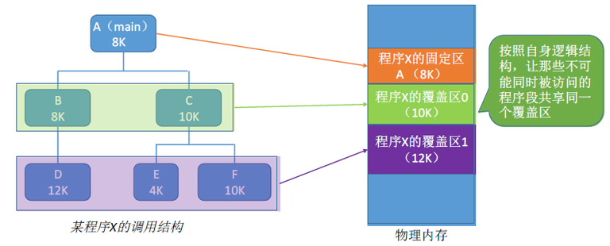
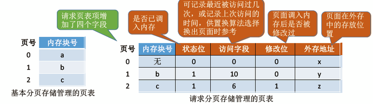
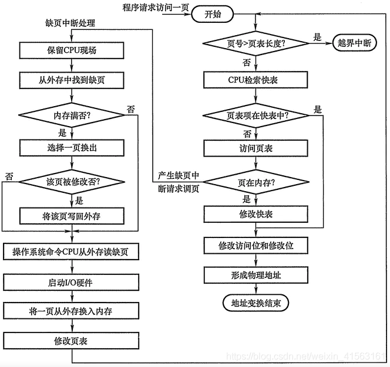
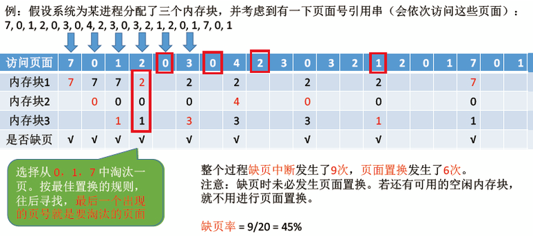
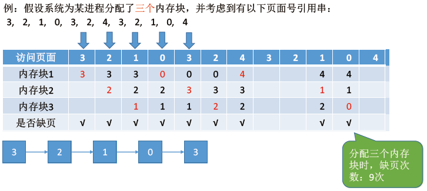
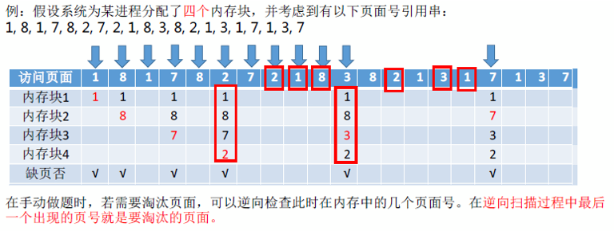

# 1.早期内存空间的扩充技术

---

## 1.1 覆盖技术

覆盖技术用来解决程序大小超过物理内存总和问题（比如一个几十多 GB 的游戏要放到只有`4`GB 的内存上运行）。

**思想：** 将程序分为多个段（多个模块），常用的段常驻内存，不常用的段在需要时调入内存。

内存中分为 **一个固定区** 和 **若干个覆盖区** 。把要 **常驻内存段放在固定区** ，调入后就不再调出（除非运行结束）； **不常用的段放在覆盖区** ，需要用到时调入内存，用不到时调出内存。

如下图所示，其中 A 一直运行，A 会调用 B 或 C（不会同时调用），B 会调用 D，C 会调用 E 或 F（不会同时调用）。可知 B、C 不可能同时进入内存，D、E、F 不可能同时进入内存，所以开辟两个覆盖区即可（节约内存）。

**缺点：** 必须由程序员声明覆盖结构，操作系统完成自动覆盖；对用户不透明，增加了用户编程负担。

---

## 1.2 交换技术

**思想：** 内存空间紧张时，系统将内存中某些进程暂时 **换出外存（挂起）** ，把外存中某些已具备运行条件的进程换入内存（进程在内存与磁盘间动态调度）。相当于 Linux 的`swap`分区。

**三个问题：**

1. 被换出的进程应该保存在外存（磁盘）的什么位置？
   - 磁盘存储空间分为 **对换区** （比如：`swap`分区） & **文件区** （比如`ext4`、`NTFS`）；
   - 文件区：采用离散分配方式，存放文件（主要追求磁盘空间的利用率）；
   - 对换区：采用连续分配方式，存放换出进程的数据（主要追求换出换入速度）；
   - 对换区的 I/O 速度比文件区更快（连续块减少寻道时间，尽管远小于内存）。

2. 什么时候应该换出？
   - 许多内存运行且内存吃紧时进行，而系统负荷降低就停止。

3. 应该换出哪些进程？
   - 优先换出 **阻塞** 进程；
   - 优先换出 **优先级低** 的进程；
   - 有的系统还会考虑 **驻留时间** 。

**注意：** **PCB（进程控制块）** 保存了进程的核心信息：进程状态、寄存器值、内存映射、I/O状态等，操作系统必须随时访问， **不能换出** 。换出的通常是 **进程映像的用户空间部分** ，包括代码段、数据段、堆栈等。

---

# 2.虚拟存储技术

先在传统存储管理方式的特征、缺点，这也是引入虚拟存储技术的原因。

1. **一次性：** 作业必须一次性全部装入内存后才能开始运行
   - 作业很大时，不能全部装入内存，导致大作业无法运行；
   - 当大量作业要求运行时，由于内存无法容纳所有的作业，因此只有少量作业能运行，导致多道程序 **并发度下降** 。

2. **驻留性：** 一旦作业被装入内存，就会一直驻留内存中，直至作业运行结束
   - 事实上，在一个时间段内，只需要访问作业的一小部分数据即可正常运行。

---

## 2.1 虚拟内存的定义和特征

- 基于局部性原理，在程序装入时，可以将程序中很快用到的部分装入内存，暂时用不到的部分留在外存，就可以让程序开始执行。
- 在程序执行过程中，当所访问的信息不在内存时，由操作系统负责将所需要的信息从外存调入内存，然后继续执行程序。
- 若内存空间不够时，由操作系统负责将内存中暂时用不到的信息换出到外存。

简而言之，在操作系统的管理下，在用户看来似乎有一个比实际内存大得多的内存，这就是虚拟内存。

---

**特点：**
- **多次性：** 无需在作业运行时一次性全部装入内存，而是运行被分为多次调入内存。
- **兑换性：** 在作业运行时无需一直常驻内存，而是允许在作业运行过程中，将作业换入、换出。
- **虚拟性：** 从逻辑上扩充了内存的容量，使用户看到的内存容量，远大于实际容量。

---

🔄 补充一下术语对照：

| 用户角度           | 操作系统实现                       |
| ------------------ | ---------------------------------- |
| “虚拟地址空间”     | 程序使用的地址空间                 |
| “看起来有很多内存” | 虚拟地址映射到物理页 + 磁盘页      |
| “不需要一次性装入” | 按页调入（demand paging）          |
| “会自动换出换入”   | 缺页中断 + 页面置换算法 + swap机制 |

---

## 2.2 实现虚拟内存技术

在传统的非连续分配存储管理的方式下进行改进：请求分页存储管理、请求分段存储管理、请求段页式存储管理。

**主要区别：**
> 在程序执行过程中，当所访问的信息不在内存时，由操作系统负责将所需要信息从外存调入内存，然后继续执行程序。步骤如下：
>> 1. 页（或段）不在内存 → 缺页（或缺段） **中断**
>> 2. 操作系统从磁盘中将所需页/段调入内存
>> 3. 修改页表/段表，重新执行指令

> 若内存空间不够，由操作系统负责将内存中暂时用不到的信息换出到外存。
>> 1. 后文会讲到的页面置换算法。

---

# 3.请求分页管理方式

---

## 3.1 页表机制

新增 **两个** 功能：
- **请求调页：** 操作系统需要知道每个页面是否已经调入内存；如果还没调入，那么也需要知道该页面在外存中存放的位置。
- **页面置换：** 操作系统需要通过某些指标来决定到底换出哪个页面（需要记录页面是否被修改）。

添加了四个标志位：

| 标志位       | 含义与作用                                                                    |
| ------------ | ----------------------------------------------------------------------------- |
| **状态位**   | 也称“ **驻留位（Present bit）** ”，表示该页是否已经在内存中（`1`在，`0`不在） |
| **访问字段** | 记录该页的访问情况（访问次数/最近访问时间）用于页面置换算法                   |
| **修改位**   | 也称“ **脏页位（Dirty bit）** ”，若页面被写过则置为`1`，换出时必须写回磁盘    |
| **外存地址** | 页面未调入时，操作系统需要根据此字段定位该页在磁盘中的位置（如`swap`区偏移）  |

---

## 3.2 缺页中断机构

在请求分页系统中，每当要访问的页面不在内存时，便产生一个 **缺页中断** ，然后由操作系统的缺页中断处理程序处理中断。

此时缺页的进程 **阻塞** ，放入阻塞队列，调页完成后再将其唤醒，放回 **就绪** 队列：
- 如果内存中有空闲块，则为进程分配一个空闲块，将所缺页面装入该块，并修改页表中相应的页表项；
- 如果内存中没有空闲块，则由页面置换算法选择一个页面淘汰，若该页面在内存期间被修改过，则要将其写回外存。未修改过的页面不用写回外存。

---

## 3.3 地址变换机构

- 只有 **写指令** 才需要修改 **修改位** 。并且，一般来说只需修改快表中的数据，只有要将快表项删除时才需要写回内存中的慢表，这样可以减少访存次数（称作 **延迟写回（lazy write-back）机制** ）。
- 和普通的中断处理一样，缺页中断处理依然需要保留 CPU 现场。
- 需要用某种 **页面置换算法** 来决定一个换出页面。
- 换入/换出页面都需要启动慢速的 I/O 操作，可见，如果换入/换出太频繁，会有很大的开销。
- 页面调入内存后，需要 **修改慢表** ，同时也需要将表项复制到快表中。

---

# 4.页面置换算法

---

## 4.1 最佳置换算法（OPT）

每次选择淘汰的页面将是 **以后永不使用** ，或者在 **最长时间内不再被使用访问** 的页面。

**注：** 上图中打勾的表示 **缺页中断** 。从第`4`个页面开始才会发生页面置换，因为内存块不够了嘛。

最佳置换算法可以保证 **最低的缺页率** ，但实际上，只有在进程执行的过程中才能知道接下来会访问到的是哪个页面，操作系统无法提前预判页面访问序列。因此，最佳置换算法是 **无法实现** 的。

---

## 4.2 先进先出置换算法（FIFO）

每次选择淘汰的页面是 **最早进入内存** 的页面。

**实现方法：** 把调入内存的页面根据调入的 **先后顺序** 排成一个 **队列** ，需要换出页面时选择队头页面即可。队列的最大长度取决于系统为进程分配了多少个内存块。

**Belady 异常：** 当为进程分配的内存块增大时，出现缺页次数不减反增的异常现象（可以假设当内存块增大为四个时，会有多少次缺页次数）。

只有 **FIFO 算法** 会产生 **Belady 异常** 。另外，FIFO 算法虽然实现简单，但是该算法与进程实际运行时的 规律不适应，因为先进入的页面也有可能最经常被访问，因此，算法性能差。

---

## 4.3 最近最久未使用置换算法（LRU）

每次淘汰的页面是 **最近最久未使用** 的页面。

**实现方法：** 赋予每个页面对应的页表项中，用访问字段记录该页面 **上次被访问以来所经历的时间`t`** 。当需要淘汰一个页面时，选择现有页面中 **`t`值最大** 的，即最近最久未使用的页面。

该算法的实现需要专门的硬件支持，虽然算法性能好，但是实现困难，开销大。

---

## 4.4 时钟置换算法（CLOCK）

时钟置换算法是一种 **性能和开销较均衡** 的算法，又称 **CLOCK 算法** （检查页面的时候，像时钟一样转圈）。**CLOCK 算法** 是一种近似 **LRU** 的算法，与 **最近未使用算法（NRU）** 都基于 **最近使用情况** 来决策页面替换，但实现方法不同。

**实现方法：** 
1. 为每个页面设置一个 **访问位** ，将内存中页面都通过指针链接形成一个 **循环队列** ；
2. 当某页面被访问时，将其访问位置为`1`；
3. 当需要淘汰一个页面时，只需检查页面的访问位：
   - 如果访问位是`0`，则选择 **换出** ；
   - 如果访问位是`1`，则将它置为`0`，暂不换出，继续检查下一个页面；
4. 如果第一轮扫描没有符合条件的页面，则继续扫描第二轮（第二轮一定有访问位为`0 `的页面）。

所以该算法 **最多扫描两轮** 。

操作实现可以记为 **一转为`1`改访问，再转为`0`就送走** ：

| 口诀部分 | 含义                                            |
| -------- | ----------------------------------------------- |
| 一转不舍 | 第一次扫描，如果访问位是`1`，暂时舍不得换出     |
| 清访问   | 把访问位改为`0`，表示已经“警告”你了，下次就换你 |
| 再转不舍 | 第二次扫描，如果访问位是`0`，说明最近真的没用了 |
| 就送走   | 直接换出这个页面（淘汰）                        |

---

## 4.5 改进型时钟置换算法

简单的时钟置换算法仅仅考虑了是否被访问过，如果一个页面访问过但是未被修改，淘汰时就不需要写回内存，应该优先淘汰此类的页面，可以减少 I/O 操作写回内存。

用 **两个** 标志位（ **访问位** ， **修改位** ）来记录一个页面是否被访问过，是否被修改过。在其它条件都相同的时候，应该 **优先淘汰没有修改过的页面** ，避免 I/O 操作。

**实现方法：** 
- 将所有可能被置换的页面排成一个 **循环队列** ；
- 第一轮：从当前位置开始扫描到第一个（0，0）的页面用于替换。本轮扫描 **不修改任何标志位** （第一优先级：最近没访问，且没修改的页面）；
- 第二轮：若第一轮扫描失败，则重新扫描，查找 **第一个（0，1）的页面** 用于替换。本轮所有扫描过的页面 **访问位设置为`0`** （第二优先级：最近没访问，但修改过的页面）。
- 第三轮：若第二轮扫描失败，则重新扫描，查找第一个（0，0）的页面用于替换。本轮扫描 **不修改任何标志位** （第三优先级：最近访问过，但没修改的页面）。
- 第四轮：若第三轮扫描失败，则重新扫描，查找第一个（0，1）的页面用于替换（第四优先级：最近访问过，且修改过的页面）。

所以该算法 **最多扫描四轮** 。

---

## 4.6 对比

| 算法           | 实现方式                           | 优点                        | 缺点                               | 性能 |
| -------------- | ---------------------------------- | --------------------------- | ---------------------------------- | ---- |
| **OPT**        | 优先淘汰最长时间内不会被访问的页面 | 最优性能，最小化缺失率      | 不可实现，依赖未来访问模式         | 最优 |
| **FIFO**       | 优先淘汰最先进入内存的页面         | 实现简单，易理解            | 忽略访问模式，可能替换频繁访问页面 | 差   |
| **LRU**        | 优先淘汰最近最久未访问的页面       | 优化访问局部性，较少缺失    | 需要硬件支持，实现复杂，更新开销大 | 较好 |
| **CLOCK**      | 优先淘汰最近未访问的页面           | 实现简单，比 LRU 更节省内存 | 近似 LRU，性能较差                 | 中等 |
| **改进型时钟** | 优先淘汰最近未访问且未修改的页面   | 减少磁盘 I/O，优化性能      | 实现复杂，内存开销较大             | 好   |

---

# 5.页面分配与置换策略

1. **驻留集：** 请求分页存储管理中给进程分配的物理块的集合。
   - 采用虚拟存储技术系统中，驻留集大小一般小于进程总大小。
   - 若驻留级 **太小** ，会导致 **频繁缺页** （也就是 **颠簸** 现象，或称 **抖动** ），系统需要花费大量时间来处理缺页。
   - 若驻留级 **太大** ，会 **占用太多物理内存** ，导致其他进程得不到足够内存，致使多道程序 **并发度下降** ，资源利用率降低。

---

1. **分配策略：**
   - **固定分配：** 操作系统为每个进程分配一组固定数目的物理块，在进程运行过程中 **驻留集大小不变** 。
   - **可变分配：** 操作系统先为每个进程分配一定数目的物理块，在进程运行期间，可根据情况做适当的增加或减少， **驻留集大小可变** 。

---

1. **置换策略：**
   - **局部置换：** 发生缺页时只能选进程自己的物理块进行置换。
   - **全局置换：** 可以将操作系统保留的空闲物理块分配给进程，也可以将别的进程持有的物理块置换到外存，再分配给缺页进程。

---

---

**固定分配 + 局部置换**
- 每个进程启动时获得固定数量的页面，运行期间不变；
- 缺页时**只能置换自己页面中的一页**；
- 初始分配数量难以精确，容易过多或过少；
- 通常参考进程大小、优先级、程序员建议等因素分配。

---

**可变分配 + 全局置换**
- 进程缺页时优先从 **系统空闲块队列中获取新块** ；
- 若无空闲块，就在系统中找**任何未锁定的页面换出** ；
- 这种策略会导致 **一个进程的缺页行为影响其他进程** ；
- 这是典型的 **“系统范围的全局置换策略”** 。

---

**可变分配 + 局部置换**
- 缺页时只允许从自己的块中换出；
- 系统会根据 **缺页率趋势** 动态调整进程的物理块数；
- 这是 **工作集模型** 和 **页面抖动控制** 背后的策略基础。

---

页面管理策略的三种典型组合对比：

| 页面分配方式 | 页面置换方式 | 策略特点                                       |
| ------------ | ------------ | ---------------------------------------------- |
| 固定分配     | 局部置换     | 简单，静态，进程间互不干扰，但分配难以合理估计 |
| 可变分配     | 全局置换     | 动态调配，内存利用率高，但可能引发进程间干扰   |
| 可变分配     | 局部置换     | 动态调配，进程独立性好，适用于工作集模型       |