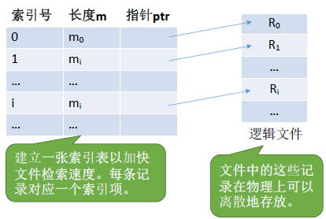
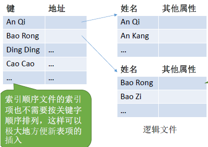
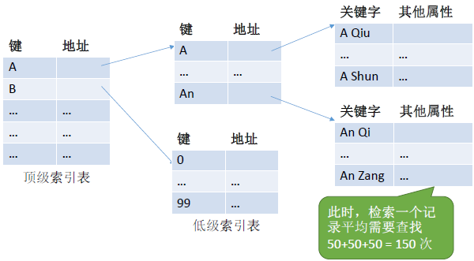
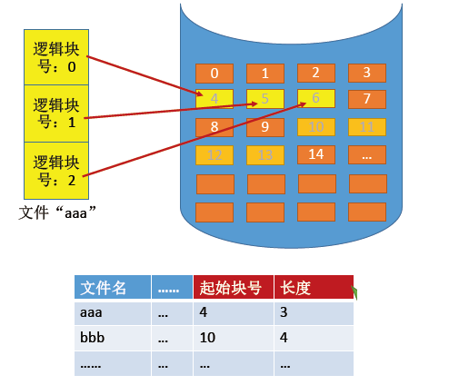
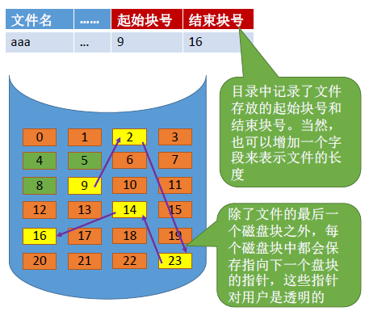
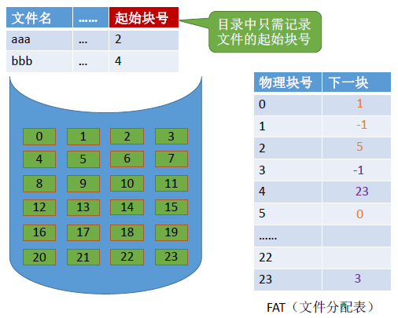
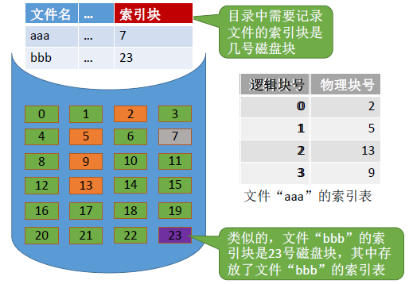
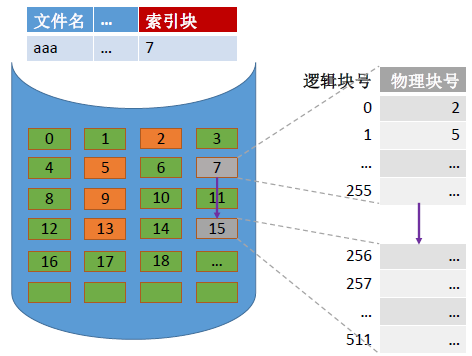
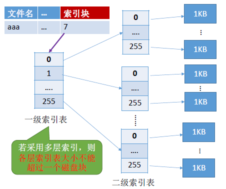
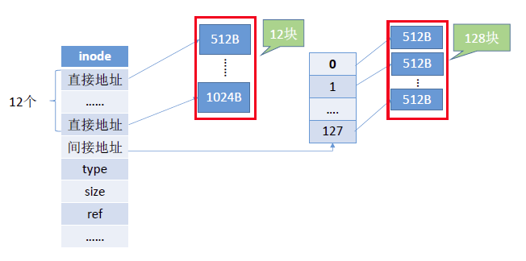

# 1.文件的基本概念和属性

---

## 1.1 文件的概念

文件：一组有意义的 **信息/数据集合** 。

---

## 1.2 文件的属性

下面是在 Linux 下执行`stat`命令查看`dotfiles`的属性的示例：
```bash
[04/06 20:29] sky@EndeavourOS:~
 >>> stat dotfiles 
  文件：dotfiles
  大小：4096            块：8          IO 块大小：4096   目录
设备：8,32      Inode: 63140       硬链接：14
权限：(0755/drwxr-xr-x)  Uid: ( 1000/     sky)   Gid: (  984/   users)
访问时间：2025-04-06 19:34:20.203588900 +0800
修改时间：2025-04-06 18:56:37.322197700 +0800
变更时间：2025-04-06 18:56:37.322197700 +0800
创建时间：2025-02-16 23:31:28.623274219 +0800
```

----

上面`stat`指令的输出示例与文件属性进行的一一对照如下：

1. **文件名：** 由创建文件的用户决定，方便识别，同一目录下不允许有重名文件。
- **`stat` 输出**：
  ```
  文件：dotfiles
  ```
  文件名就是 `dotfiles`，也就是这里查看的这个目录（目录也是一种文件！）。

2. **标识符：** 操作系统用来 **唯一识别文件的`ID`** 。
- **`stat` 输出**：
  ```
  Inode: 63140
  ```
  **inode** 编号就是文件系统内部唯一标识文件的标识符。

3. **类型：** 区分普通文件、目录、设备文件等。
- **`stat` 输出**：
  ```
  权限：(0755/drwxr-xr-x)
  ```
  这部分权限信息中的 `d` 表示该文件是一个 **目录** （directory）。

4. **位置：** 文件的存储路径。
- `stat` 输出中未直接显示完整路径，如果要看绝对路径，可以用 `realpath dotfiles`。

5. **大小：** 文件实际大小。
- **`stat` 输出**：
  ```
  大小：4096
  ```
  是目录在磁盘上占用的空间大小（单位：`Byte`）。`4096`是 **目录本身的元数据** 所占用的空间（即目录项，占了一个`block`，通常是`4KB`）。

6. **创建时间：** 文件第一次建立的时间。
- **`stat` 输出**：
  ```
  创建时间：2025-02-16 23:31:28.623274219 +0800
  ```

7. **上次修改时间：** 文件内容最后一次被修改的时间。
- **`stat` 输出**：
  ```
  修改时间：2025-04-06 18:56:37.322197700 +0800
  ```

8. **文件所有者信息：** 记录谁创建了这个文件。
- **`stat` 输出**：
  ```
  Uid: ( 1000/     sky)   Gid: (  984/   users)
  ```
  表示文件的拥有者是 `sky`，用户 ID 是 `1000`；所属用户组是 `users`，组 ID 是 `984`。

9. **保护信息：** 访问权限（谁能读/写/执行）。
- **`stat` 输出**：
  ```
  权限：(0755/drwxr-xr-x)
  ```
  `0755` 权限：
  - `owner (sky)`：读、写、执行
  - `group (users)`：读、执行
  - `others`：读、执行

---

# 2.文件的逻辑结构

> **逻辑结构：** 是用户角度理解的文件内部组织方式，文件内部的数据应该如何组织起来（比如像一篇文章是按段落、行、字符组织的）。

---

## 2.1 无结构文件

文件内部的数据就是一系列 **二进制流** （比如`.jpg`图片文件）或 **字符流** （比如 `.txt`、`.c`、`.md` 文件）组成。操作系统不关心内容结构，都是交给应用程序来解析的。

---

## 2.2 有结构文件

由一组相似的记录组成，又称 **记录式文件** 。每条记录又有若干个数据项组成（如：数据库表文件），其中通常包含一个 **关键字** `key`（ps：也称索引号，但我感觉这种叫法不严谨，应试的话可以不作区分）作为唯一标识。根据每条记录是否等长，又可分为 **定长记录** 和 **可变长记录** 。

有结构文件的 **逻辑结构** 可分为三种：**顺序文件** 、 **索引文件** 、 **索引顺序文件** 。

---

### 2.2.1 顺序文件

> 文件中的记录一个接一个地 **顺序排列（逻辑上）** ，记录可以是 **定长**的或 **可变长** 的。各个记录在物理上可以顺序存储或链式存储，可与数据结构中的线性表类比。
> - **顺序存储：** 逻辑上相邻，物理上也相邻。
> > - **定长：** 可实现 **随机存取** 。记录长度为`L`，则第`i`个记录存放的相对位置是`i*L`
> > - **变长：** 无法实现随机存取。每次只能从头往后开始依次查找。
> - **链式存储：** 逻辑上相邻，物理上不相邻。
> > - 无论是定长还是可变长记录，都无法实现随机存取，每次只能从第一个记录开始依次从前往后查找。

---

顺序文件的结构：
- **串结构：** 记录一个接一个地写入文件中，不考虑关键字的大小顺序。记录的顺序只反映插入的先后，比如谁先写入谁排前。
- **顺序结构：** 记录之间的顺序按关键字顺序排列，逻辑顺序就是关键字顺序。

| 对比点   | 串结构               | 顺序结构           |
| -------- | -------------------- | ------------------ |
| 排序方式 | 按写入顺序           | 按关键字排序       |
| 查找效率 | 低，需顺序查找       | 高，可用折半查找   |
| 插入效率 | 高，直接追加         | 低，需保持顺序     |
| 应用场景 | 日志、追加型记录文件 | 电话簿、索引文件等 |

---

### 2.2.2 索引文件

索引文件主要就是解决 **可变长记录** 无法随机存取的问题。

**思路：** 为每一个文件建立一个索引表 **[索引号、长度`m`、指针`ptr`]** ，其中指针指向文件中的每个记录项的起始位置，长度为每个记录项的长度。索引表中的 **每个索引项的长度都是相等** 的，所以可以通过索引号来随机访问某一个记录项。



---

### 2.2.3 索引顺序文件

**索引文件存在的问题：** 如果文件中的记录项比较多，且每个记录项都比较小（只有`8B`），这样就会导致索引表很大，且每个索引表占`32B`，那么索引表都要比文件内容本身大`4`倍，这样对存储空间的利用率就太低了。

索引顺序文件思想：为每一组记录设置一个索引，每一组内的记录依然采用顺序文件。这就形成了“两级结构”：第一层是“组级索引”,第二层是“组内顺序文件”。



性能分析：
> - 若一个顺序文件有`10000`个记录，则根据关键字检索文件，只能从头开始顺序查找（这里指的并不是定长记录、顺序结构的顺序文件），平均须查找`5000`个记录。
> - 若采用索引顺序文件结构，可把`10000`个记录分为`100`组，每组`100`个记录。则需要先顺序查找索引表找到分组（共`100`个分组，因此索引表长度为`100`，平均需要查`50`次），找到分组后，再在分组中顺序查找记录（每个分组`100`个记录，因此平均需要查`50`次）。可见，采用索引顺序文件结构后，平均查找次数减少为`50+50=100`次。

> ps：不知道平均查找长度（`ASL`）怎么计算的，建议去重修数据结构🤣。

可以很直观的看出，索引顺序文件性能的提升

---

### 2.2.4 多级索引顺序文件

> **新问题：** 我们把数据集增大，假设有 \(10^6\) 个记录，分为`1000`组，每组`1000`个记录，那么需要查找`500 + 500 = 1000`次，依然需要查找很多次。

当我们采用多级索引时（假设是二级索引），我们把上述数据首先分为`100`组，每一组再分`100`组，其中每组`100`个记录，那么需要查找`50 + 50 + 50 = 150`次。



所以说，多级索引文件的结构本质上就是一个 **树形结构** ，更具体说，是一种多路树结构，最典型就是：数据库采用的 **B 树** / **B⁺ 树** 。

---

# 3.文件的物理结构

**注：** 在学习这章内容之前，建议先学习 **[4.2 目录](04文件管理/02目录.md)** 这一章节。

> **物理结构：** 文件在外存（如磁盘）上 **实际** 的存储方式，与“逻辑结构”（用户视角）相对。

逻辑上，文件被划分成逻辑块（文件块），这些文件块通过文件系统的映射机制被分配到实际的磁盘块（物理块）上。
- **文件块（逻辑块）：** 文件的逻辑地址空间也被分为一个一个的文件块 **[逻辑块号，块内地址]** 。
- **磁盘块（物理块）：** 磁盘的物理结构上是由若干个 **固定大小** 的物理块（磁盘块、扇区）构成的，这些物理块是磁盘读写的最小单位。

---

## 3.1 连续分配

连续分配要求每个文件在磁盘上占有一组 **连续** 的块。


文件目录中记录存放该文件在外存中的 **起始块** 和 **长度**。

用户给出要访问的逻辑块号，操作系统找到该文件对应的目录项（FCB）
\[
物理块号 = 起始块号 + 逻辑块号
\]

- **优点：**
  - 文件在顺序读写时速度最快。
  - 可以支持顺序访问 & 随机访问。

- **缺点：**
  - 不方便扩展。如果需要新增一个磁盘块，但连续的地方没有位置了，就需要把所有磁盘块一起移动到空间满足的位置。
  - 存储空间利用率低，会产生难以利用的磁盘碎片（可用紧凑技术处理碎片，但是时间代价大）。

---

## 3.2 链接分配

> 链接分配采用 **离散** 分配的方式，可以为文件分配离散的磁盘块，分为隐式链接 & 显示链接。

---

### 3.2.1 隐式链接

除文件的最后一个磁盘块之外，每个磁盘块都存有指向下一个盘块的指针。


文件目录中记录存放该文件在 **外存** 中的 **起始块号** 和 **结束块号** 。用户给出要访问的逻辑块号，操作系统找到该文件对应的目录项指向的 `FCB`。

> 比如：从目录项中找到起始块号（即`0`号块），将`0`号逻辑地址读入内存，由此知道`1`号逻辑块存放的物理地址，于是读入`1`号逻辑块，再找到`2`号逻辑块，以此类推...
> 因此，读入`i`号逻辑块，总共需要`i + 1`次磁盘 I/O 。

**扩展文件的方式：** 随便找到一个空闲磁盘块，挂到文件的磁盘块链尾，并修改文件的 FCB 。

- **优点：** 
  - 方便文件扩展，不会有碎片问题，外存利用率高。
- **缺点：**
  - 只支持顺序访问，不支持随机访问，查找效率低，指向下一个磁盘块的指针也需要消耗一定的存储空间。

---

### 3.2.2 显示链接

**文件分配表（FAT）** ：用来管理磁盘中所有文件的块之间的链接关系的一张表。每个 **磁盘块** 对应 FAT 表中的一个 **表项** ，每个表项的内容是：当前块的“下一个块号”，实现 **显示链式** 结构。

假设某个新创建的文件 “aaa” 依次存放在磁盘块 2 -> 5 -> 0 -> 1；假设某个新创建的文件 “bbb” 依次存放在磁盘块4 -> 23 -> 3。其文件分配表如下图所示：


> 用户给出要访问的逻辑块号 `i`，操作系统找到该文件对应的目录项（FCB）。
> 从目录项中找到起始块号，若 `i > 0`，则查询内存中的文件分配表 FAT，往后找到 `i` 号逻辑块对应的物理块号。逻辑块号转换成物理块号的过程不需要读磁盘操作。

- **优点：**
  - 很方便文件拓展，不会有碎片问题，外存利用率高，并且支持随机访问。相比于隐式链接来说，地址转换时不需要访问磁盘，因此文件的访问效率更高。
- **缺点：**
  - 文件分配表的需要占用一定的存储空间。

> **注意：** 链表结构在 FAT 中是表实现的，不是写在块内部。一个磁盘仅设置一张 FAT。开机时，将 FAT 读入内存，并 **常驻内存** 。FAT 的各个表项在物理上连续存储，且每一个表项长度相同，因此，物理块号可以隐含。

---

## 3.3 索引分配

索引分配允许文件 **离散** 地分配在各个磁盘块中，系统会为每个文件建立一张 **索引表** ，索引表中记录了文件的各个逻辑块对应的物理块（类似于内存管理中的页表，建立逻辑到物理的映射）。索引表存放的磁盘块称为 **索引块** ，文件数据存放的磁盘块称为 **数据块** 。



> 用户给出要访问的逻辑块号 `i`，操作系统找到该文件对应的目录项（FCB）。
> 从目录项中可知索引表存放位置，将索引表 **从外存读入内存** ，并查找索引表即可知 `i` 号逻辑块在外存中的存放位置。

可见，索引分配方式可以支持 **随机访问** 。 文件拓展也很容易实现（只需要给文件分配一个空闲块，并增加一个索引表项即可）但是索引表需要占用一定的存储空间。

> **注意：** 在显式链接的链式分配方式中，文件分配表 FAT 是一个磁盘对应一张；而索引分配方式中， **索引表是一个文件对应一张** 。

> 思考 🤔 ：如果一个磁盘块是装不下文件的整张索引表的，如何解决这个问题？
> > 解决的办法就是后文中各种索引分配的实现方式。

---

### 3.3.1 链接索引

如果索引表太大，一个索引块装不下，那么可以将多个索引块链接起来存放。如下图所示：


**存在的问题：** 用户请求访问某个逻辑块时，操作系统首先查找索引表的第一个块。如果该索引块存储的指针不足以满足请求，操作系统会跳转到下一个链接的索引块，以此类推，直到找到所需的索引块。这意味着 **磁盘 I/O 的次数增加** ，效率极低。

---

### 3.3.2 多层索引

多层索引的原理类似于多级页表，都是通过逐级索引来定位最终的数据块。在多层索引中，每一级的索引表指向下一级的索引块，直到最后一级指向实际数据块。

比如：
- 一级索引块包含指向二级索引块的指针；
- 二级索引块包含指向三级索引块的指针，依此类推……
- 最后一层索引直接指向数据块，即文件的实际内容。


> 假设 **磁盘块** 大小为 `1KB`，一个 **索引表** 项占 `4B`，则一个磁盘块只能存放 \(2^{10} / 2^2=2^8\) 个索引。若某文件采用两层索引，一级索引表占用 `1` 个磁盘块，存放 \(2^8\) 个二级索引块的地址，每个二级索引块也存放 \(2^8\) 个数据块的地址，因此，两层索引可管理的文件最大长度可以到 \(2^8 \cdot 2^8 \cdot 2^{10} = 2^{26}=64MB\) （单层索引只能管理 `256KB`）。
> 
> 可以根据逻辑块号计算出应该查询索引表中的表项，如：要访问 `1026` 号逻辑块：
>> - \(1026\ / \ 2^8 = 4\) （商是 `4`，从一级索引表（根索引块）中读取第 `4` 个表项，找到对应的二级索引块地址）； 
>> - \(1026\ \% \ 2^8 = 2\) （余数是 `2`，从二级索引块中读取第 `2` 个表项，找到最终的数据块地址）。

采用 `K` 层索引结构，且顶级索引表未调入内存，则访问一个数据块只需要 `K + 1` 次读写操作。
> **原因：** 
> - **K 次 I/O：** 用于逐层加载所有索引块（从第 1 层到第 K 层）。
> - **+1 次 I/O：** 最后加载数据块本身。

> **注：** 多层索引的本意并不是为了减少“总空间占用”，而是为了 **避免一次性分配大量连续空间给整个索引表** ，提高索引的 **空间利用率** 和 **按需分配能力** 。

---

### 3.3.3 混合索引

**混合索引** 是多种索引方式的结合。例如，一个文件的顶级索引表中，既包含直接地址索引（直接指向数据块），又包含一级间接索引（指向单层索引块），还包含两级间接索引（指向两层索引表）。一般是 **小文件用直接块，大文件用间接块** 。


---

## 3.4 总结

| 分配方式                     | 实现方式                                                       | 目录项内容                                    | 优点                                                       | 缺点                                                     |
| ---------------------------- | -------------------------------------------------------------- | --------------------------------------------- | ---------------------------------------------------------- | -------------------------------------------------------- |
| **顺序分配**                 | 将文件的所有块连续地存储在磁盘上                               | 起始块号、文件长度                            | ✅ 顺序访问效率高<br>✅ 支持随机访问<br>✅ 实现简单           | ❌ 不易扩展，需整体移动文件<br>❌ 易产生碎片               |
| **链式分配（隐式链接）**     | 除文件的最后一个磁盘块外，每个数据块内存放一个指向下一块的指针 | 起始块号（FCB）、结束块号                     | ✅ 易于扩展，块可离散存储<br>✅ 空间利用率高                 | ❌ 仅支持顺序访问<br>❌ 难以定位随机位置<br>❌ 指针占用空间 |
| **链式分配（显式链接/FAT）** | 将所有块的链接信息集中放在文件分配表（FAT）中                  | 起始块号（FAT 用于维护块关系）                | ✅ 支持随机访问（查表即可）<br>✅ 文件易扩展<br>✅ 无外部碎片 | ❌ FAT 需要常驻内存，表很大<br>❌ 不适合大型磁盘           |
| **索引分配（单层）**         | 为每个文件分配一个索引块，记录所有数据块地址                   | 索引块地址                                    | ✅ 支持随机访问<br>✅ 易扩展<br>✅ 无碎片                     | ❌ 索引块可能过大，造成浪费                               |
| **链接索引（索引块链）**     | 多个索引块用链表方式链接                                       | 起始索引块地址                                | ✅ 支持大文件<br>✅ 可离散存储                               | ❌ 查找效率较低<br>❌ 难以快速定位随机块                   |
| **多层索引**                 | 索引块中再指向索引块，可多层递归                               | 顶层索引块地址（或 inode 中的直接、间接指针） | ✅ 空间利用率高<br>✅ 支持大文件<br>✅ 小文件无需多余索引     | ❌ 随机访问需多次 I/O<br>❌ 索引块增加复杂性               |
| **混合索引**                 | 结合直接索引、一级索引、二级索引等                             | 多个指针（直接、间接）                        | ✅ 灵活高效<br>✅ 小文件少占空间，大文件可扩展               | ❌ 实现相对复杂                                           |
