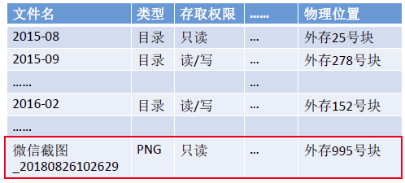
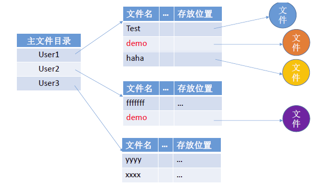
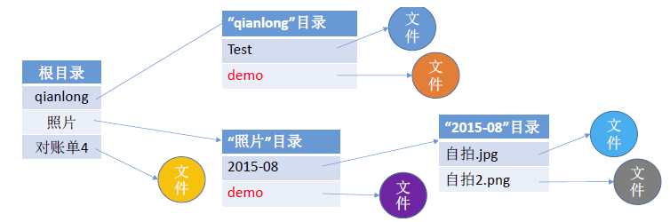
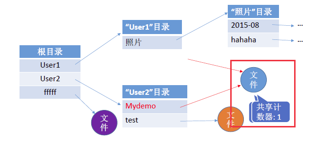
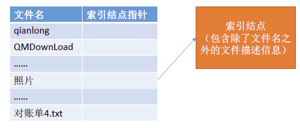

# 1.文件的目录结构

在文件系统中，每一个目录本质上是一个特殊的文件，称为目录文件，其内容为一张 **目录表** 。目录表由一条条 **目录项（Directory Entry）** 组成，每一项对应该目录下的一个文件或子目录。如下所示：

- 每条目录项通常包含：
  - 子文件/子目录的名称；
  - 指向 子文件/子目录 的 **文件控制块（FCB）** 的指针。

- 文件控制块（FCB）中存储了文件的元信息，包括：
  - 文件名、类型、大小；
  - 存储位置（逻辑/物理结构）；
  - 权限信息（读/写/执行权限、访问控制）；
  - 使用信息（创建/修改/访问时间等）。

- 对目录的基本操作包括：
  - 搜索文件（查找目录项）；
  - 创建/删除文件（添加/删除目录项）；
  - 显示目录（列出目录项）；
  - 修改目录（如重命名文件或更改属性）。

因此，目录结构不仅记录了文件的存在，还承担着 **文件管理** 和 **访问控制** 的重要功能。

---

# 2.单级目录结构

早期操作系统不支持多级目录，整个系统只建立 **一张目录表** ，每个文件占一个目录项。单级目录实现了 **按名存取** ，但是不允许文件重名。在创建一个文件时，需要先检查目录表中有没有重名文件，确定不重名后才能允许建立文件，并将新文件对应的目录项插入目录表中。

---

# 3.两级目录结构

早期的多用户操作系统，采用两级目录结构，分为 **主文件目录（MFD）** 和 **用户文件目录（UFD）** ，如下图所示：

主文件目录下是用户目录，每个用户一个目录，每个用户目录里存放文件。不同用户目录下允许重名（因为每个用户的文件名空间是独立的），同一个用户的文件名在其 **UFD 中必须唯一** （否则目录项冲突）。

**缺点：** 对于某一个用户来说，不能对自己的文件进行分类管理，因为 UFD 只是一个平铺结构，用户自己的文件都堆在一个目录下。

---

# 4.多级目录结构

> 这里要额外说明下 **多级目录结构** 和 **多级索引顺序文件** 的区别：
> - 多级目录结构：是“文件放在哪”，用户能直接找到；
> - 多级索引顺序文件：是“文件里面的数据怎么排”，用户直接找不到，但访问效率和它有关。

---

## 4.1 树形目录结构

对于一个目录中，可以有目录和文件。不同目录下的文件可以重名：

树形目录结构可以很方便地对文件进行分类，层次结构清晰，也能够更有效地进行文件的管理和保护。从根目录出发的路径称为 **绝对路径** ，在引入“当前目录”（ **相对路径** ）后，它能避免每次都输入完整路径，可以减少磁盘 I/O 的次数，提升访问文件的效率。

**缺点：** 树形结构不便于实现多个用户共享文件或跨目录访问文件。

---

## 4.2 无环有向图目录结构

在树形目录结构的基础上，增加了一些指向同一节点的有向边，使整个目录成为一个有向无环图。可以更加方便的实现多个用户间的文件共享：

可以用不同的文件名指向同一个文件，甚至可以指向同一个目录。

> 需要为每个共享结点设置一个 **共享计数器** ，用于记录此时有多少个地方在共享该结点。用户提出删除结点的请求时，只是 **删除该用户的`FCB`、并使共享计数器减`1`** ，并不会直接删除共享结点。只有共享计数器减为`0`时，才删除结点。

**注意：** 共享和复制是不同的！！！ **在共享文件中，由于各用户指向的是同一个文件，因此只要其中一个用户修改了文件数据，那么所有用户都可以看到文件数据的变化。**

---

# 5.索引节点

> 在查找文件的时候，仅仅使用到了文件名这个信息，但是我们却是在整个目录表中去查找的，需要把真个目录表从磁盘中读取出来。有时目录表很大，需要多个盘块存放，这样在查找的时候，就需要启动磁盘很多次，导致开销增大。

**优化思路：** 把除了文件名之外的文件描述信息都放到一个索引结点里，同时建立一张表，其中包含文件名，和指向索引结点的指针。查找时，只需要把这张表调出即可。由于这张表只有两个字段，很小，占用的盘块也相应减少，需要启动磁盘的次数减少，提高了检索速度。

存放在 **外存** 中的索引结点称为 **“磁盘索引结点”** ，当索引结点放入 **内存** 后，称为 **“内存索引结点”** 。相比之下，内存索引结点中需要增加一些信息，比如：文件是否被修改、此时有几个进程正在访问该文件等。