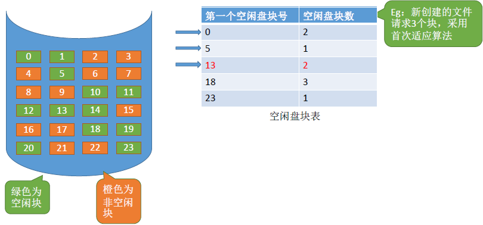
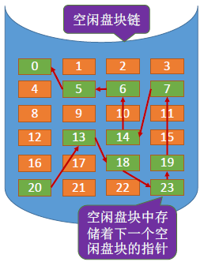
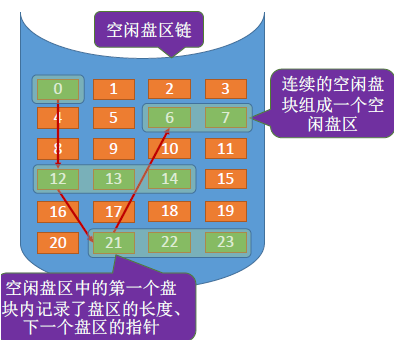
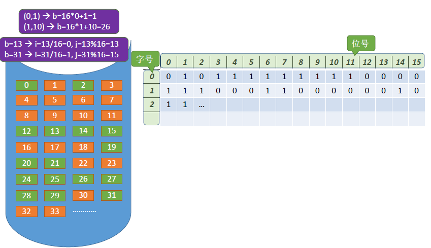
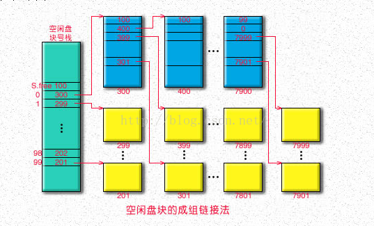

# 1.存储空间的划分和初始化

- **划分：** 操作系统会将整个物理磁盘划分为多个 **逻辑卷** （也叫文件卷、逻辑盘）。比如在 Linux 中，物理磁盘（如 `/dev/sda`）一般被划分成分区（如 `/dev/sda1`, `/dev/sda2` 等），这些分区就是逻辑卷的体现。
- **初始化：** 把每个逻辑卷划分为 **目录区** 、 **文件区** 。

---

**目录区（Metadata 区 / 管理信息区）**
- 用于存放文件系统的**元数据**：
  - **目录信息（文件名、路径、FCB）**
  - **空闲空间管理信息** （如位示图、空闲链表）
- 是访问文件所必须依赖的结构。

**文件区（Data 区 / 文件存储区）**
- 存放真正的**文件内容（数据块）**
- 文件的物理结构（顺序、链式、索引等）就是基于这个区域进行分配和访问的。

---

# 2.文件存储空间管理

---

## 2.1 空闲表法

适用于 **连续分配方式** 。空闲表维护的是一个“连续空闲区”的 **[起始块号, 空闲块数]** 。如下图所示：

- 空闲表通常放在磁盘的 **目录区** 中，系统开机时 **加载到内存** 中；
- 缺点：查找或维护效率较低（尤其空闲区碎片多时）；对文件扩展不灵活（因为必须找“连续空间”）。

---

- **分配方法：** 与内存管理中动态分区分配类似，为一个文件分配连续的存储空间。同样可采用首次适用、最佳适应、最坏适应等算法来决定要为文件分配哪个区间。
- **回收方法：** 与内存管理中动态分区分配类似，当回收某个存储区时需要有四种情况：
  - 回收区前后都没有空闲区
  - 回收区前面有空闲区
  - 回收区后面有空闲区
  - 回收区前后都有空闲区

> 需要注意 **合并** 相邻空闲块。

---

## 2.2 空闲链表法

---

### 2.2.1 空闲盘块链

以 **盘块** 为单位组成一条链。

每个空闲块内部存储 **指向下一个空闲块** 的指针， **操作系统** 只需要保存 **链头（第一个空闲块）** 和 **链尾** 指针。

- **分配方法：** 若某文件申请 K 个盘块，则从链头依次摘下 K 个盘块分配，链头指针向后更新。
- **回收方法：** 回收的盘块依次挂到链尾，链尾指针更新。

---

### 2.2.2 空闲盘区链

以 **盘区** 为单位组成一条链。

每个节点记录一个“空闲盘区”的 **起始块号** 和 **空闲块数量** ，每个盘区内部盘块是连续的。 **操作系统** 仍需要保存 **链头（第一个空闲块）** 和 **链尾** 指针。

- **分配方法：** 
  - 请求的空间小于某空闲区的大小：分配一部分（可以采用首次适应、最佳适应等算法来检索），并修改空闲区描述信息(比如起始块号 +K)；
  - 请求大小刚好等于空闲区：整段摘下；
  - 请求空间较大：可能需要分多次从不同盘区中分配(产生非连续的分配结果)。
- **回收方法：** 
  - 与相邻空闲区连续：需要进行合并，避免外部碎片；
  - 不连续：作为新的空闲区，加入链尾或链头。

---

## 2.3 位示图法

每个二进制位对应一个盘块。在下图中，“0” 代表盘块空闲， “1” 代表盘块已分配。位示图一般用连续的 **“字（word）”** 来表示，如本例中一个字的字长是 `16` 位，字中的每一位对应一个盘块。因此可以用 **（字号，位号）** 对应一个盘块号。

（字号，位号）= （i，j），则二进制对应的盘块号 \(b = n \cdot i + j\) 。也可以推出：`b` 号盘块对应的字号 \(i = b / n\) ，位号 \(j=b \% n\) 
- `n` 是一个字中位的个数（比如这里是 `16`）；
- `i` 是第几个字（字号）；
- `j` 是字中的第几位（位号）；
- `b` 是对应的盘块号；
- **注意：** 索引是从 `0` 开始。

---

若文件需要 K 个空闲块。
- **分配方法：** 
  - 顺序扫描位示图，找到 K 个相邻或不相邻的 “0”；
  - 根据（字号，位号）算出对应的盘块号，将相应盘块分配给文件；
  - 将相应位设置为 “1”，表示盘块已分配。
- **回收方法：**
  - 根据回收的盘块号计算出对应的（字号，位号）；
  - 将相应二进制位设为 “0”。

---

## 2.4 成组链接法

空闲表法、空闲链表法不适用于大型文件系统，因为空闲表或空闲链表占用的存储空间可能过大。UNIX 系统中则采用了成组链接法对磁盘空闲块进行管理。

文件卷的自录区中专门用一个磁盘块作为 **“超级块”** ，当系统启动时需要 **将超级块读入内存** 。并且要保证内存与外存中的“超级块”数据一致。

---

本质上就是压栈过程（后续再详细补充），可以先参考这个视频 [成组链接法，看起来这么高大上，原来只是一个栈？？？](https://www.bilibili.com/video/BV19P411a7ac/?spm_id_from=333.337.search-card.all.click&vd_source=b9b04588afd330834a3b569fd4167028) 。