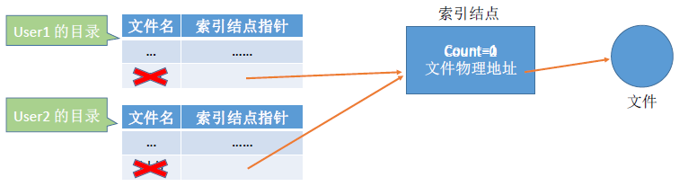
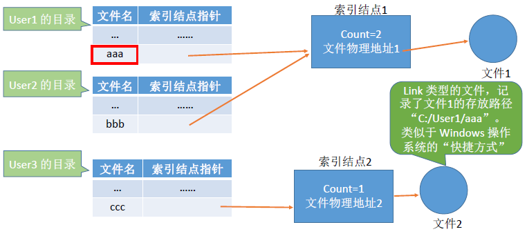
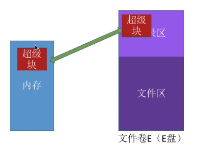
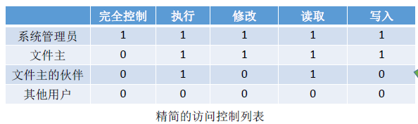

# 1.文件的共享

---

## 1.1 硬链接

硬链接：基于 **索引结点** 的共享方式。

设置一个索引结点，其中包含 `count`、文件物理地址（指向某一个文件），如果需要共享这个文件，只需要指向这个索引结点即可。当有用户删除该共享文件时，索引结点的数量减 `1`，即 `count--`，当 `count` 为 `0` 是才删除共享文件。



---

🔗 Linux 下的硬链接示例（共享 inode）：

```bash
# 创建原始文件
echo "Hello" > file.txt

# 创建硬链接
ln file.txt file_hard.txt

# 查看 inode 号（相同）
ls -li
```

输出类似：
```
123456 -rw-r--r-- 2 user user 6 Apr 8 21:00 file.txt
123456 -rw-r--r-- 2 user user 6 Apr 8 21:00 file_hard.txt
```

**说明：**
- `file.txt` 和 `file_hard.txt` 指向同一个 inode（编号相同）。
- `2` 表示有两个硬链接引用这个 inode。
- 删除任意一个文件，另一个仍然存在，数据不会丢失。
- 只有在所有硬链接都删掉后才会清理 inode 和数据。

---

## 1.2 软链接

软链接：基于 **符号链接** 的共享方式。

设置一个 `Link` 类型的文件，该文件记录了共享文件的路径，即可以通过 `Link` 类型的文件找到共享文件（类似于快捷方式）。删除时，只需把 `Link` 类型的文件删除即可。



---

🔗 Linux 下的软链接示例（路径引用）：

```bash
# 创建软链接
ln -s file.txt file_soft.txt

# 查看信息
ls -li
```

输出类似：

```
123456 -rw-r--r-- 1 user user 6 Apr 8 21:00 file.txt
123789 lrwxrwxrwx 1 user user 8 Apr 8 21:01 file_soft.txt -> file.txt
```

**说明：**
- `file_soft.txt` 是一个 **符号链接（symbolic link）**，指向路径 `file.txt`。
- 它的 inode 是不同的，是一个独立文件，里面存的是 **路径** 。
- 如果删除原始文件 `file.txt`，软链接就变成“死链”：
    ```bash
    cat file_soft.txt
    # 输出：No such file or directory
    ```

---

## 1.3 对比

| 类型   | 原理                                    | 删除行为                                             | 优点                   | 缺点                           |
| ------ | --------------------------------------- | ---------------------------------------------------- | ---------------------- | ------------------------------ |
| 硬链接 | 共享 **相同的 inode（索引结点）**       | 只有最后一个链接删除才真正删除文件                   | 稳定、安全             | 不能跨文件系统，不能给目录创建 |
| 软链接 | 创建一个 **路径引用** 文件（Link 文件） | 删除 link 本身不影响原文件，原文件删了 link 变“死链” | 跨文件系统、能链接目录 | 有可能失效，不如硬链接稳定     |

---

# 2.文件保护

---

## 2.1 口令保护

**原理：**
- 为每个文件（或目录）**设置一个口令（password）** ；
- 用户在访问该文件时，系统要求输入口令进行验证；
- 若口令正确，则允许访问，否则拒绝。

**存储位置：**
- 口令一般存储在文件的 **FCB（文件控制块）** 或 **inode（索引节点）** 中；
- 在实际实现中通常不会直接存储明文，而是存储**加密或哈希后的口令**（防止泄露）。

---

**优点：**
- **实现简单、直观** ：一个口令保护一个文件，不需要用户表或权限矩阵。
- **空间开销小** ：只需存一个口令即可，尤其适合早期资源受限系统。
- **时间开销小** ：验证过程只需字符串比对，速度快。

**缺点：**
- **安全性低** ：
  - 若口令以明文形式存储，一旦系统被入侵可能泄露。
  - 多人共用一个口令时，难以控制谁做了什么操作。
- **不支持细粒度控制** （例如：只读、写权限区分）。
- **不支持多用户环境的灵活权限设置**。

---

## 2.2 加密保护

**原理：**
- 使用某个“密码”对文件进行加密，在访问文件时需要提供正确的“密码”才能对文件进行正确的解密。



---

**优点：**
- **保密性强** ：
  - 文件在物理存储上是加密的，就算别人拿到文件也无法直接读取；
  - 密钥 **不需要存储在系统内部** （或者以加密形式存储），降低泄露风险。
- **适用于传输和备份** ：加密的文件可以安全地发送或备份到其他介质。

**缺点：**
- **性能开销** ：
  - 每次访问文件时都需要加密/解密；
  - 对 CPU 和系统资源有一定消耗，尤其是处理大文件或频繁访问的文件时。
- **密钥管理难度大** ：
  - 一旦密钥丢失或忘记，加密文件可能 **永久无法恢复** ；
  - 如何安全地生成、存储、传输和更新密钥是实际系统设计的重点难题。

---

## 2.3 访问控制

访问控制（Access Control）是一种 **限制哪些用户可以对哪些文件进行哪些操作** 的机制。在操作系统中，它主要通过在文件的 FCB（文件控制块） 或 inode（索引结点） 中，附加一个 **访问控制结构** （如：访问控制列表）来实现。




