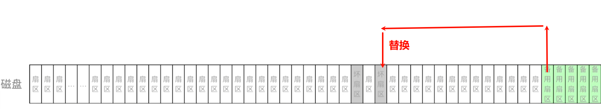
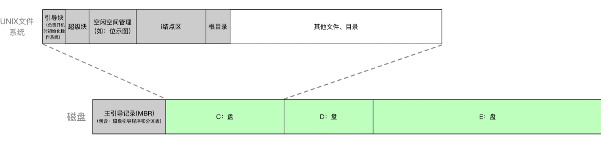
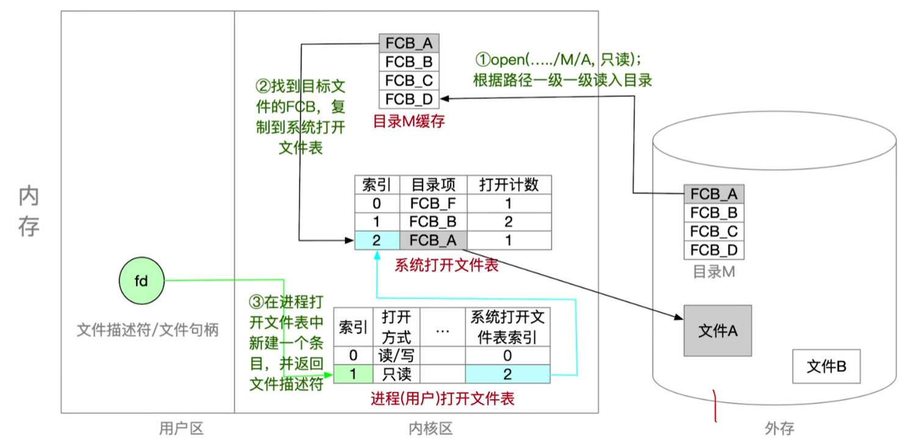
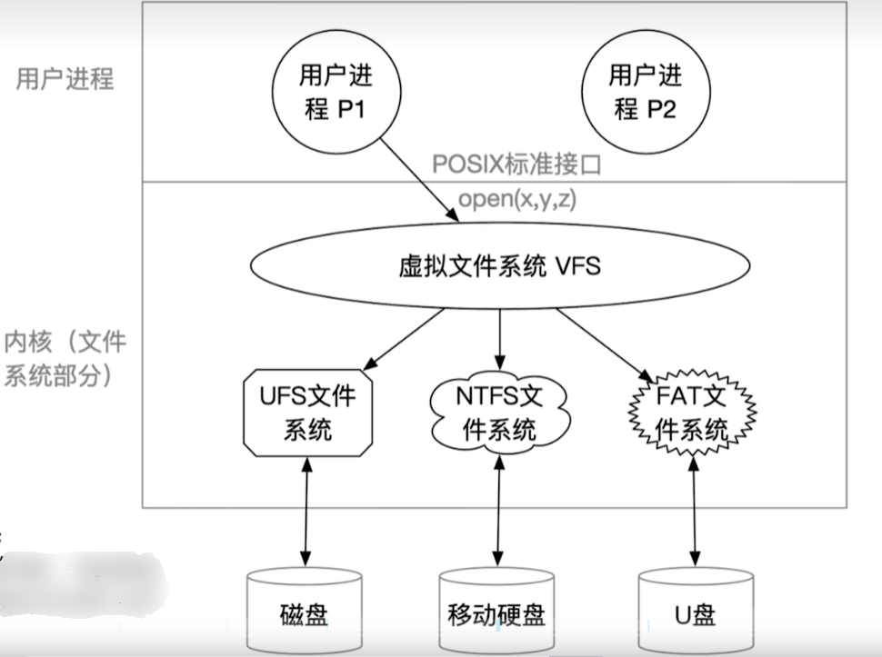
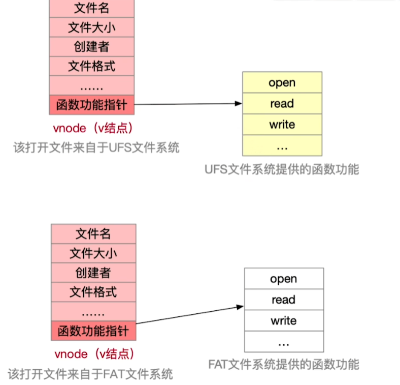

# 1.文件系统布局

---

## 1.1 磁盘格式化

**物理格式化（低级）：** 物理格式化，即低级格式化一一划分扇区，检测坏扇区，并用备用扇区替换坏扇区。通常，物理格式化只会在磁盘 **首次使用时** 或 **进行彻底的清理时** 执行。

---

**逻辑格式化（高级）：** 逻辑格式化后，把磁盘分区（分卷 Volume），创建文件系统结构，初始化文件系统的元数据（如超级块、目录表等），并且将文件系统的分区准备好接受数据写入（下图中的灰色部分）。

> 注：逻辑格式化后，灰色部分就有实际数据了，白色部分还没有数据。

---

## 1.2 文件系统在内存中的结构

> 注：近期访问过的目录文件会缓存在内存中，不用每次都从磁盘读入，这样可以加快目录检索速度。

系统为了提高效率，避免频繁查找文件，通常在 **进程级别** 和 **系统级别** 维护两个 **打开文件表** ：

| 层级          | 位置             | 作用                                              |
| ------------- | ---------------- | ------------------------------------------------- |
| 用户级（UFD） | 每个进程私有     | 存放文件描述符（fd），指向系统级打开文件表的索引  |
| 系统级（OFT） | 操作系统内核维护 | 存储文件状态（如读/写指针、权限、引用计数）等信息 |

> 所以：文件在“打开文件表中的索引号”就是 **文件描述符**（file descriptor）。

---

# 2.虚拟文件系统（VFS）

**虚拟文件系统的特点：**
- 向上层用户进程提 **供统一标准** 的系统调用接口，屏蔽底层具体文件系统的实现差异。
- VFS 要求下层的文件系统必须实现某些规定的函数功能，如：`open/read/write`。一个新的文件系统想要在某操作系统上被使用，就必须满足该操作系统 VFS 的要求。
- 每打开一个文件，VFS 就在主存中新建一个 `vnode`，用统一的数据结构表示文件，无论该文件存储在哪个文件系统。

> 注意：`vnode`只存在于主存中，而`inode`既会被调入主存，也会在外存中存储。

打开文件后，创建`vnode`，并将文件信息复制到`vnode`中，`vnode`的 **功能指针** 指向具体文件系统的 **函数** 功能。

---

# 3.文件系统的挂载（mounting）

**文件系统挂载要做的事：**
1. 在VFS中注册新挂载的文件系统。内存中的挂载表（`mount table`）包含每个文件系统的相关信息，包括文件系统类型、容量大小等。
2. 新挂载的文件系统，要向 VFS 提供一个 **函数地址列表** 。
3. 将新文件系统加到 **挂载点** （mount point），也就是将新文件系统挂载在某个父目录下。
