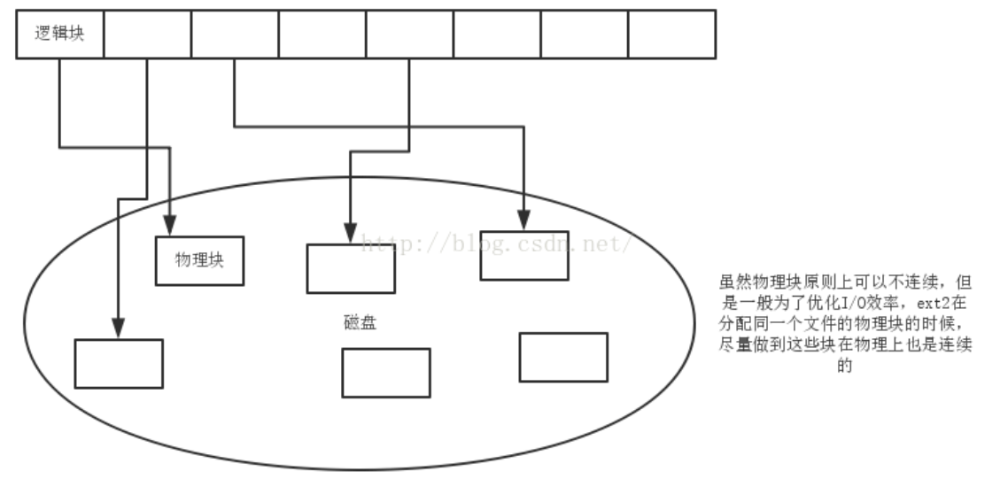
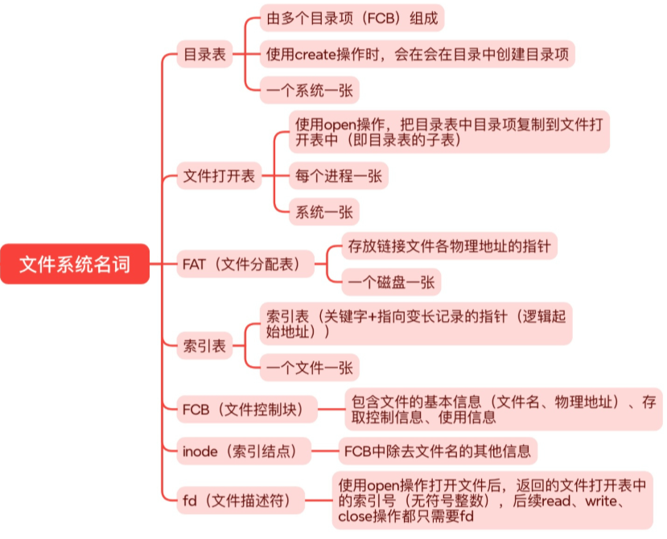

# 1.术语解释

---

## 1.1 扇区（sector）

磁盘上的每个磁道被等分为若干个弧段，这些弧段称之为扇区。扇区是 **硬件要求的最小单位** （通常：一个扇区 = 512B）。

> **注意：** 
> 扇区是 **硬件层面** 的概念，操作系统是不直接与扇区交互的，而是与 **多个连续扇区组成的磁盘块** 交互。由于扇区是物理层面的概念，在硬件厂商生产的时候就确定了大小，所以无法在系统中进行大小的更改。

**示例：**
```bash
[04/09 19:48] sky@Arco:~
 >>> sudo fdisk -l
Disk /dev/sda：20 GiB，21474836480 字节，41943040 个扇区
磁盘型号：VMware Virtual S
单元：扇区 / 1 * 512 = 512 字节
扇区大小(逻辑/物理)：512 字节 / 512 字节
I/O 大小(最小/最佳)：512 字节 / 512 字节
磁盘标签类型：gpt
磁盘标识符：A24084D8-DFEE-466A-8094-0AB216FBD9FE

设备          起点     末尾     扇区 大小 类型
/dev/sda1     4096  4100095  4096000   2G EFI 系统
/dev/sda2  4100096 41929583 37829488  18G Linux 文件系统
```
本例中扇区为 512 字节。

---

## 1.2 磁盘块/磁盘簇/物理块（Disk Block）

> 一般 Linux 系统中称为块，在 Windows 系统中称为簇。

**操作系统** 将相邻的扇区组合在一起，形成一个块，对块进行管理。每个磁盘块可以包括 2、4、8、16、32 或 64 个扇区。磁盘块是 **文件系统操作文件（操作系统与磁盘交互）的最小单位** 。

> **注意：** 
> **磁盘块** 是 **操作系统抽象出的单位** ，面向文件管理。因此磁盘块是操作系统所使用的 **逻辑概念** ，而非磁盘的物理概念。磁盘块的大小是可以通过 `blockdev` 命令更改的。
> 
> 为了更好地管理磁盘空间和更高效地从硬盘读取数据，操作系统规定一个磁盘块中只能放置一个文件，因此 **文件所占用的空间，只能是磁盘块的整数倍** ，那就意味着会出现文件的实际大小，会小于其所占用的磁盘空间的情况。

**示例：**
```bash
[04/09 19:51] sky@Arco:~
 >>> stat /boot 
  文件：/boot
  大小：4096      	块：8          IO 块大小：4096   目录
设备：8,2	Inode: 130561      硬链接：5
权限：(0755/drwxr-xr-x)  Uid: (    0/    root)   Gid: (    0/    root)
访问时间：2025-03-19 21:12:57.582834763 +0800
修改时间：2025-04-01 17:49:01.979997266 +0800
变更时间：2025-04-01 17:49:01.979997266 +0800
创建时间：2025-03-19 21:12:57.582834763 +0800

```
其中 IO 块大小就是磁盘块大小，本例中是 4096 Bytes，也就是 4K。

---

## 1.3 文件块/逻辑块

逻辑块作为一个抽象的概念，它必然要映射到具体的物理块上去，因此，逻辑块的大小必须是物理块大小的 **整数倍** ，一般来说，两者是一样大的。

> **注意：** 
> 通常，一个文件占用的 **多个物理块在磁盘上是不连续存储** 的，因为如果连续存储，则经过频繁的删除、建立、移动文件等操作，最后磁盘上将形成大量的空洞，很快磁盘上将无空间可供使用。因此，必须提供一种方法将一个文件占用的多个连续逻辑块映射到对应的非连续存储的物理块上去。



---

## 1.4 其它




