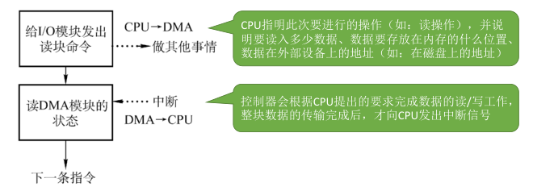

# 1.I/O 设备的概念

**I/O：** Input/Output = 输入/输出

---

按照 **I/O 设备使用特性** 分类：

- 人机交互类设备（数据传输速度慢）
- 存储设备（数据传输速度快）
- 网络通信设备（数据传输速度介于上述二者之间）

----

按照 **传输速率** 分类：

- **低速设备**：如键盘、鼠标等人机交互设备。
- **中速设备**：如打印机、扫描仪等。
- **高速设备**：如硬盘、光盘、SSD 等存储设备。

> 这种分类在操作系统中没有严格标准，了解即可。

---

按照 **信息交换单位** 分类：

1. **块设备（Block Devices）**
- 信息交换以 **数据块** 为单位，通常是固定长度的数据块（如 512B、4KB 等）。
- 属于**有结构设备**，典型如磁盘、固态硬盘。
- **特点**：
  - 可寻址：可以访问任意一个块（随机访问）。
  - 可随机读写。
  - 传输速率较高（相对于字符设备）。

1. **字符设备（Character Devices）**
- 信息以 **字符/字节** 为单位传输，通常是流式。
- 属于 **无结构设备** ，如终端（键盘/显示器）、串口、打印机。
- **特点**：
  - 不支持随机访问（不可寻址）。
  - 传输速率较低。
  - 通常采用 **中断驱动** 方式。

---

# 2.I/O 控制器（设备控制器）

> CPU 无法直接控制 I/O 设备的机械部件，因此I/O设备还要有一个 **机械/电子部件** 作为 CPU 和 I/O 设备机械部件之间的“中介”，用于实现CPU对设备的控制。

这个电子部件就是 **I/O 控制器** ，又称 **设备控制器** 。CPU 可控制 I/O 控制器，又由 I/O 控制器来控制设备的机械部件。

---

**I/O 控制器的功能：**
- **接受和识别 CPU 发出的命令：** 如 CPU 发来的 read/write 命令，I/O 控制器中会有相应的 **控制寄存器** 来存放命令和参数。
- **向 CPU 报告设备的状态：** I/O 控制器中会有相应的 **状态寄存器** ，用于记录 I/O 设备的当前状态。如：1 表示空闲，0 表示忙碌。
- **数据交换：** I/O 控制器中会设置相应的 **数据寄存器** 。输出时，数据寄存器用于暂存 CPU 发来的数据，之后再由控制器传送设备。输入时，数据寄存器用于暂存设备发来的数据，之后 CPU 从数据寄存器中取走数据。
- **地址识别：** 类似于内存的地址，为了区分设备控制器中的各个寄存器，也需要给各个寄存器设置一个特定的“地址”。I/O 控制器通过 CPU 提供的“地址”来判断 CPU 要读/写的是哪个寄存器。

I/O 控制器的组成：

1. **I/O 控制器与 CPU 的接口：** 具有三类信号线，数据线、地址线和控制线。数据线与数据寄存器和控制状态寄存器相连，分别存放 CPU 发来的数据和设备控制信息。
2. **I/O 控制器与设备的接口：** 可以存在 **多个** 设备接口，每个接口中存在数据、控制和状态三种类型的交互。
3. **IO 逻辑：** 用于实现对设备的控制。

> 值得注意的小细节：
> 1. 一个 I/O 控制器可能会对应多个设备；
> 2. 数据寄存器、控制寄存器、状态寄存器可能有多个（如：每个控制/状态寄存器对应一个具体的设备），且这些寄存器都要有相应的地址，才能方便 CPU 操作。有的计算机会让这些寄存器占用内存地址的一部分，称为 **内存映像 I/O** ；另一些计算机则采用 I/O 专用地址，即 **寄存器独立编址** 。

内存映像 I/O VS 寄存器独立编址：

---

# 3. I/O 控制方式

---

## 3.1 程序直接控制方式

---

> 假设完成一次读/写操作的流程。

1. CPU 干预的频率： **很频繁** ，I/O 操作开始之前、完成之后需要 CPU 介入，并且在等待 I/O 完成的过程中 CPU 需要不断地 **轮询** 检查。
2. 数据传送的单位：每次读/写一个 **字（= 2Bytes）** 。
3. 数据的流向： **每个字的读/写都需要 CPU 的帮助** 。
   - 读操作（数据输入）：I/O 设备 -> CPU 的寄存器 -> 内存
   - 写操作（数据输出）：内存 -> CPU 的寄存器 -> I/O 设备
4. 优缺点：
   - **优点：** 实现简单。在读/写指令之后，加上实现循环检查一系列指令即可（因此才称为“程序直接控制方式”）。
   - **缺点：** CPU 和 I/O 设备只能 **串行** 工作，CPU 需要一直轮询检查，长期处于“忙等”状态，因此 CPU 利用率低。

---

## 3.2 中断驱动方式

引入 **中断机制** 。由于 I/O 设备速度很慢，因此在 CPU 发出读/写命令后，可将 **等待 I/O 的进程阻塞** ，先切换到别的进程执行。当 I/O 完成后，控制器会向 CPU 发出一个中断信号，CPU 检测到中断信号后，会保存当前进程的运行环境信息，转去执行中断处理程序处理该中断。处理中断的过程中，CPU 从 I/O 控制器读一个字的数据传送到 CPU 寄存器，再写入主存。接着，CPU 恢复等待 I/O 的进程（或其他进程）的运行环境，然后继续执行。

> **注意：** 
> 1. CPU会在每个指令周期的末尾检查中断。
> 2. 中断处理过程中需要保存、恢复进程的运行环境，这个过程是需要一定时间开销的。可见，如果中断发生的频率太高，也会降低系统性能。

---

> 假设完成一次读/写操作的流程。

1. CPU 干预的频率：每次 I/O 操作开始之前、完成之后需要 CPU 介入，但是在等待 I/O 完成的过程中 CPU 可以 **切换到别的进程执行** 。
2. 数据传送的单位：每次读/写一个 **字（= 2Bytes）** 。
3. 数据的流向： **每个字的读/写都需要 CPU 的帮助** 。
   - 读操作（数据输入）：I/O 设备 -> CPU 的寄存器 -> 内存
   - 写操作（数据输出）：内存 -> CPU 的寄存器 -> I/O 设备
4. 优缺点：
   - **优点：** CPU 和 I/O 设备可 **并行** 工作，CPU 利用率得到明显提升。
   - **缺点：** 每个字在 I/O 设备与内存之间的传输，都需要经过 CPU。而 **频繁的中断处理会消耗较多的 CPU 时间** 。

---

## 3.3 DMA 方式

与“中断驱动方式”相比，DMA方式（Direct Memory Access， **直接存储器存取** 。主要用于块设备的 I/O 控制）有这样几个改进：
1. 数据的传送单位是 **“块”** ，不再是一个字、一个字的传送。
2. 数据的流向是 **从设备直接放入内存** ，或者 **从内存直接到设备** 。不再需要 CPU 作为中转。
3. 仅在传送一个或多个数据块的开始和结束时，才需要 CPU 干预。

---

- **DR （Data Register，数据寄存器）：** 暂存从设备到内存，或从内存到设备的数据。
- **MAR （Memory Address Register，内存地址寄存器）：** 在输入时，MAR 表示数据应放到内存中的什么位置；输出时 MAR 表示要输出的数据放在内存中的什么位置。
- **DC （Data Counter，数据计数器）：** 表示剩余要读/写的字节数。
- **CR（Command Register，命令/状态寄存器）：** 用于存放 CPU 发来的 I/O 命令，或设备的状态信息。

---

> 假设完成一次读/写操作的流程。

1. CPU 干预的频率：仅在传送一个或多个数据块的开始和结束时，才需要CPU干预。
2. 数据传送的单位：每次读/写一个或多个块（注意：每次读写的只能是 **连续的** 多个块，且这些块读入内存后 **在内存中也必须是连续的** ）。
3. 数据的流向： **不再需要经过 CPU** 。
   - 读操作（数据输入）：I/O 设备 -> 内存
   - 写操作（数据输出）：内存 -> I/O 设备
4. 优缺点：
   - **优点：** 数据传输以“块”为单位，CPU 介入频率进一步降低。数据的传输不再需要先经过 CPU 再写入内存，数据传输效率进一步增加。CPU 和 I/O 设备的并行性得到提升。
   - **缺点：** CPU 每发出一条 I/O 指令，只能读/写一个或多个连续的数据块。如果要读/写多个离散存储的数据块，或者要将数据分别写到不同的内存区域时，CPU 要分别发出多条 I/O 指令，进行多次中断处理才能完成。

---

## 3.4 通道控制方式

**通道：** 一种 **硬件** ，可以理解为是“轻量级 CPU”。与 CPU 相比，通道可以执行的指令很单一，并且通道程序是放在 **主机内存** 中的，也就是说通道与 CPU 共享内存。通道可以识别并执行一系列通道指令。

> **补充：**
> - 通道执行的“通道指令”是预定义好的，通常由 CPU 将其写入内存；
> - 通道从内存读取这些指令后，不再依赖 CPU，可直接控制设备完成数据传输。

---

> 假设完成一次读/写操作的流程。

1. CPU 干预的频率： **极低** ，通道会根据 CPU 的指示执行相应的通道程序，只有完成一组数据块的读/写后才需要发出中断信号，请求 CPU 干预。
2. 数据传送的单位：每次读/写 **一组数据块** 。
3. 数据的流向： **在通道的控制下进行** 。
   - 读操作（数据输入）：I/O 设备 -> 内存
   - 写操作（数据输出）：内存 -> I/O 设备
4. 优缺点：
   - **优点：** CPU、通道、I/O 设备可并行工作，资源利用率很高。
   - **缺点：** 实现复杂，需要专门的通道硬件支持。

---

## 3.5 对比

| 对比维度              | 程序直接控制方式         | 中断驱动方式                     | DMA（直接存储访问）        | 通道控制方式                   |
| --------------------- | ------------------------ | -------------------------------- | -------------------------- | ------------------------------ |
| 📌 控制方式            | CPU 主动轮询设备状态     | 设备主动中断 CPU                 | DMA 控制器自动完成数据传输 | 通道控制器自动执行通道程序     |
| 💻 CPU 干预频率        | 高：每次传输都参与       | 中：每个字参与                   | 低：仅开始与结束           | 极低：仅任务开始和结束介入     |
| 📦 数据传送单位        | 1 word                   | 1 word                           | 连续的数据块               | 多个块 / 成组传输              |
| 🔁 数据是否经 CPU 中转 | 是                       | 是                               | 否（设备 ↔ 内存）          | 否（设备 ↔ 内存）              |
| 📶 数据流路径          | 设备 → CPU → 内存        | 设备 → CPU → 内存                | 设备 → 内存（DMA 控制）    | 设备 → 内存（通道控制）        |
| 🧠 并行能力            | 无：CPU 与设备串行       | 有限：CPU 等待期间可执行其他任务 | 强：CPU 与设备可并行       | 极强：CPU、通道、设备三者并行  |
| ⏱ 效率                | 最低                     | 较高                             | 高                         | 最高                           |
| ⚠️ 缺点                | CPU 忙、效率低           | 中断频繁开销大                   | 需连续块传输，硬件略复杂   | 成本高、实现复杂、硬件依赖强   |
| 🧩 适用设备            | 低速、简单设备（如键盘） | 中低速设备                       | 高速块设备（磁盘、光盘）   | 大型系统中大量设备、高负载场景 |
| 🧷 是否需专用控制器    | 否                       | 需要 I/O 控制器                  | 是（DMA 控制器）           | 是（通道控制器）               |
| 📚 控制程序存放位置    | 无                       | 无                               | 控制器内部                 | **主内存中的通道程序**         |
| 🧮 传输管理者          | CPU 完全管理             | CPU + 中断响应                   | DMA 控制器                 | 通道控制器执行“微程序”         |
| 📝 典型场景            | 输入法、鼠标等轮询类     | 打印机、串口等字符设备           | 磁盘读取大文件             | 大型主机、高并发数据中心       |

---

**记忆小技巧：**

| 控制方式 | 核心关键词          | 记忆锚点                     |
| -------- | ------------------- | ---------------------------- |
| 程序查询 | **轮询+阻塞**       | “CPU 保姆型，全程盯着设备”   |
| 中断驱动 | **响应+中断**       | “设备找 CPU 报告进度”        |
| DMA      | **块传输+绕过 CPU** | “设备绕开 CPU，走 VIP 通道”  |
| 通道控制 | **自动化+并发**     | “设备总管，通道全权负责 I/O” |

----

# 4. I/O 软件层次结构

---

## 4.1 用户软件层

用户软件层实现了与 **用户交互** 的接口，用户可直接使用该层提供的、与 I/O 操作相关的库函数对设备进行操作。

**作用：**
   - 将用户请求翻译成格式化的 I/O 请求，并通过“系统调用”请求操作系统内核的服务。

---

## 4.2 设备独立性软件（设备无关性软件）

与设备的硬件特性 **无关** 的功能几乎都在这一层实现。
  
**作用：**
   - 向上层提供统一的调用接口（如 read/write 系统调用）。
   - 通过权限设置实现保护设备。
   - 对一些设备的错误进行处理。
   - 设备的分配与回收。
   - 可以通过 **缓冲技术** 屏蔽设备之间数据交换单位大小和传输速度的差异。
   - 建立 **逻辑设备名 -> 物理设备名** 的映射关系；根据设备类型选择调用相应的驱动程序（通过 **“逻辑设备表（LUT，Logical Unit Table）”** 实现）。

---

**管理逻辑设备表的方式:**
- 方式一： **整个系统只设置一张 LUT** ，这就意味着所有用户不能使用相同的逻辑设备名，因此这种方式只适用于 **单用户操作系统** 。
- 方式二： **为每个用户设置一张 LUT** ，各个用户使用的逻辑设备名可以重复，适用于多用户操作系统。系统会在用户登录时为其建立一个用户管理进程，而 LUT 就存放在用户管理进程的 **PCB** 中。

---

## 4.3 设备驱动程序

- 主要负责对硬件设备的具体控制，将上层发出的一系列命令（如 read/write）转化成特定设备“能听得懂”的一系列操作。包括设置设备寄存器；检查设备状态等。
- 不同的 I/O 设备有不同的硬件特性，具体细节只有设备的厂家才知道，因此厂家需要根据设备的硬件特性设计并提供相应的驱动程序。

> **注意：** 驱动程序一般会以一个 **独立进程** 的方式存在（某些 OS 中是内核模块形式）。

---

## 4.4 中断处理程序

当 I/O 任务 **完成** 时，I/O 控制器会发送一个 **中断信号** ，系统会根据中断信号类型找到相应的中断处理程序并执行。

中断处理程序的处理流程如下：

---

## 4.5 总结

直接涉及到 **硬件** 具体细节、且 **与中断无关** 的操作肯定是在 **设备驱动程序层** 完成的；没有涉及硬件的、对各种设备都需要进行的管理工作都是在 **设备独立性软件层** 完成的。

---

# 5.I/O 应用程序接口 & 设备驱动程序接口

---

## 5.1 I/O 应用程序接口

在 **用户软件层** 和 **设备独立性软件层** 之间还有 **系统调用** ，包括下面三种接口：

- **字符设备接口：** 
  - **get/put 系统调用：** 向字符设备读/写一个字符。

- **块设备接口：** 
  - **read/write 系统调用：** 向块设备的 **读写指针位置** 读/写多个字符（以“块”为单位）。
  - **lseek 系统调用：** 修改读中断处理程序后，写指针的位置。

- **网络设备接口（网络套接字接口/socket 接口）：**
  - **socket 系统调用：** **创建一个网络套接字** ，需指明网络协议（TCP？UDP？）
  - **bind：** 将套接字绑定到某个本地“端口”。
  - **connect：** 将套接字连接到远程地址。
  - **read/write 系统调用：** 从套接字读/写数据。

---

## 5.2 阻塞/非阻塞 IO

- **阻塞 I/O：** 应用程序发出 I/0 系统调用，进程需转为 **阻塞态** 等待。比如读取键盘输入（字符设备），程序会 **挂起（阻塞）** 等待用户按键，直到有数据可读才会继续运行。

- **非阻塞 I/O：** 应用程序发出 I/O 系统调用， **系统调用可迅速返回** ，进程无需阻塞等待。比如：若数据未就绪，系统调用会 **立即返回错误码（如 EAGAIN 或 EWOULDBLOCK）** ，进程需轮询或结合其他机制（如 I/O 多路复用）检查就绪状态。

---

## 5.3 设备驱动程序接口

不同的操作系统，对设备驱动程序接口的标准各不相同，因此，设备厂商必须根据操作系统的接口要求，开发相应的设备驱动程序，设备才能被使用。