# 1.I/O 核心子系统

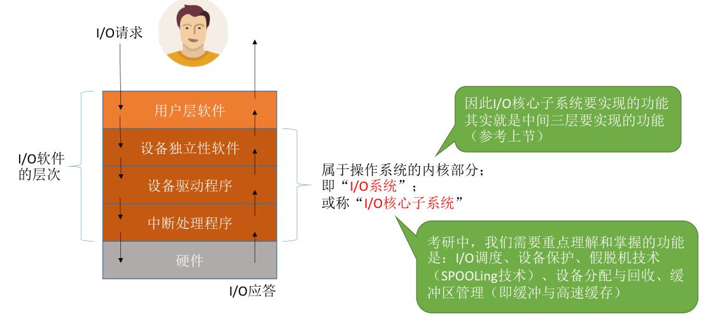

- 用户层软件：假脱机技术（`SPOOLing` 技术）,比如将打印请求写入磁盘中的“输出缓冲文件”中，然后后台进程读取缓冲文件去打印。
- 设备独立性软件：I/O调度、设备保护、设备分配与回收、缓冲区管理（即缓冲与高速缓存）。

> **注意：** 假脱机技术（`SPOOLing` 技术）需要请求“磁盘设备”的设备独立性软件的服务，因此一般来说假脱机技术是在用户层软件实现的。但是 408 大纲又将假脱机技术归为“I/O核心子系统”的功能，因此考试时还是以大纲为准（ **技术实现在用户层，功能归属于 I/O 核心子系统** ）。

---

**I/O 调度：** 用某种算法确定一个好的顺序来处理各个 I/O 请求。如：磁盘调度（先来先服务算法、最短寻道优先算法、SCAN 算法、C-SCAN 算法、LOOK 算法、C-LOOK 算法）。当多个磁盘 I/O 请求到来时，用某种调度算法确定满足I/O请求的顺序。

> 同理，打印机等设备也可以用先来先服务算法、优先级算法、短作业优先等算法来确定 I/O 调度顺序。

---

**设备保护：** 在 UNIX/类UNIX 系统中，设备被抽象成一种特殊的 **文件** ，每个设备也会有对应的 **FCB** 。当用户请求访问某个设备时，系统根据 FCB 中记录的信息来判断该用户是否有相应的访问权限，以此实现“设备保护”的功能。

---

# 2.假脱机技术（SPOOLing）

---

## 2.1 基本概念

> **问题背景：** 手工操作阶段，主机直接从 I/O 设备获得数据，由于设备速度慢，主机速度很快。人机速度矛盾明显，主机要浪费很多时间来等待设备。

批处理阶段引入了脱机输入/输出技术（用磁带完成）：引入脱机技术后，缓解了 CPU 与慢速 I/O 设备的速度矛盾。另一方面，即使 CPU 在忙碌，也可以提前将数据输入到磁带；即使慢速的输出设备正在忙碌，也可以提前将数据输出到磁带。

**过程：** 在 **外围控制机** 的控制下，慢速输入设备的数据先被输入到更快速的磁带上。之后主机可以从快速的磁带上读入数据，从而缓解了速度矛盾。

> 为什么称为“脱机” —— 脱离主机的控制进行的输入/输出操作。

---

## 2.2 输入井和输出井

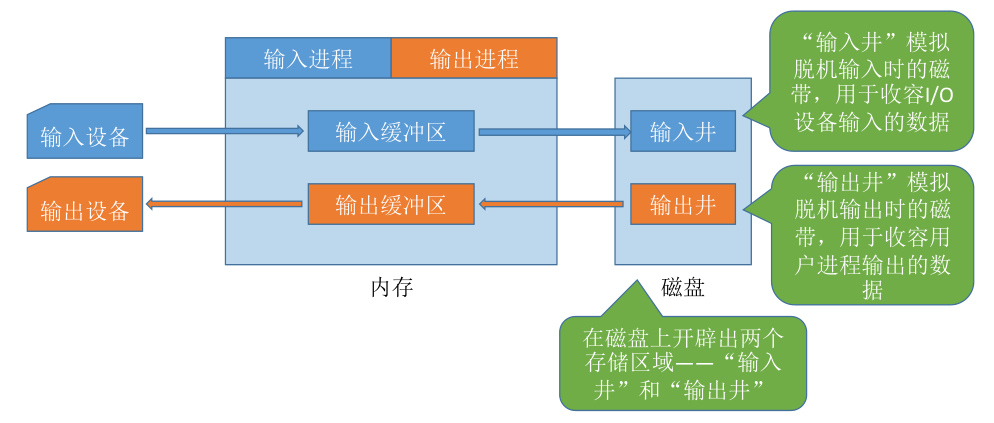

> **注意：** **输入井和输出井** 是 SPOOLing 的核心，位于 **磁盘** 上，主要负责“用户进程数据和设备之间的桥梁”。

---

## 2.3 输入进程和输出进程

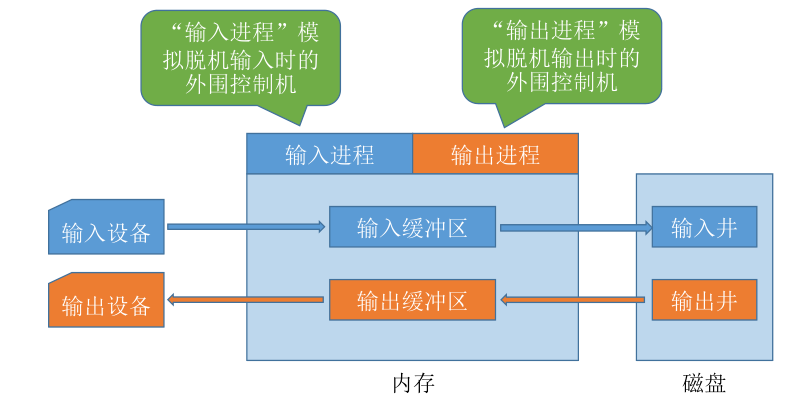

要实现 SPOOLing 技术，必须要有 **多道程序技术** 的支持。系统会建立“输入进程”和 “输出进程”。

> SPOOLing 必须靠后台进程（输入/输出进程）与用户进程并发执行，否则就只能串行工作。
> - **没有多道：** 用户进程写完数据，CPU 空转等打印。
> - **有了多道 + SPOOLing：** 用户进程写完数据，直接放到输出井里就走了，打印交给输出进程慢慢处理。

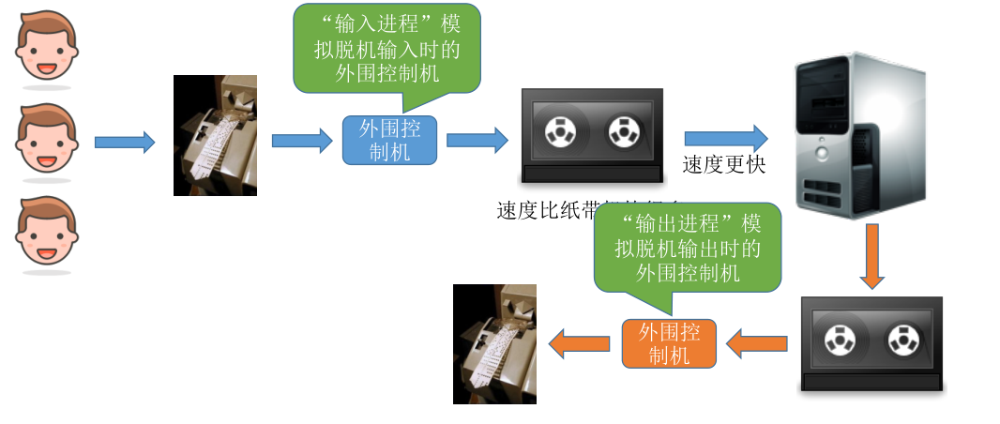

---

SPOOLing 技术是用 **软件** 的方式来模拟脱机技术。 SPOOLing 系统的组成如下：
- **输入缓冲区：** 在输入进程的控制下，“输入缓冲区”用于暂存从 **输入设备** 输入的数据，之后再转存到 **输入井** 中。
- **输出缓冲区：** 在输出进程的控制下，“输出缓冲区”用于暂存从 **输出井** 送来的数据，之后再传送到 **输出设备** 上。

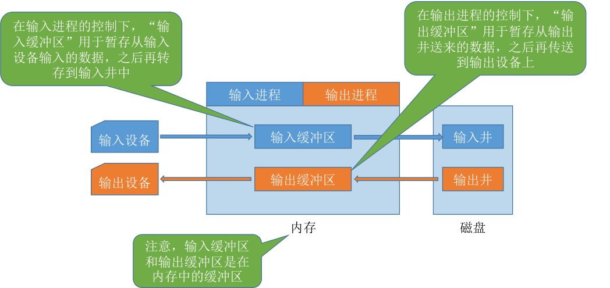

> **注意：** **输入缓冲区** 和 **输出缓冲区** 是在 **内存** 中。需要注意与 **输入/输出井** 所在位置的区别。

---

## 2.4 共享打印机原理分析

- **独占式设备:** 只允许各个进程 **串行** 使用的设备。一段时间内只能满足一个进程的请求。
- **共享设备:** 允许多个进程“同时（并发）”使用的设备（宏观上同时使用，微观上可能是交替使用）。可以同时满足多个进程的使用请求。

> 比如：打印机是种“独占式设备”，若进程1正在使用打印机，则进程2请求使用打印机时必然阻塞等待。

可以用 SPOOLing 技术把打印机改造成“共享设备”。当多个用户进程提出输出打印的请求时，系统会答应它们的请求，但是并不是真正把打印机分配给他们，而是由假脱机管理进程为每个进程做两件事：
1. 在 **磁盘** 输出井中为进程申请一个空闲缓冲区，并将要打印的数据送入其中；
2. 为用户进程申请一张空白的打印请求表，并将用户的打印请求填入表中（其实就是用来说明用户的打印数据存放位置等信息的），再将该表挂到 **假脱机文件队列（打印任务队列）** 上。当打印机空闲时，输出进程会从文件队列的队头取出一张打印请求表，并根据表中的要求将要打印的数据从输出井传送到输出缓冲区，再输出到打印机进行打印。用这种方式可依次处理完全部的打印任务。

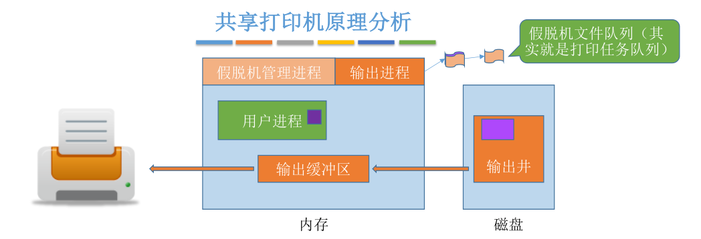

> 虽然系统中只有一个台打印机，但每个进程提出打印请求时，系统都会为在输出井中为其分配一个存储区（相当于分配了一个逻辑设备），使每个用户进程都觉得自己在独占一台打印机，从而实现对打印机的共享。

SPOOLing 技术可以把一台物理设备 **虚拟** 成逻辑上的多台设备，可将独占式设备改造成共享设备（实质/微观上仍是独占！）。

---

# 3.设备的分配与回收

---

## 3.1 设备分配时的考虑因素

**设备的固有属性：**
- **独占设备：** 一个时段只能分配给一个进程（如打印机）。
- **共享设备：** 可同时分配给多个进程使用（如磁盘），各进程往往是宏观上同时共享使用设备，而微观上交替使用。
- **虚拟设备：** 采用 SPOOLing 技术将独占设备改造成虚拟的共享设备，可同时分配给多个进程使用（如采用 SPOOLing 技术实现的共享打印机）。

**设备的分配算法：** 先来先服务、优先级高者优先、短任务优先 ……

**设备分配中的安全性：**
- **安全分配方式：** 为进程 **分配一个设备后就将进程阻塞** ，本次 I/O 完成后才将进程唤醒，即一个时段内每个进程只能使用一个设备。（比如：进程请求打印机打印输出）
  - **优点：** 破坏了“请求和保持”条件，不会死锁。
  - **缺点：** 对于一个进程来说，CPU 和 I/O 设备只能串行工作。
- **不安全分配方式：进程发出 I/O 请求后，系统为其分配 I/O 设备，进程可继续执行，之后还可以发出新的 I/O 请求。只有某个 I/O 请求得不到满足时才将进程阻塞，即一个进程可以同时使用多个设备。
  - 优点：进程的计算任务和 I/O 任务可以 **并行*8 处理，使进程迅速推进。
  - 缺点：有可能发生死锁（ps：思考下死锁的发生条件……）。

---

## 3.2 静态分配和动态分配

**静态分配：** 进程运行前为其分配全部所需资源，运行结束后归还资源（破坏了“请求和保持”条件，不会发生死锁）。

**动态分配：** 进程运行过程中动态申请设备资源。

---

## 3.3 设备分配管理中的数据结构

**“设备、控制器、通道”之间的关系：** 一个通道可控制多个设备控制器，每个设备控制器可控制多个设备。

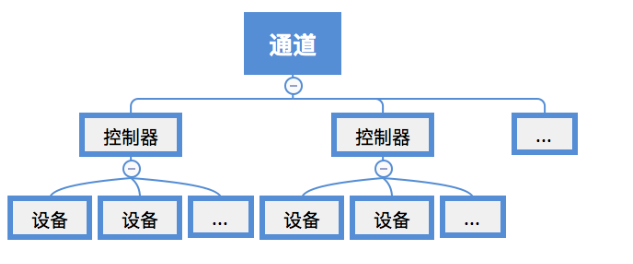

---

**设备控制表（DCT）：** 系统为每个设备配置一张 DCT，用于记录设备情况。

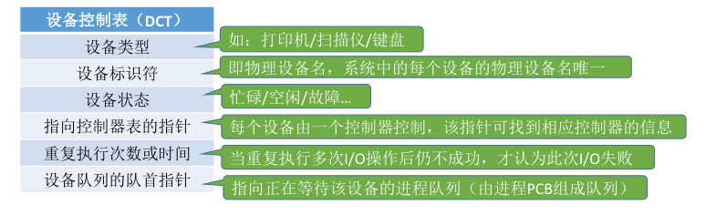

> **注意：** “进程管理”章节中曾经提到过“系统会根据阻塞原因不同，将进程PCB挂到不同的阻塞队列中”。正好和 **设备队列的队首指针** 有关。

---

**控制器控制表（COCT）：** 每个设备控制器都会对应一张 COCT。操作系统根据 COCT 的信息对控制器进行操作和管理。

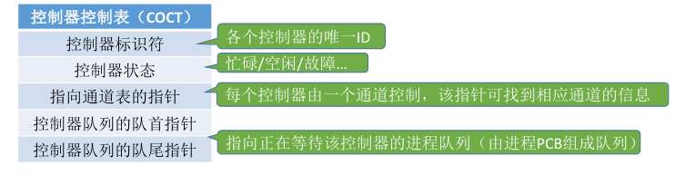

---

**通道控制表（CHCT）：** 每个通道都会对应一张 CHCT。操作系统根据 CHCT 的信息对通道进行操作和管理。

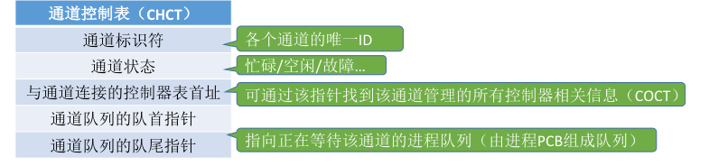

---

**系统设备表（SDT）：** 记录了系统中 **全部设备** 的情况，每个设备对应一个表目。

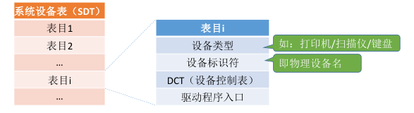

---

## 3.4 设备分配的步骤

1. 根据进程请求的物理设备名查找 SDT（注：物理设备名是进程请求分配设备时提供的参数）。
2. 根据 SDT 找到 DCT，若设备忙碌则将进程 PCB 挂到 **设备等待队列** 中，不忙碌则将设备分配给进程。
3. 根据 DCT 找到 COCT，若控制器忙碌则将进程 PCB 挂到 **控制器等待队列** 中，不忙碌则将控制器分配
给进程。
4. 根据 COCT 找到 CHCT，若通道忙碌则将进程 PCB 挂到 **通道等待队列** 中，不忙碌则将通道分配给进程。

> **注意：** 只有设备、控制器、通道三者都分配成功时，这次设备分配才算成功，之后便可启动 I/O 设备进行数据传送。

**上述分配步骤的缺点：**
- 用户编程时必须使用“物理设备名”，底层细节对用户不透明，不方便编程。
- 若换了一个物理设备，则程序无法运行。
- 若进程请求的物理设备正在忙碌，则即使系统中还有同类型的设备，进程也必须阻塞等待。

> 改进方法： **建立逻辑设备名与物理设备名的映射机制** ，用户编程时只需提供逻辑设备名。

---

**改进后的分配步骤：**
1. 根据进程请求的逻辑设备名查找 SDT（注：用户编程时提供的逻辑设备名其实就是“设备类型”）。
2. 查找 SDT，找到用户进程指定类型的、并且空闲的设备，将其分配给该进程。操作系统在逻辑设备表（LUT）中新增一个表项。
3. 根据 DCT 找到 COCT，若控制器忙碌则将进程 PCB 挂到 **控制器等待队列** 中，不忙碌则将控制器分配
给进程。
4. 根据 COCT 找到 CHCT，若通道忙碌则将进程 PCB 挂到 **通道等待队列** 中，不忙碌则将通道分配给进程。

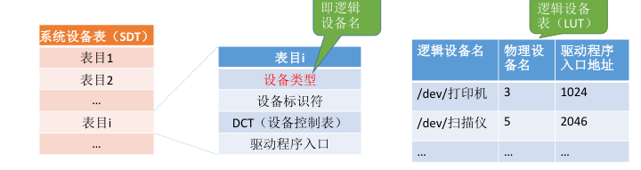

- 整个系统只有一张 LUT：各用户所用的逻辑设备名不允许重复，适用于单用户操作系统。
- 每个用户一张LUT：不同用户的逻辑设备名可重复，适用于多用户操作系统。

---

# 4.缓冲区管理

---

## 4.1 缓冲区的概念

缓冲区是一个存储区域，可以由专门的硬件 **寄存器** 组成，也可利用 **内存** 作为缓冲区。使用硬件寄存器作为缓冲区的成本较高，容量也较小，一般仅用在对速度要求非常高的场合（如存储器管理中所用的联想寄存器，由于对页表的访问频率极高，因此使用速度很快的联想寄存器来存放页表项的副本）。一般情况下，更多的是利用内存作为缓冲区，“设备独立性软件”的缓冲区管理就是要组织管理好这些缓冲区。

> **缓冲区和缓存的区别**
> - Buffer（缓冲区）的核心作用是用来 **缓冲** ，即 **缓和冲击** （对输出设备的冲击，包括磁盘、打印机、显示器）。比如你每秒要写 100 次硬盘，对系统冲击很大，浪费了大量时间在忙着处理开始写和结束写这两件事嘛。用个 Buffer 暂存起来，变成每 10 秒写一次硬盘，对系统的冲击就很小，写入效率就高了。 **Buffer** 中的数据一般是唯一的中间态， **一旦丢失可能导致数据损坏** （比如磁盘写缓存掉电丢数据）。
> - Cache （缓存）的核心作用是用来 **临时存储** ，即 **加快取用的速度** （包括 CPU 读内存、内存读磁盘、用户通过浏览器请求资源）。比如你一个很复杂的计算做完了，下次还要用结果，就把结果放手边一个好拿的地方存着，下次不用再算了。 **Cache** 中的数据是原始数据的副本， **可以随时失效** 。

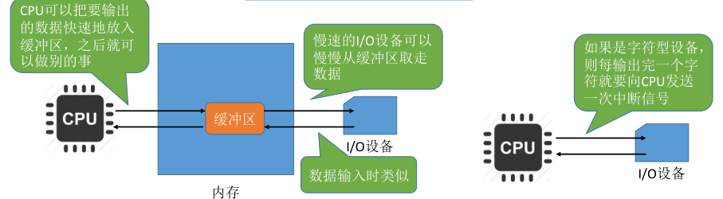

---

## 4.2 单缓冲

若采用 **单缓冲** 的策略，操作系统会在主存中为其分配一个缓冲区（若题目中没有特别说明，一个缓冲区的大小就是一个块）。

> 注意： **当缓冲区数据非空时，不能往缓冲区冲入数据，只能从缓冲区把数据传出；当缓冲区为空时，可以往缓冲区冲入数据，但必须把缓冲区冲满以后，才能从缓冲区把数据传出。**

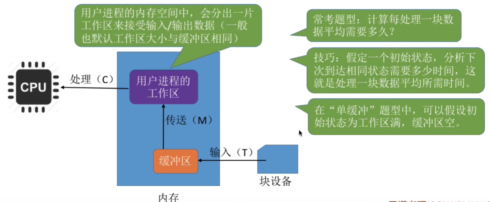

---

> 问题：假设某用户进程请求某种块设备读入若干块的数据。

| 符号 | 含义                                                   |
| ---- | ------------------------------------------------------ |
| `T`  | 从块设备读数据 -> 填满缓冲区的时间                     |
| `C`  | CPU 处理（工作区）数据的时间                           |
| `M`  | 从缓冲区 -> 工作区传送数据的时间（通常是内存复制时间） |

采用单缓冲策略，处理一块数据平均耗时为 `Max(C, T)+M` 。

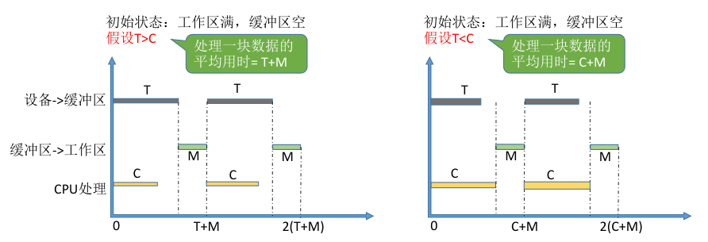

---

## 4.3 双缓冲

若采用 **双缓冲** 的策略，操作系统会在主存中为其分配两个缓冲区（若题目中没有特别说明，一个缓冲区的大小就是一个块）。

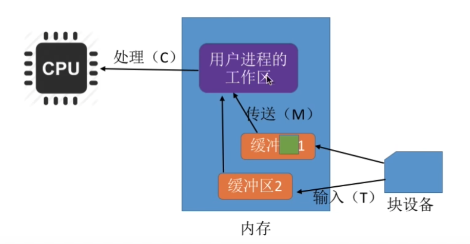

---

> 双缓冲题目中，假设初始状态为：工作区空，其中一个缓冲区满，另一个缓冲区空假设 T > C+M 。

处理一块数据平均耗时为 `T` 。

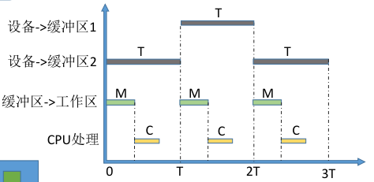

---

> 双缓冲题目中，假设初始状态为：工作区空，其中一个缓冲区满，另一个缓冲区空假设 T < C+M 。

这种情况味着设备输入数据块的速度要比处理机处理数据块的速度更快。每处理一个数据块平均耗时 `C+M` 。

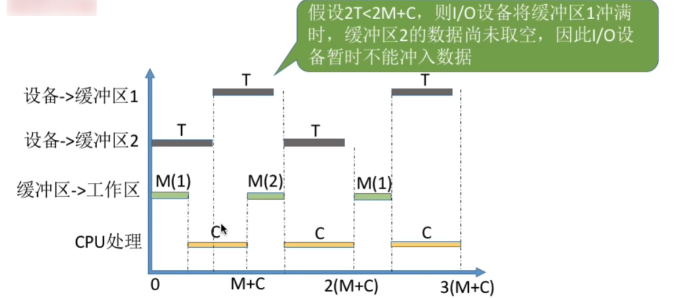

---

> **结论：** 处理一块数据平均耗时为 `max(T, C+M)` 。

---

## 4.4 单/双缓冲通信

两台机器之间通信时，可以配置缓冲区用于数据的发送和接受。

单缓冲通信示例：
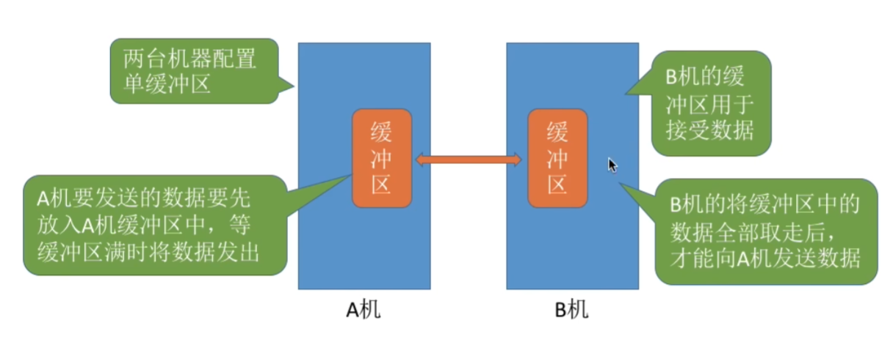

> 显然，若两个相互通信的机器只设置单缓冲区，在任一时刻只能实现数据的 **单向** 传输。

---

若两个相互通信的机器设置双缓冲区，则同一时刻可以实现 **双向** 的数据传输，如下图所示：
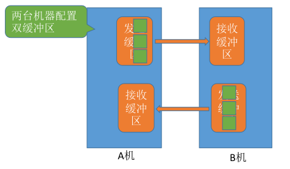

> **注：** 管道通信中的“管道”其实就是缓冲区。要实现数据的双向传输，必须设置两个管道

---

## 4.5 循环缓冲区

将多个 **大小相等** 的缓冲区链接成一个 **循环队列** 。

> 注：以下图示中，橙色表示已充满数据的缓冲区，绿色表示空缓冲区。

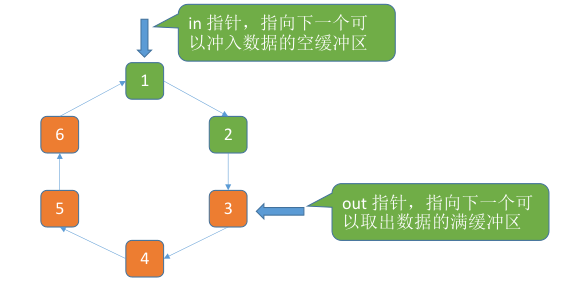

---

## 4.6 缓冲池

**缓冲池** 由系统中共用的 **缓冲区** 组成。这些缓冲区按使用状况可以分为：空缓冲队列、装满输入数据的缓冲队列（输入队列）、装满输出数据的缓冲队列（输出队列）。

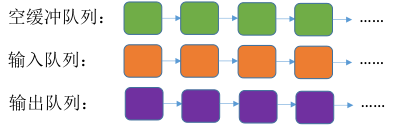

---

另外，根据一个缓冲区在实际运算中扮演的功能不同，又设置了四种工作缓冲区：用于 **收容输入数据** 的工作缓冲区（hin）、用于 **提取输入数据** 的工作缓冲区（sin）、用于 **收容输出数据** 的工作缓冲区（hout）、用于 **提取输出数据** 的工作缓冲区（sout）。

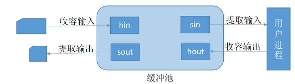

1. 输入进程请求 **输入** 数据，从 **空缓冲队列** 中取出一块作为 **收容输入数据的工作缓冲区（hin）** 。冲满数据后将缓冲区挂到 **输入队列** 队尾。
2. 计算进程想要 **取得** 一块输入数据，从 **输入队列** 中取得一块冲满输入数据的缓冲区作为 **提取输入数据的工作缓冲区（sin）** 。缓冲区读空后挂到 **空缓冲区队列** 队尾。
3. 计算进程想要将准备好的数据 **冲入** 缓冲区，从 **空缓冲队列** 中取出一块作为 **收容输出数据的工作缓冲区（hout）** 。数据冲满后将缓冲区挂到 **输出队列** 队尾。
4. 输出进程请求 **输出** 数据，从 **输出队列** 中取得一块冲满输出数据的缓冲区作为 **提取输出数据的工作缓冲区（sout）** 。缓冲区读空后挂到 **空缓冲区队列** 队尾。

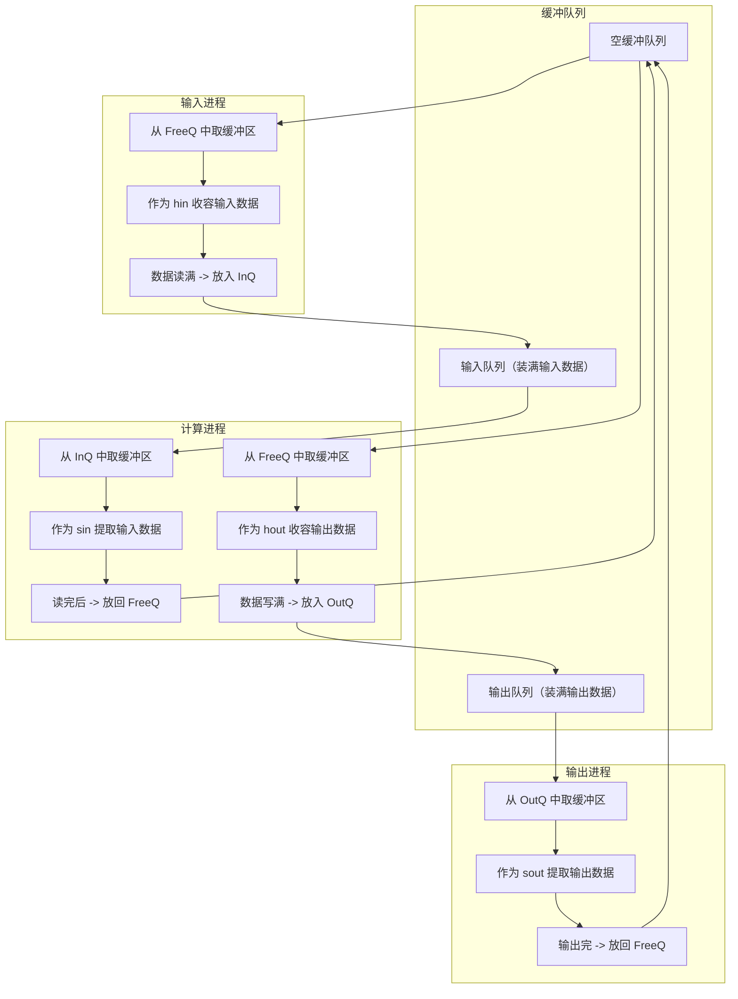

- 🟢 `FreeQ` 表示空缓冲队列，所有缓冲区初始都在这里；
- 🟡 输入进程负责把数据写入缓冲区（`hin`）；
- 🔵 计算进程既读取输入（`sin`）又生成输出（`hout`）；
- 🟣 输出进程负责将输出数据发送出去（`sout`）；
- 🔁 所有缓冲区**循环使用**，始终在 `FreeQ → InQ → FreeQ → OutQ → FreeQ` 间转圈。

