# 1.磁盘的结构

这里指的是 **机械硬盘** 。

---

## 1.1 磁盘的逻辑结构

- **盘片：** 一个磁盘由多个盘片叠加而成。盘片的表面涂有磁性物质，这些磁性物质用来记录 **二进制** 数据。因为正反两面都可涂上磁性物质，故 **一个盘片可能会有两个盘面** 。

- **磁道：** 磁面被进一步划分成一个个“环”，每个“环”就是一个磁道。

- **扇区：** 每个磁道又划分为一个个扇区。

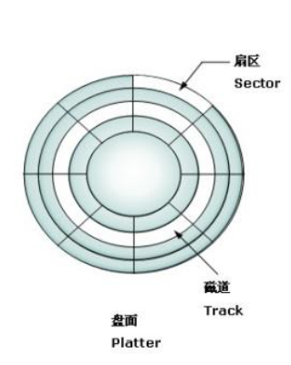

---

- **柱面：** 硬盘通常由重叠的一组盘片构成，每个盘面都被划分为数目相等的磁道，并从外缘的“0”开始编号，具有相同编号的磁道形成一个圆柱，称之为磁盘的柱面。

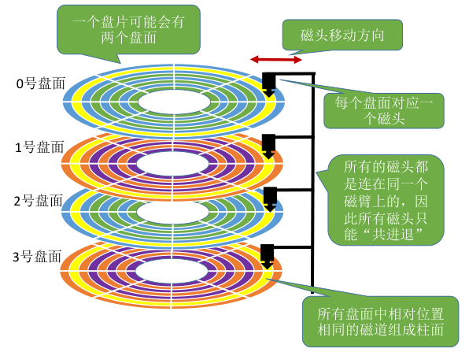

> 数据的读/写 **按柱面从外向内** 进行，而不是按盘面进行。定位时，首先确定柱面，再确定盘面，然后确定扇区。

---

## 1.2 磁盘的物理地址

可用 **(柱面号，盘面号，扇区号)** 来定位任意一个“磁盘块”。

读取一个“扇区”的步骤：
1. 根据“柱面号”移动磁臂，让磁头指向指定柱面；
2. 激活指定盘面对应的磁头；
3. 磁盘旋转的过程中，指定的扇区会从磁头下面划过，这样就完成了对指定扇区的读/写。

---

> 思考：为什么磁盘的物理地址是（柱面号，盘面号，扇区号），而不是（盘面号，柱面号，扇区号）？

> 假设某磁盘有 8 个柱面/磁道（假设最内侧柱面/磁道号为 0），4 个盘面，8 个扇区。则可用 3 个二进制位表示柱面，2 个二进制位表示盘面，3 个二进制位表示扇区。

1. **❌ 如果地址结构是：（盘面号，柱面号，扇区号）**  

> 连续读取：（00, 000, 000）到（00, 001, 111）

   - 虽然地址 **看起来连续** ，但实际是跨了柱面（从 000 → 001），所以 **磁头必须移动** ，多次寻道（代价大）。

2. **✅ 如果地址结构是：（柱面号，盘面号，扇区号）**  

> 连续读取：（000, 00, 000）到（000, 01, 111）

   - 柱面号不变 => 不需要移动磁头臂，只需切换磁头读取不同盘面（速度快）。

---

究其原因，读取数据的成本从高到低为：
- 移动磁臂 => 换柱面（最耗时）
- 切换磁头 => 换盘面（耗时小）
- 旋转等候 => 找扇区（固定平均延迟）

**总结：** 读取地址连续的磁盘块时，采用（柱面号，盘面号，扇区号）的地址结构可以 **减少磁头移动消耗的时间** 。

---

## 1.3 磁盘的分类

**活动头磁盘：** 磁头可以移动，磁臂可以来回伸缩来带动磁头定位磁道。

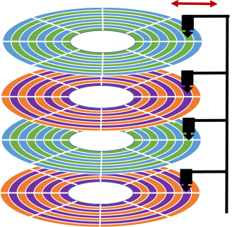

**固定头磁盘：** 磁头不可移动，这种磁盘中每个磁道有一个磁头。

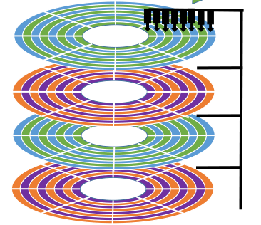

- **可换盘磁盘：** 盘片可以更换。

- **固定盘磁盘：** 盘片不可更换。

---

# 2.一次磁盘读/写操作所需时间

- **寻找时间（寻道时间） \(T_S\) ：** 在读/写数据前，将磁头移动到指定磁道所花的时间。
  - 启动磁头臂是需要时间的。假设耗时为 \(s\) ；
  - 移动磁头也是需要时间的。假设磁头匀速移动，每跨越一个磁道耗时为 \(m\) ，总共需要跨越 \(n\) 条磁道。
\[
寻道时间：T_S = s + m \cdot n    
\]

- **延迟时间 \(T_R\) ：** 通过旋转磁盘，使磁头定位到目标扇区所需要的时间。
  - 设磁盘转速为 \(r\) （单位：转/秒，或 转/分）。
\[
平均所需的延迟时间：T_R = \frac{1}{2} \cdot \frac{1}{r} = \frac{1}{2r}
\]
> **说明：** 因为磁头在等待某一扇区转到下面时，平均来说需要 **半圈** 的时间，而每圈时间是 1/r 。

- **传输时间 \(T_t\) ：** 从磁盘读出或向磁盘写入数据所经历的时间。
  - 假设磁盘转速为 \(r\) ，此次读/写的字节数为 \(b\) ，每个磁道上的字节数为 \(N\) 。
\[
传输时间：T_t = \frac{1}{r} \cdot \frac{b}{N} = \frac{b}{rN}
\]
> **说明：** 每个磁道要可存N字节的数据，因此 b 字节的数据需要 b/N 个磁道才能存储。而读/写一个磁道所需的时间刚好又是转一圈所需要的时间 1/r 。

则总的平均存取时间：
\[
T_a = T_S + \frac{1}{2r} +\frac{b}{rN}
\]

> **延迟时间** 和 **传输时间** 都与磁盘转速相关，且为线性相关。而转速是硬件的固有属性，因此操作系统也无法优化延迟时间和传输时间，能优化的只有 **寻道时间** （通过调度算法）。

---

# 3.磁盘调度算法（优化寻道时间）

---

## 3.1 先来先服务算法（FCFS）

根据 **进程请求访问磁盘的先后顺序** 进行调度。

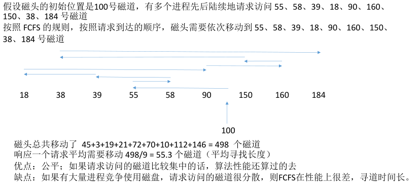

---

## 3.2 最短寻找时间优先（SSTF）

优先处理的磁道是 **与当前磁头最近** 的磁道。可以保证每次的寻道时间最短，但是并不能保证总的寻道时间最短。

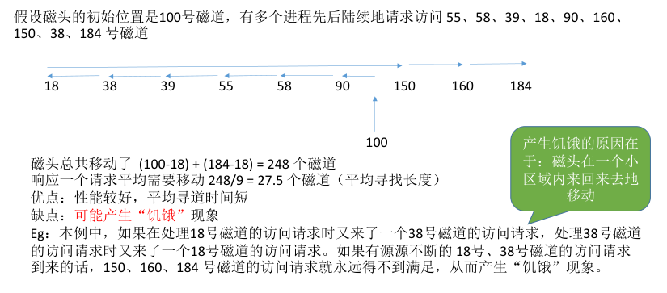

---

## 3.3 扫描算法（SCAN）

> SSTF 算法会产生饥饿的原因在于： **磁头有可能在一个小区域内来回来去地移动** 。

为了防止这个问题，可以规定， **只有磁头移动到最外侧磁道的时候才能往内移动，移动到最内侧磁道的时候才能往外移动** 。这就是扫描算法（SCAN）的思想。由于磁头移动的方式很像电梯，因此也叫 **电梯算法** 。

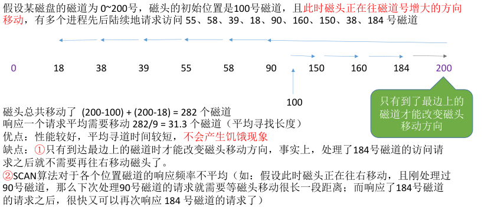

---

## 3.4 LOOK 调度算法

>扫描算法（SCAN）中，只有到达最边上的磁道时才能改变磁头移动方向，事实上，处理了 184 号磁道的访问请求之后就不需要再往右移动磁头了。

LOOK 调度算法就是为了解决这个问题，如果在磁头移动方向上已经 **没有磁道访问请求** ，就可以立即改变磁头移动方向。（边移动边观察，因此叫 LOOK）。

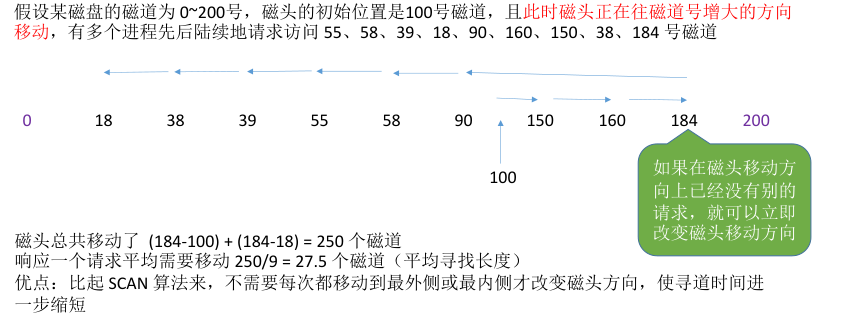

---

## 3.5 循环扫描算法（C-SCAN）

**SCAN 算法** 对于各个位置磁道的 **响应频率不平均** ，而 C-SCAN 算法就是为了解决这个问题。规定 **只有磁头朝某个特定方向移动时才处理磁道访问请求，而返回时直接快速移动至起始端而不处理任何请求。**

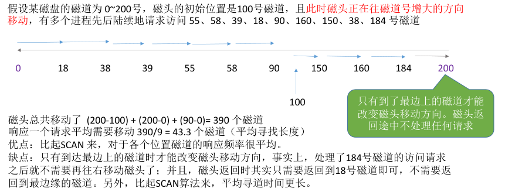

---

## 3.6 C-LOOK 调度算法

C-SCAN 算法的主要缺点是只有到达最边上的磁道时才能改变磁头移动方向，并且磁头返回时不一定需要返回到最边缘的磁道上。C-LOOK 算法就是为了解决这个问题。如果磁头移动的方向上已经 **没有磁道访问请求** 了，就可以立即让磁头返回，并且磁头只需要返回到有磁道访问请求的位置即可。

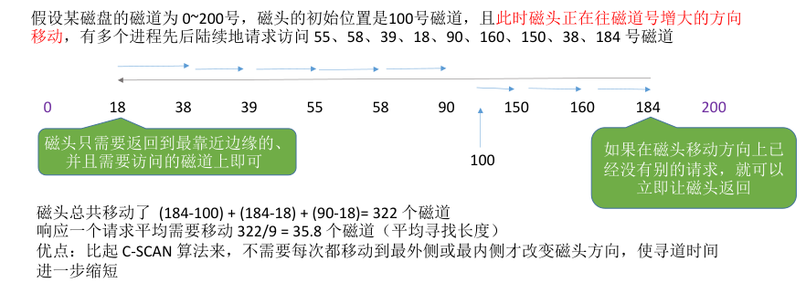

---

# 4.减少延迟时间（物理设计）

假设要连续读取橙色区域的 2、3、4 扇区：磁头读取一块的内容（也就是一个扇区的内容）后，需要一小段时间处理，而盘片又在不停地旋转。因此，如果2、3号扇区相邻着排列，则读完 2 号扇区后无法连续不断地读入 3 号扇区，必须等盘片继续旋转， 3 号扇区再次划过磁头，才能完成扇区读入。

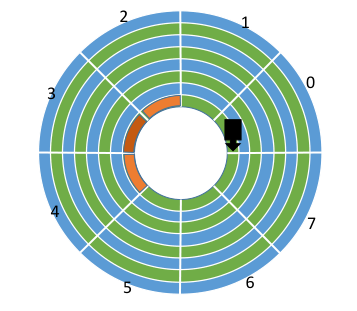

> **结论：** **磁头读入一个扇区数据后需要一小段时间处理** ，如果逻辑上相邻的扇区在物理上也相邻，则读入几个连续的逻辑扇区，可能需要很长的“延迟时间”。

---

## 4.1 交替编号法（针对扇区）

若采用 **交替编号** 的策略，即让逻辑上相邻的扇区在物理上有一定的间隔，可以使读取连续的逻辑扇区所需要的延迟时间更小。

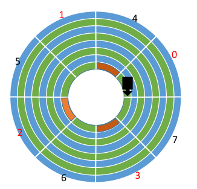

---

## 4.2 错位命名法（针对盘面）

> 方案一： **若相邻的盘面相对位置相同处扇区编号相同。**

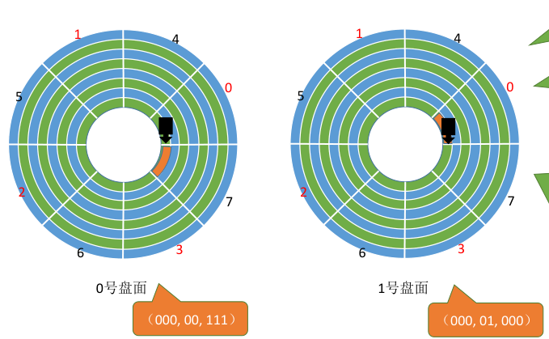

> **注意：所有盘面都是一起连轴转的。**

读取完磁盘块（000, 00, 111）之后，需要短暂的时间处理，而盘面又在不停地转动，因此当（000, 01, 000）第一次划过 1 号盘面的磁头下方时，并不能读取数据，只能再等该扇区再次划过磁头。

---

> 方案二： **采用错位命名** 。

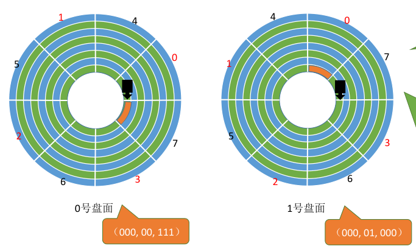

由于采用错位命名法，因此读取完磁盘块（000, 00, 111）之后，还有一段时间处理，当（000, 01, 000）第一次划过 1 号盘面的磁头下方时，就可以直接读取数据，从而减少了延迟时间。

---

# 5.磁盘的管理

---

## 5.1 磁盘初始化

磁盘初始化：
- **Step 1：** 进行 **低级格式化（物理格式化）** ，将磁盘的各个磁道划分为扇区。一个扇区通常可分为 **头、数据区域（如 512B 大小）、尾** 三个部分组成。管理扇区所需要的各种数据结构一般存放在头、尾两个部分，包括扇区校验码（如奇偶校验、CRC循环冗余校验码等，校验码用于校验扇区中的数据是否发生错误）。
- **Step 2：** 将磁盘 **分区** ，每个分区由若干柱面组成（比如在 Linux 系统下，把 `/dev/sda` 分为 `/dev/sda1`，`/dev/sda2`）。
- **Step 3：** 进行 **逻辑格式化** ，创建文件系统。包括创建文件系统的根目录、初始化存储空间管理所用的数据结构（如 位示图、空闲分区表）。

---

示例：
```bash
[04/12 16:28] sky@Arco:~
 >>> fdisk -l                              
Disk /dev/sda：30 GiB，32212254720 字节，62914560 个扇区
磁盘型号：VMware Virtual S
单元：扇区 / 1 * 512 = 512 字节
扇区大小(逻辑/物理)：512 字节 / 512 字节
I/O 大小(最小/最佳)：512 字节 / 512 字节
磁盘标签类型：gpt
磁盘标识符：A51BD864-B3FF-468F-91F8-591555603908

设备          起点     末尾     扇区  大小 类型
/dev/sda1     2048  1026047  1024000  500M BIOS 启动
/dev/sda2  1026048 62914526 61888479 29.5G Linux 文件系统
```

| 列名     | 含义                                                                  |
| -------- | --------------------------------------------------------------------- |
| **设备** | 分区的设备路径，比如 `/dev/sda1` 表示第一分区，`/dev/sda2` 是第二分区 |
| **起点** | 这个分区开始的扇区编号                                                |
| **末尾** | 这个分区结束的扇区编号                                                |
| **扇区** | 分区总共有多少个扇区（末尾 - 起点 + 1）                               |
| **大小** | 分区的总大小（计算自扇区数，每个扇区 512 字节）                       |
| **类型** | 分区的用途或格式，比如 BIOS 启动分区、Linux 文件系统等                |

---

## 5.2 引导块

计算机开机时需要进行一系列初始化的工作，这些初始化工作是通过执行 **初始化程序（自举程序）** 完成的。初始化程序可以放在 ROM （只读存储器）中。ROM 中的数据在出厂时就写入了，并且以后不能再修改。ROM 一般是出厂时就集成在主板上的.

> 出现的问题：万一需要更新自举程序，将会很不方便，因为ROM中的数据无法更改。如何解决呢？

解决方法：完整的自举程序放在 **磁盘的启动块（即引导块/启动分区）** 中（上个示例的`/dev/sda1`分区就是引导分区，挂载点为`boot`或`/boot/efi`），启动块位于磁盘的固定位置。拥有启动分区的磁盘称为 **启动磁盘** 或 **系统磁盘** 。ROM 中 **只存放很小的“自举装入程序”** ，开机时计算机先运行“自举装入程序”，通过执行该程序就可找到 **引导块** ，并将完整的“自举程序”读入内存，完成初始化。

---

## 5.3 坏块的管理

坏了、无法正常使用的扇区就是“坏块”。这属于硬件故障，操作系统是无法修复的。应该将坏块 **标记** 出来，以免错误地使用到它。

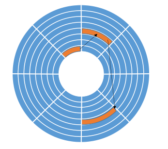

- **简单的磁盘：** 可以在逻辑格式化时（建立文件系统时）对整个磁盘进行坏块检查，标明哪些扇区是坏扇区，比如：在 FAT 表上标明。（在这种方式中，坏块对操作系统不透明）。
- **复杂的磁盘：** 磁盘控制器（磁盘设备内部的一个硬件部件）会维护一个 **坏块链表** 。在磁盘出厂前进行低级格式化（物理格式化）时就将坏块链进行初始化。会保留一些 **“备用扇区”** ，用于替换坏块，这种方案称为 **扇区备用** 。且这种处理方式中，坏块对操作系统透明。

---

# 6.固态硬盘

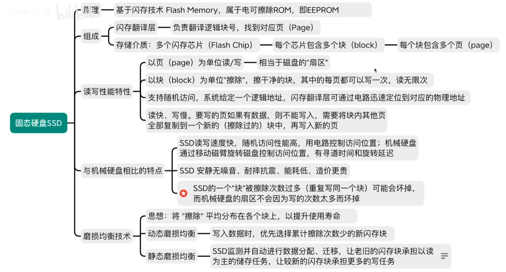